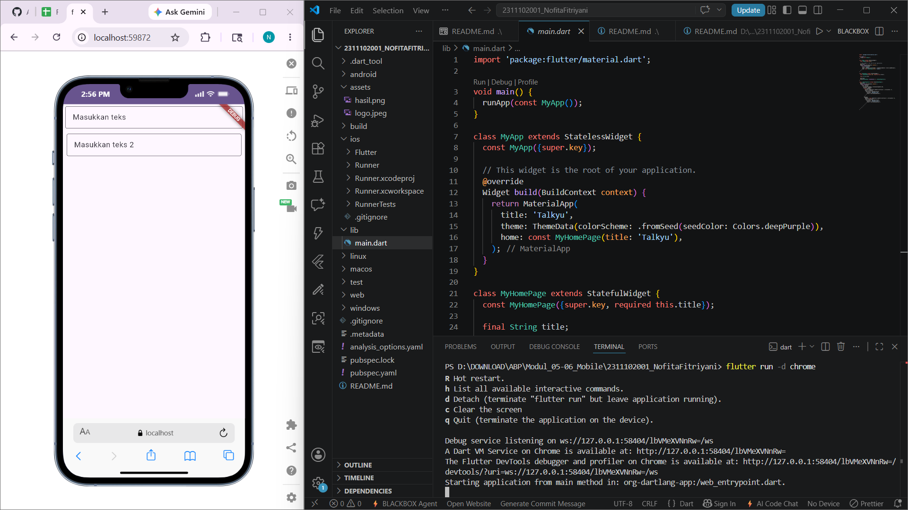

<div align="center">
  <br />
  <h1>LAPORAN PRAKTIKUM <br>APLIKASI BERBASIS PLATFORM</h1>
  <br />
  <h3>MODUL 5 & 6<br> FONT & TEXTFIELD</h3>
  <br />
   
  <br />
  <br />
  <br />
  <h3>Disusun Oleh :</h3>
  <p>
    <strong>NOFITA FITRIYANI</strong><br>
    <strong>2311102001</strong><br>
    <strong>S1 IF-11-REG01</strong>
  </p>
  <br />
  <br />
  <h3>Dosen Pengampu :</h3>
  <p>
    <strong>Dimas Fanny Hebrasianto Permadi, S.ST., M.Kom</strong>
  </p>
  <br />
  <br />
    <h4>Asisten Praktikum :</h4>
    <strong> Apri Pandu Wicaksono </strong> <br>
    <strong>Rangga Pradarrell Fathi</strong>
  <br />
  <h3>LABORATORIUM HIGH PERFORMANCE
 <br>FAKULTAS INFORMATIKA <br>UNIVERSITAS TELKOM PURWOKERTO <br>2026</h3>
</div>

---

## 1. Dasar Teori

#### 1.1 Flutter
Flutter merupakan framework open-source yang dikembangkan oleh Google untuk membangun aplikasi mobile, web, dan desktop menggunakan satu basis kode (single codebase). Flutter menggunakan bahasa pemrograman Dart dan menyediakan berbagai widget yang memudahkan pengembangan antarmuka pengguna (UI) secara cepat dan responsif.

Flutter menerapkan konsep widget sebagai komponen utama dalam pembuatan tampilan aplikasi. Setiap elemen pada antarmuka, seperti teks, tombol, gambar, maupun layout, dibangun menggunakan widget.

Implementasi Flutter pada praktikum ini digunakan untuk membuat tampilan antarmuka sederhana yang terdiri dari beberapa widget seperti `Column, Padding, dan TextField`.

#### 1.2 Widget Pada Flutter
Widget merupakan komponen dasar dalam Flutter yang digunakan untuk membangun tampilan aplikasi. Widget dapat berupa elemen visual maupun pengatur layout tampilan.

Secara umum, widget pada Flutter dibagi menjadi dua jenis, yaitu:

1. StatelessWidget
Widget yang tampilannya bersifat tetap dan tidak berubah selama aplikasi berjalan.
2. StatefulWidget
Widget yang dapat berubah tampilannya sesuai dengan perubahan data atau state aplikasi.

Pada program praktikum ini digunakan StatefulWidget pada halaman utama aplikasi untuk mengatur tampilan form input.

#### 1.3 Widget Column
`Column` merupakan widget layout pada Flutter yang digunakan untuk menyusun beberapa widget secara vertikal dari atas ke bawah.

Widget `Column` memiliki beberapa properti, salah satunya crossAxisAlignment yang digunakan untuk mengatur posisi horizontal widget di dalam `Column`.

Pada praktikum ini, widget `Column` digunakan untuk menampilkan dua buah TextField secara vertikal sehingga tampilan aplikasi menjadi lebih terstruktur.

#### 1.4 Widget Padding
`Padding` merupakan widget yang digunakan untuk memberikan jarak pada suatu widget terhadap widget lain maupun terhadap sisi layar.

Penggunaan `Padding` bertujuan agar tampilan antarmuka lebih rapi dan nyaman dilihat pengguna.

Pada program praktikum, widget `Padding` digunakan untuk memberikan jarak di sekitar TextField sehingga kolom input tidak menempel langsung pada sisi layar.

#### 1.5 Widget TextField
`TextField` merupakan widget input pada Flutter yang digunakan untuk menerima masukan berupa teks dari pengguna.

Widget `TextField` memiliki beberapa properti penting, antara lain:
- `hintText` → menampilkan teks petunjuk pada kolom input.
- `border` → memberikan garis tepi pada input.
- `controller` → mengatur dan mengambil data input pengguna.

Pada praktikum ini, `TextField` digunakan untuk membuat dua buah kolom input teks dengan tampilan border berbentuk kotak menggunakan `OutlineInputBorder()`.

#### 1.6 Material Design
Material Design merupakan pedoman desain antarmuka yang dikembangkan oleh Google untuk menciptakan tampilan aplikasi yang konsisten, modern, dan responsif.

Flutter menyediakan library `material.dart` yang berisi berbagai widget Material Design seperti:
- Scaffold
- AppBar
- TextField
- Button
- Card

Pada praktikum ini, Material Design digunakan melalui `MaterialApp` dan widget-widget bawaan Flutter sehingga tampilan aplikasi menjadi lebih modern dan mudah digunakan.

---

## 2. Source Code dan Implementasinya

Berikut adalah kode program yang dipelajari pada Modul 5 ini:

```dart
import 'package:flutter/material.dart';

void main() {
  runApp(const MyApp());
}

class MyApp extends StatelessWidget {
  const MyApp({super.key});

  // This widget is the root of your application.
  @override
  Widget build(BuildContext context) {
    return MaterialApp(
      title: 'Talkyu',
      theme: ThemeData(colorScheme: .fromSeed(seedColor: Colors.deepPurple)),
      home: const MyHomePage(title: 'Talkyu'),
    );
  }
}

class MyHomePage extends StatefulWidget {
  const MyHomePage({super.key, required this.title});

  final String title;

  @override
  State<MyHomePage> createState() => _MyHomePageState();
}

class _MyHomePageState extends State<MyHomePage> {
  @override
  Widget build(BuildContext context) {
    return Scaffold(
      body: Column(
        crossAxisAlignment: CrossAxisAlignment.end,
        children: <Widget>[
          const Padding(
            padding: EdgeInsets.symmetric(vertical: 5, horizontal: 5),
            child: TextField(
              decoration: InputDecoration(
                hintText: 'Masukkan teks',
                border: OutlineInputBorder(),
              ),
            ),
          ),
          Padding(
            padding: const EdgeInsets.symmetric(vertical: 6, horizontal: 8),
            child: TextField(
              decoration: InputDecoration(
                hintText: 'Masukkan teks 2',
                border: OutlineInputBorder(),
              ),
            ),
          ),
        ],
      ),
    );
  }
}

```

**Implementasi Widget (Column, Padding, dan TextField)**

1. **Implementasi Widget `Column`**:
```
Column(
  crossAxisAlignment: CrossAxisAlignment.end,
  children: <Widget>[
```
Widget Column digunakan untuk menyusun beberapa widget secara vertikal dari atas ke bawah. Pada program ini, Column digunakan untuk menampilkan dua buah TextField secara berurutan

Properti :
```
crossAxisAlignment: CrossAxisAlignment.end
```
digunakan agar posisi widget di dalam `Column` rata ke kanan.

Pada aplikasi, widget `Column` digunakan sebagai wadah utama untuk menampilkan form input teks secara vertikal sehingga tampilan menjadi lebih terstruktur dan rapi.

2. **Implementasi Widget `Padding`**
```
Padding(
  padding: EdgeInsets.symmetric(vertical: 5, horizontal: 5),
```
dan 
```
Padding(
  padding: const EdgeInsets.symmetric(vertical: 6, horizontal: 8),
```
Widget Padding digunakan untuk memberikan jarak di sekitar widget agar tampilan tidak terlalu menempel dengan sisi layar maupun widget lainnya.

Pada program ini, Padding diterapkan pada masing-masing TextField agar tampilan input lebih nyaman dilihat dan memiliki ruang antar komponen sehingga antarmuka aplikasi menjadi lebih rapi.

3. **Implementasi Widget `TextField`**
```
TextField(
  decoration: InputDecoration(
    hintText: 'Masukkan teks',
    border: OutlineInputBorder(),
  ),
),
```
dan
```
TextField(
  decoration: InputDecoration(
    hintText: 'Masukkan teks 2',
    border: OutlineInputBorder(),
  ),
),
```
Widget TextField digunakan sebagai komponen input teks yang memungkinkan pengguna memasukkan data ke dalam aplikasi.

- hintText digunakan untuk menampilkan teks petunjuk pada kolom input.
- OutlineInputBorder() digunakan untuk memberikan border berbentuk kotak pada TextField.

Pada aplikasi ini terdapat dua buah TextField yang digunakan sebagai kolom input pengguna. Kedua input memiliki placeholder berbeda untuk membedakan fungsi masing-masing input. Border kotak pada TextField membuat tampilan form menjadi lebih jelas dan mudah digunakan pengguna.

## 3. OUTPUT
