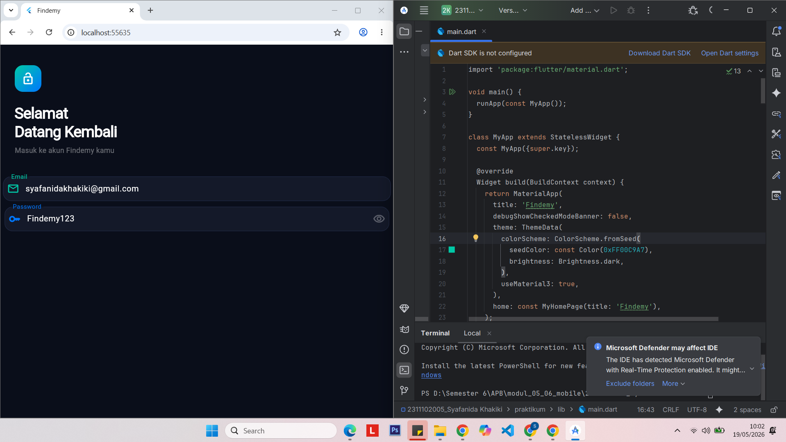

<div align="center">


\## LAPORAN PRAKTIKUM <br> APLIKASI BERBASIS PLATFORM


\### MODUL 5 \& 6

\### MOBILE


<br>

<br>


<br>

<br>


\*\*Disusun oleh:\*\*  

\*\*Syafanida Khakiki\*\*  

\*\*2311102005\*\*


<br>


\*\*KELAS PS1IF-11-REG01\*\*  

\*\*Dosen: Dimas Fanny Hebrasianto Permadi, S.ST., M.Kom\*\*


<br><br>


\## PROGRAM STUDI S1 TEKNIK INFORMATIKA <br> FAKULTAS INFORMATIKA <br> UNIVERSITAS TELKOM PURWOKERTO <br> 2026 <br><br>


</div>


\---


\# 1. Dasar Teori


Flutter menyediakan berbagai widget input dan state management sederhana untuk membangun antarmuka interaktif. Pada praktikum modul 5 dan 6, fokus utama adalah penggunaan `TextField`, `TextEditingController`, pengelolaan state menggunakan `StatefulWidget`, serta penerapan desain modern menggunakan Material Design 3.


\## TextField


`TextField` merupakan widget input pada Flutter yang digunakan untuk menerima data dari pengguna seperti email, password, pencarian, dan teks lainnya.


Beberapa properti penting pada `TextField`:


| Properti | Fungsi |

|---|---|

| `controller` | Mengontrol dan mengambil isi teks dari input |

| `keyboardType` | Menentukan jenis keyboard yang muncul |

| `obscureText` | Menyembunyikan teks, biasanya untuk password |

| `decoration` | Mengatur tampilan TextField |

| `style` | Mengatur style teks input |


\---


\## TextEditingController


`TextEditingController` digunakan untuk mengontrol isi dari `TextField`. Controller memungkinkan program membaca, mengubah, maupun menghapus isi input.


Contoh:


```dart

final TextEditingController \_emailController =

&#x20;   TextEditingController();

```


Controller perlu dibersihkan menggunakan `dispose()` agar tidak terjadi memory leak.


```dart

@override

void dispose() {

&#x20; \_emailController.dispose();

&#x20; super.dispose();

}

```


\---


\## StatefulWidget


`StatefulWidget` digunakan ketika tampilan aplikasi memiliki data yang dapat berubah secara dinamis selama aplikasi berjalan.


Pada praktikum ini, `StatefulWidget` digunakan untuk:

\- Mengubah icon visibility password

\- Mengatur status `obscureText`

\- Mengelola perubahan state menggunakan `setState()`


\---


\## Material Design 3


Flutter mendukung Material Design 3 melalui properti:


```dart

useMaterial3: true

```


Material Design 3 memberikan:

\- Tampilan modern

\- Dynamic color system

\- Rounded component

\- UI lebih clean dan responsif


\---


\## InputDecoration


`InputDecoration` digunakan untuk mempercantik tampilan `TextField`.


Komponen yang digunakan:

\- `labelText`

\- `hintText`

\- `prefixIcon`

\- `suffixIcon`

\- `filled`

\- `border`


\---


\# 2. Hasil Praktikum


\## Deskripsi Aplikasi


Aplikasi yang dibuat bernama \*\*Findemy\*\*, yaitu tampilan halaman login modern bertema dark mode dengan desain clean dan futuristik. Aplikasi menggunakan dua buah `TextField`, yaitu input email dan password, lengkap dengan icon, efek focus border, serta fitur show/hide password.


Tema warna utama menggunakan kombinasi:

\- Hijau tosca (`#00C9A7`)

\- Biru (`#0077FF`)

\- Dark navy background (`#0A0E1A`)


\---


\## Langkah-Langkah Pembuatan


\### 1. Membuat Project Flutter


Buka terminal atau Visual Studio Code lalu jalankan:


```bash

flutter create findemy

```


Masuk ke folder project:


```bash

cd findemy

```


\---


\### 2. Membuka File main.dart


Buka file:


```text

lib/main.dart

```


Hapus seluruh kode default Flutter.


\---


\### 3. Menambahkan Kode Program


Tambahkan kode berikut pada file `main.dart`:


```dart

import 'package:flutter/material.dart';


void main() {

&#x20; runApp(const MyApp());

}


class MyApp extends StatelessWidget {

&#x20; const MyApp({super.key});


&#x20; @override

&#x20; Widget build(BuildContext context) {

&#x20;   return MaterialApp(

&#x20;     title: 'Findemy',

&#x20;     debugShowCheckedModeBanner: false,

&#x20;     theme: ThemeData(

&#x20;       colorScheme: ColorScheme.fromSeed(

&#x20;         seedColor: const Color(0xFF00C9A7),

&#x20;         brightness: Brightness.dark,

&#x20;       ),

&#x20;       useMaterial3: true,

&#x20;     ),

&#x20;     home: const MyHomePage(title: 'Findemy'),

&#x20;   );

&#x20; }

}


class MyHomePage extends StatefulWidget {

&#x20; const MyHomePage({super.key, required this.title});


&#x20; final String title;


&#x20; @override

&#x20; State<MyHomePage> createState() => \_MyHomePageState();

}


class \_MyHomePageState extends State<MyHomePage> {

&#x20; final TextEditingController \_emailController =

&#x20;     TextEditingController();


&#x20; final TextEditingController \_passwordController =

&#x20;     TextEditingController();


&#x20; bool \_obscurePassword = true;


&#x20; @override

&#x20; void dispose() {

&#x20;   \_emailController.dispose();

&#x20;   \_passwordController.dispose();

&#x20;   super.dispose();

&#x20; }


&#x20; @override

&#x20; Widget build(BuildContext context) {

&#x20;   return Scaffold(

&#x20;     backgroundColor: const Color(0xFF0A0E1A),


&#x20;     body: SafeArea(

&#x20;       child: Column(

&#x20;         crossAxisAlignment: CrossAxisAlignment.end,

&#x20;         children: \[


&#x20;           // Hero Section

&#x20;           Padding(

&#x20;             padding:

&#x20;                 const EdgeInsets.fromLTRB(28, 40, 28, 0),


&#x20;             child: Align(

&#x20;               alignment: Alignment.centerLeft,


&#x20;               child: Column(

&#x20;                 crossAxisAlignment:

&#x20;                     CrossAxisAlignment.start,


&#x20;                 children: \[


&#x20;                   Container(

&#x20;                     width: 52,

&#x20;                     height: 52,


&#x20;                     decoration: BoxDecoration(

&#x20;                       gradient: const LinearGradient(

&#x20;                         begin: Alignment.topLeft,

&#x20;                         end: Alignment.bottomRight,


&#x20;                         colors: \[

&#x20;                           Color(0xFF00C9A7),

&#x20;                           Color(0xFF0077FF)

&#x20;                         ],

&#x20;                       ),


&#x20;                       borderRadius:

&#x20;                           BorderRadius.circular(16),

&#x20;                     ),


&#x20;                     child: const Icon(

&#x20;                       Icons.lock\_open\_rounded,

&#x20;                       color: Colors.white,

&#x20;                       size: 26,

&#x20;                     ),

&#x20;                   ),


&#x20;                   const SizedBox(height: 24),


&#x20;                   const Text(

&#x20;                     'Selamat\\nDatang Kembali',


&#x20;                     style: TextStyle(

&#x20;                       color: Colors.white,

&#x20;                       fontSize: 30,

&#x20;                       fontWeight: FontWeight.w800,

&#x20;                       height: 1.2,

&#x20;                       letterSpacing: -0.8,

&#x20;                     ),

&#x20;                   ),


&#x20;                   const SizedBox(height: 8),


&#x20;                   const Text(

&#x20;                     'Masuk ke akun Findemy kamu',


&#x20;                     style: TextStyle(

&#x20;                       color: Colors.white38,

&#x20;                       fontSize: 14,

&#x20;                     ),

&#x20;                   ),

&#x20;                 ],

&#x20;               ),

&#x20;             ),

&#x20;           ),


&#x20;           const SizedBox(height: 36),


&#x20;           // TextField Email

&#x20;           Padding(

&#x20;             padding: const EdgeInsets.symmetric(

&#x20;               vertical: 5,

&#x20;               horizontal: 5,

&#x20;             ),


&#x20;             child: TextField(

&#x20;               controller: \_emailController,

&#x20;               keyboardType:

&#x20;                   TextInputType.emailAddress,


&#x20;               style: const TextStyle(

&#x20;                 color: Colors.white,

&#x20;               ),


&#x20;               decoration: InputDecoration(

&#x20;                 hintText: 'Masukkan teks',


&#x20;                 hintStyle: const TextStyle(

&#x20;                   color: Colors.white30,

&#x20;                 ),


&#x20;                 labelText: 'Email',


&#x20;                 labelStyle: const TextStyle(

&#x20;                   color: Color(0xFF00C9A7),

&#x20;                 ),


&#x20;                 prefixIcon: const Icon(

&#x20;                   Icons.email\_outlined,

&#x20;                   color: Color(0xFF00C9A7),

&#x20;                 ),


&#x20;                 filled: true,

&#x20;                 fillColor:

&#x20;                     const Color(0xFF141929),


&#x20;                 border: OutlineInputBorder(

&#x20;                   borderRadius:

&#x20;                       BorderRadius.circular(16),

&#x20;                 ),

&#x20;               ),

&#x20;             ),

&#x20;           ),


&#x20;           // TextField Password

&#x20;           Padding(

&#x20;             padding: const EdgeInsets.symmetric(

&#x20;               vertical: 6,

&#x20;               horizontal: 8,

&#x20;             ),


&#x20;             child: TextField(

&#x20;               controller: \_passwordController,

&#x20;               obscureText: \_obscurePassword,


&#x20;               style: const TextStyle(

&#x20;                 color: Colors.white,

&#x20;               ),


&#x20;               decoration: InputDecoration(

&#x20;                 hintText: 'Masukkan teks 2',


&#x20;                 hintStyle: const TextStyle(

&#x20;                   color: Colors.white30,

&#x20;                 ),


&#x20;                 labelText: 'Password',


&#x20;                 labelStyle: const TextStyle(

&#x20;                   color: Color(0xFF0077FF),

&#x20;                 ),


&#x20;                 prefixIcon: const Icon(

&#x20;                   Icons.key\_rounded,

&#x20;                   color: Color(0xFF0077FF),

&#x20;                 ),


&#x20;                 suffixIcon: IconButton(

&#x20;                   icon: Icon(

&#x20;                     \_obscurePassword

&#x20;                         ? Icons

&#x20;                             .visibility\_off\_outlined

&#x20;                         : Icons

&#x20;                             .visibility\_outlined,


&#x20;                     color: Colors.white30,

&#x20;                   ),


&#x20;                   onPressed: () {

&#x20;                     setState(() {

&#x20;                       \_obscurePassword =

&#x20;                           !\_obscurePassword;

&#x20;                     });

&#x20;                   },

&#x20;                 ),


&#x20;                 filled: true,

&#x20;                 fillColor:

&#x20;                     const Color(0xFF141929),


&#x20;                 border: OutlineInputBorder(

&#x20;                   borderRadius:

&#x20;                       BorderRadius.circular(16),

&#x20;                 ),

&#x20;               ),

&#x20;             ),

&#x20;           ),

&#x20;         ],

&#x20;       ),

&#x20;     ),

&#x20;   );

&#x20; }

}

```


\---


\### 4. Menjalankan Program


Jalankan aplikasi menggunakan Chrome:


```bash

flutter run -d chrome

```


Atau emulator Android:


```bash

flutter run

```


\---


\# Output


<div align="center">


\### Tampilan Halaman Login Findemy





</div>


\---


\# 3. Penjelasan Widget yang Digunakan


\## 3.1 MaterialApp


`MaterialApp` merupakan root widget utama pada Flutter yang digunakan untuk mengatur tema, title aplikasi, routing, dan konfigurasi Material Design.


```dart

MaterialApp(

&#x20; title: 'Findemy',

&#x20; debugShowCheckedModeBanner: false,

)

```


\---


\## 3.2 Scaffold


`Scaffold` digunakan sebagai struktur dasar tampilan aplikasi Material Design.


Widget ini menyediakan:

\- body

\- backgroundColor

\- layout utama aplikasi


```dart

Scaffold(

&#x20; backgroundColor: const Color(0xFF0A0E1A),

)

```


\---


\## 3.3 StatefulWidget


`StatefulWidget` digunakan karena aplikasi memiliki state yang berubah, yaitu status tampil/sembunyikan password.


```dart

class MyHomePage extends StatefulWidget

```


Perubahan state dilakukan menggunakan:


```dart

setState(() {

&#x20; \_obscurePassword = !\_obscurePassword;

});

```


\---


\## 3.4 TextField


`TextField` digunakan untuk menerima input dari pengguna.


\### TextField Email


```dart

TextField(

&#x20; controller: \_emailController,

&#x20; keyboardType: TextInputType.emailAddress,

)

```


\### TextField Password


```dart

TextField(

&#x20; controller: \_passwordController,

&#x20; obscureText: \_obscurePassword,

)

```


\---


\## 3.5 TextEditingController


Controller digunakan untuk mengontrol isi TextField.


```dart

final TextEditingController \_emailController =

&#x20;   TextEditingController();

```


Controller dibersihkan menggunakan `dispose()`.


\---


\## 3.6 InputDecoration


`InputDecoration` digunakan untuk mengatur tampilan TextField seperti:

\- label

\- hint

\- icon

\- border

\- warna


```dart

decoration: InputDecoration(

&#x20; labelText: 'Email',

&#x20; prefixIcon: Icon(Icons.email\_outlined),

)

```


\---


\## 3.7 IconButton


`IconButton` digunakan untuk tombol show/hide password.


```dart

suffixIcon: IconButton(

&#x20; icon: Icon(Icons.visibility\_outlined),

)

```


\---


\# 4. Kesimpulan


Pada praktikum modul 5 dan 6, telah berhasil dibuat aplikasi login modern bernama \*\*Findemy\*\* menggunakan Flutter dan Dart. Praktikum ini mempelajari penggunaan `TextField`, `TextEditingController`, `StatefulWidget`, `InputDecoration`, serta pengelolaan state menggunakan `setState()`.


Selain itu, aplikasi juga menerapkan konsep UI modern menggunakan Material Design 3 dengan dark mode dan kombinasi warna futuristik sehingga tampilan menjadi lebih menarik dan interaktif.


\---

