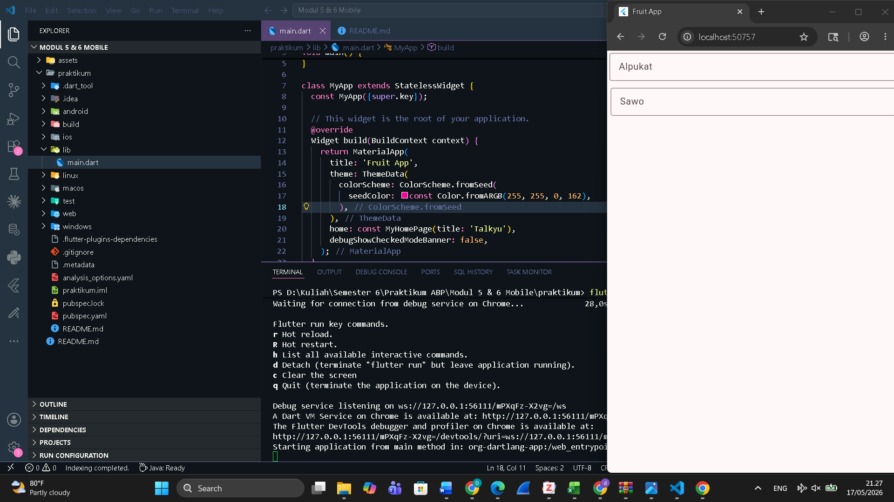

<div align="center">

## LAPORAN PRAKTIKUM <br> APLIKASI BERBASIS PLATFORM

<br>

### MODUL 5 & 6
### MOBILE

<br>
<br>


<br>
<br>
<br>

**Disusun oleh:**

**Diva Octaviani**  
**2311102006**

<br>

**KELAS PS1IF-11-REG01**

**Dosen: Dimas Fanny Hebrasianto Permadi, S.ST., M.Kom**

<br><br>

## PROGRAM STUDI S1 TEKNIK INFORMATIKA <br> FAKULTAS INFORMATIKA <br> UNIVERSITAS TELKOM PURWOKERTO <br> 2026 <br><br>

</div>

---

## 1. Dasar Teori

Flutter menyediakan berbagai widget input yang memungkinkan pengguna untuk memasukkan data ke dalam aplikasi. Salah satu widget input yang paling umum digunakan adalah **TextField**.

**TextField** adalah widget yang digunakan untuk menerima input teks dari pengguna. Widget ini dapat dikustomisasi melalui properti `decoration` bertipe `InputDecoration`, yang memungkinkan penambahan hint text, label, border, ikon, dan berbagai elemen visual lainnya. Properti `border` pada `InputDecoration` menentukan tampilan garis tepi input, salah satunya menggunakan `OutlineInputBorder` yang menghasilkan border berbentuk persegi panjang dengan sudut rounded di sekeliling field.

**Padding** adalah widget yang digunakan untuk memberikan jarak (ruang kosong) di sekitar widget child-nya. Padding menerima properti `padding` bertipe `EdgeInsets`, yang dapat dikonfigurasi dengan berbagai cara:
- `EdgeInsets.all()` untuk padding yang sama di semua sisi.
- `EdgeInsets.symmetric()` untuk padding berbeda antara sumbu horizontal dan vertikal.
- `EdgeInsets.only()` untuk padding di sisi tertentu saja.

**Column** adalah widget multi-child yang menyusun child widget secara vertikal dari atas ke bawah. Properti `crossAxisAlignment` mengatur perataan child secara horizontal, misalnya `CrossAxisAlignment.end` untuk meratakan ke kanan.

**Scaffold** adalah widget dasar yang menyediakan struktur visual standar sebuah halaman pada Material Design, termasuk dukungan untuk `AppBar`, `body`, `FloatingActionButton`, `Drawer`, dan lainnya.

---

## 2. Hasil Praktikum

### Langkah-Langkah:

**1.** Buka Visual Studio Code dan buat project Flutter.

**2.** Buka file `lib/main.dart` dan hapus semua kode bawaan.

**3.** Tambahkan kode berikut pada `main.dart` bagian `MyApp` sebagai entry point aplikasi:

```dart
import 'package:flutter/material.dart';

void main() {
  runApp(const MyApp());
}

class MyApp extends StatelessWidget {
  const MyApp({super.key});

  @override
  Widget build(BuildContext context) {
    return MaterialApp(
      title: 'Fruit App',
      theme: ThemeData(
        colorScheme: ColorScheme.fromSeed(
          seedColor: const Color.fromARGB(255, 255, 0, 162),
        ),
      ),
      home: const MyHomePage(title: 'Fruit App'),
      debugShowCheckedModeBanner: false,
    );
  }
}
```

**4.** Buat widget `MyHomePage` sebagai halaman utama berupa `StatefulWidget` dengan `Scaffold` dan `Column` sebagai body-nya:

```dart
class MyHomePage extends StatefulWidget {
  const MyHomePage({super.key, required this.title});

  final String title;

  @override
  State<MyHomePage> createState() => _MyHomePageState();
}
```

**5.** Di dalam `_MyHomePageState`, tambahkan widget `Scaffold` dengan `body` berupa `Column` yang memiliki `crossAxisAlignment` ke kanan (`CrossAxisAlignment.end`):

```dart
class _MyHomePageState extends State<MyHomePage> {
  @override
  Widget build(BuildContext context) {
    return Scaffold(
      body: Column(
        crossAxisAlignment: CrossAxisAlignment.end,
        children: <Widget>[
          // TextField akan ditambahkan di sini
        ],
      ),
    );
  }
}
```

**6.** Tambahkan **TextField pertama** di dalam `Column`, dibungkus dengan `Padding` menggunakan `EdgeInsets.symmetric` untuk jarak horizontal dan vertikal. TextField ini menggunakan `hintText` "Alpukat" dan `OutlineInputBorder`:

```dart
const Padding(
  padding: EdgeInsets.symmetric(horizontal: 4, vertical: 4),
  child: TextField(
    decoration: InputDecoration(
      hintText: "Alpukat",
      border: OutlineInputBorder(),
    ),
  ),
),
```

**7.** Tambahkan **TextField kedua** dengan pola yang sama, menggunakan `hintText` "Sawo":

```dart
Padding(
  padding: EdgeInsetsGeometry.symmetric(horizontal: 6, vertical: 8),
  child: TextField(
    decoration: InputDecoration(
      hintText: "Sawo",
      border: OutlineInputBorder(),
    ),
  ),
),
```

**8.** Jalankan aplikasi dengan perintah `flutter run` di terminal, lalu pilih platform yang diinginkan (misalkan Chrome ataupun emulator yang lain).

### Output:

