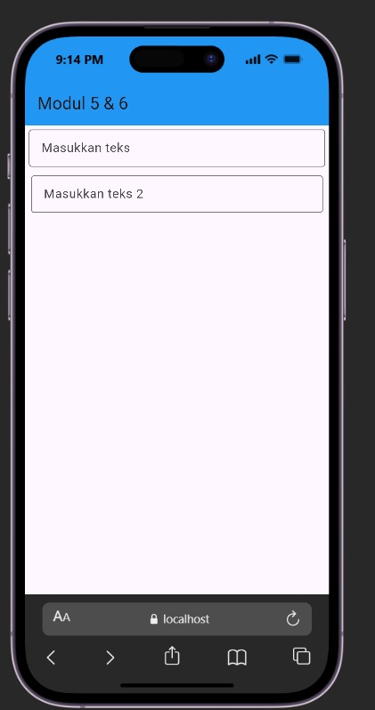

<div align="center">
  <br />
  <h1>LAPORAN PRAKTIKUM <br>APLIKASI BERBASIS PLATFORM</h1>
  <br />
  <h3>MODUL 5 & 6<br> FONT & TEXTFIELD</h3>
  <br />
   
  <br />
  <br />
  <br />
  <h3>Disusun Oleh :</h3>
  <p>
    <strong>Nadhif Atha Zaki</strong><br>
    <strong>2311102007</strong><br>
    <strong>S1 IF-11-01</strong>
  </p>
  <br />
  <br />
  <h3>Dosen Pengampu :</h3>
  <p>
    <strong>Dimas Fanny Hebrasianto Permadi, S.ST., M.Kom</strong>
  </p>
  <br />
  <br />
  <h4>Asisten Praktikum :</h4>
  <strong>Apri Pandu Wicaksono</strong> <br>
  <strong>Rangga Pradarrell Fathi</strong>
  <br />
  <h3>LABORATORIUM HIGH PERFORMANCE
  <br>FAKULTAS INFORMATIKA <br>UNIVERSITAS TELKOM PURWOKERTO <br>2026</h3>
</div>

---

## 1. Dasar Teori

Dalam pengembangan aplikasi menggunakan Flutter, terdapat beberapa komponen (widget) dasar yang sangat penting untuk membangun antarmuka pengguna (UI):

- **Scaffold**: Merupakan kerangka kerja atau struktur visual dasar untuk mengimplementasikan layout Material Design. Scaffold menyediakan ruang untuk mengatur berbagai elemen layar seperti *body*, *app bar*, dan *floating action button*.
- **AppBar**: Widget yang ditampilkan di bagian atas layar sebagai *header* aplikasi. Dapat diisi dengan judul, ikon aksi, dan warna latar belakang.
- **Column**: Sebuah widget tata letak (layout) fleksibel yang menyusun widget anak-anaknya (*children*) secara vertikal (berbaris dari atas ke bawah).
- **Padding**: Widget ini berguna untuk memberikan ruang kosong (jarak/margin bagian dalam) di sekitar widget yang dibungkusnya. Hal ini sangat berguna agar elemen-elemen UI tidak saling berdempetan.
- **TextField**: Widget input teks interaktif yang memungkinkan pengguna memasukkan teks menggunakan keyboard. Widget ini dapat dikonfigurasi lebih lanjut menggunakan properti `decoration` (seperti `InputDecoration`) untuk memberikan *hint text* (teks bayangan/placeholder) dan bentuk *border*.

---

## 2. Pembahasan Code dan Implementasi

Berikut adalah kode dari implementasi Modul 5 & 6 yang menggunakan widget-widget dasar untuk membentuk form input teks:

### A. Struktur Aplikasi (MyApp)

```dart
void main() {
  runApp(const MyApp());
}

class MyApp extends StatelessWidget {
  const MyApp({super.key});

  @override
  Widget build(BuildContext context) {
    return MaterialApp(
      debugShowCheckedModeBanner: false,
      home: const MyHomePage(),
    );
  }
}
```

**Penjelasan:**

1. **`main()`**: Titik awal program Flutter yang menjalankan widget root `MyApp` menggunakan `runApp()`. Keyword `const` digunakan untuk optimasi performa karena widget bersifat konstan.
2. **`MyApp`**: Merupakan `StatelessWidget` yang berfungsi sebagai root aplikasi. Di dalamnya dikonfigurasi `MaterialApp` dengan `debugShowCheckedModeBanner: false` untuk menyembunyikan banner debug, dan `home` diarahkan ke widget `MyHomePage`.

---

### B. Implementasi Widget (AppBar, Column, Padding, dan TextField)

```dart
class MyHomePage extends StatefulWidget {
  const MyHomePage({super.key});

  @override
  State<MyHomePage> createState() => _MyHomePageState();
}

class _MyHomePageState extends State<MyHomePage> {
  @override
  Widget build(BuildContext context) {
    return Scaffold(
      appBar: AppBar(
        title: const Text("Modul 5 & 6"),
        backgroundColor: Colors.blue,
      ),
      body: Column(
        crossAxisAlignment: CrossAxisAlignment.end,
        children: <Widget>[
          const Padding(
            padding: EdgeInsets.symmetric(vertical: 5, horizontal: 5),
            child: TextField(
              decoration: InputDecoration(
                hintText: 'Masukkan teks',
                border: OutlineInputBorder(),
              ),
            ),
          ),
          const Padding(
            padding: EdgeInsets.symmetric(vertical: 6, horizontal: 8),
            child: TextField(
              decoration: InputDecoration(
                hintText: 'Masukkan teks 2',
                border: OutlineInputBorder(),
              ),
            ),
          ),
        ],
      ),
    );
  }
}
```

**Penjelasan:**

1. **`MyHomePage` (StatefulWidget)**: Halaman utama didefinisikan sebagai `StatefulWidget` agar memungkinkan perubahan state di masa mendatang. Method `createState()` mengembalikan instance dari `_MyHomePageState`.

2. **`Scaffold` & `AppBar`**: Halaman dibungkus menggunakan `Scaffold` yang dilengkapi dengan `AppBar`. AppBar menampilkan judul `"Modul 5 & 6"` dengan warna latar belakang biru (`Colors.blue`).

3. **`Column`**: Pada bagian `body`, digunakan widget `Column` agar dapat menampilkan lebih dari satu form input secara bersusun ke bawah. Properti `crossAxisAlignment: CrossAxisAlignment.end` membuat *children* di dalamnya rata ke arah kanan layar.

4. **TextField Pertama**: Dibungkus dengan widget `Padding` berukuran vertikal 5 dan horizontal 5 piksel. Menggunakan `OutlineInputBorder()` untuk memberikan bentuk kotak input bergaris, serta *hintText* bertuliskan `'Masukkan teks'`.

5. **TextField Kedua**: Implementasinya hampir sama dengan TextField pertama, namun dengan konfigurasi `Padding` yang berbeda yaitu vertikal 6 dan horizontal 8 piksel, serta *hintText* `'Masukkan teks 2'`.

---

## 3. Hasil Tampilan (*Output*)

Berikut adalah *screenshot* hasil eksekusi program dari pembuatan form input dengan TextField:



---

## 4. Kesimpulan

Berdasarkan praktikum yang telah dilakukan, dapat disimpulkan bahwa Flutter menyediakan widget-widget yang mudah digunakan untuk membangun form input. Widget `TextField` dengan `InputDecoration` memungkinkan pembuatan kolom input yang informatif dan menarik. Penggunaan `Padding` membantu mengatur jarak antar elemen sehingga tampilan lebih rapi, sementara `Column` memudahkan penyusunan beberapa widget secara vertikal dalam satu halaman.

Penggunaan `StatefulWidget` pada `MyHomePage` juga memberikan fleksibilitas untuk mengelola state yang dapat berubah, seperti membaca dan memanipulasi nilai input dari `TextField` di pengembangan selanjutnya.

---
