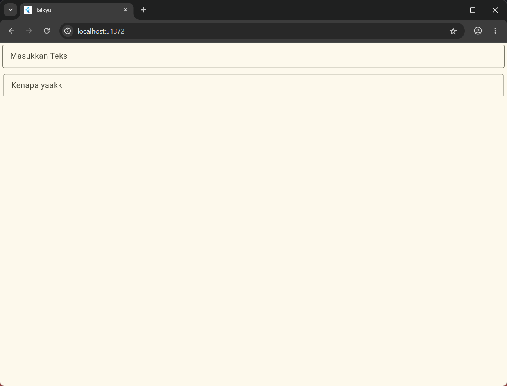

<div align="center">

# LAPORAN PRAKTIKUM
# APLIKASI BERBASIS PLATFORM


## MODUL 5 & 6
## FONT & TEXT FIELD


**Disusun Oleh :**

**Sherine Naura Early Gunawan**

**2311102020**

**S1 IF-11-REG01**


**PROGRAM STUDI S1 INFORMATIKA**

**FAKULTAS INFORMATIKA**

**UNIVERSITAS TELKOM PURWOKERTO**

**2025/2026**

</div>

---

## 1. Dasar Teori

Dalam pengembangan aplikasi berbasis Flutter, antarmuka dibangun menggunakan konsep Widget Tree dengan MaterialApp sebagai komponen tingkat atas yang mengonfigurasi fitur global seperti navigasi dan standarisasi visual melalui properti ThemeData. Arsitektur ini mengintegrasikan dua jenis manajemen state, yaitu StatelessWidget untuk komponen statis (immutable) dan StatefulWidget untuk komponen dinamis yang responsif terhadap perubahan data pada saat runtime. Untuk menyusun halaman, Scaffold digunakan sebagai kerangka tata letak utama yang menyediakan struktur dasar Material Design, di mana area kontennya dapat diatur secara vertikal menggunakan widget tata letak multi-child berupa Column. Estetika dan kerapian tata letak tersebut dikelola oleh widget Padding yang memberikan jarak dalam (inset) tertentu, sementara interaksi dan pengambilan data dari pengguna diakomodasi secara langsung melalui komponen input TextField yang bentuk visualnya dikustomisasi menggunakan InputDecoration dan OutlineInputBorder.

Secara teoretis, fungsi dari masing-masing komponen di atas dapat dijabarkan sebagai berikut:
- MaterialApp & ThemeData: MaterialApp bertindak sebagai pembungkus utama aplikasi yang mengatur fungsionalitas global (seperti navigasi dan lokalisasi), sedangkan ThemeData berfungsi sebagai pusat konfigurasi visual untuk mendefinisikan skema warna (color palette) dan tipografi secara konsisten
- StatelessWidget & StatefulWidget: StatelessWidget adalah widget yang tampilannya tidak dapat diubah setelah dirender (statis), sementara StatefulWidget memiliki objek State yang memungkinkannya memperbarui tampilan UI secara dinamis berdasarkan interaksi pengguna atau perubahan data.
- Scaffold & Column: Scaffold menyediakan slot struktural standar halaman aplikasi (seperti area body dan AppBar), sedangkan Column berfungsi menyusun elemen-elemen anak di dalamnya secara vertikal serta mengatur perataannya melalui sumbu silang (Cross Axis).
- Padding: Komponen layout yang berfungsi untuk memberikan ruang kosong atau jarak dalam (spacing) di sekitar widget anak, dengan konfigurasi yang dapat diatur secara merata, spesifik, maupun simetris menggunakan kelas geometri EdgeInsets.
- TextField & Keserasian Komponen Input: TextField merupakan media utama untuk menerima input teks dari pengguna, yang penataan estetikanya didukung oleh InputDecoration untuk menampilkan teks petunjuk (hintText) serta OutlineInputBorder untuk memberikan garis tepi berbentuk persegi dengan sudut melengkung.

---

## 2. Source Code
```dart
import 'package:flutter/material.dart';

void main() {
  runApp(const MyApp());
}

class MyApp extends StatelessWidget {
  const MyApp({super.key});

  // This widget is the root of your application.
  @override
  Widget build(BuildContext context) {
    return MaterialApp(
      title: 'Talkyu',
      theme: ThemeData(
        colorScheme: ColorScheme.fromSeed(seedColor: Colors.yellowAccent),
      ),
      home: const MyHomePage(title: 'Talkyu'),
      debugShowCheckedModeBanner: false,
    );
  }
}

class MyHomePage extends StatefulWidget {
  const MyHomePage({super.key, required this.title});

  final String title;

  @override
  State<MyHomePage> createState() => _MyHomePageState();
}

class _MyHomePageState extends State<MyHomePage> {
  @override
  Widget build(BuildContext context) {
    return Scaffold(
      body: Column(
        crossAxisAlignment: CrossAxisAlignment.end,
        children: <Widget>[
          const Padding(
            padding: EdgeInsets.symmetric(horizontal: 4, vertical: 4),
            child: TextField(
              decoration: InputDecoration(
                hintText: "Masukkan Teks",
                border: OutlineInputBorder(),
              ),
            ),
          ),
          Padding(
            padding: EdgeInsetsGeometry.symmetric(horizontal: 6, vertical: 8),
            child: TextField(
              decoration: InputDecoration(
                hintText: "Kenapa yaakk",
                border: OutlineInputBorder(),
              ),
            ),
          ),
        ],
      ),
    );
  }
}
```

### Penjelasan kode
```dart
void main() {
  runApp(const MyApp());
}

class MyApp extends StatelessWidget {
  const MyApp({super.key});

  @override
  Widget build(BuildContext context) {
    return MaterialApp(
      title: 'Talkyu',
      theme: ThemeData(
        colorScheme: ColorScheme.fromSeed(seedColor: Colors.yellowAccent),
      ),
      home: const MyHomePage(title: 'Talkyu'),
      debugShowCheckedModeBanner: false,
    );
  }
}
```
**Penjelasan:** Fungsi main() merupakan fungsi utama (entry point) yang dieksekusi pertama kali oleh mesin Dart untuk menjalankan siklus hidup aplikasi melalui pemanggilan fungsi internal runApp(). Pada komponen root, kelas MyApp diimplementasikan dengan mewarisi karakteristik dari StatelessWidget, sebuah kelas abstrak untuk membuat komponen antarmuka yang bersifat immutable (konfigurasi data di dalamnya tidak dapat diubah setelah proses render selesai).

Di dalam metode build, widget ini mengembalikan objek MaterialApp yang bertindak sebagai generator utama komponen berbasis Material Design. Objek ini mengonfigurasi properti title sebagai pengenal aplikasi pada sistem operasi, properti debugShowCheckedModeBanner untuk mengontrol visibilitas penanda debug, serta properti theme yang mengintegrasikan kelas ThemeData.

---
```dart
class MyHomePage extends StatefulWidget {
  const MyHomePage({super.key, required this.title});

  final String title;

  @override
  State<MyHomePage> createState() => _MyHomePageState();
}
```
**Penjelasan:** Kelas MyHomePage dideklarasikan sebagai StatefulWidget, yaitu jenis widget yang bersifat mutable dan dirancang untuk memfasilitasi komponen antarmuka yang dapat berubah bentuk atau datanya secara dinamis selama aplikasi berjalan (runtime). Komponen ini memiliki sebuah parameter wajib bertipe data variabel String bernama title yang dilewatkan melalui constructor menggunakan kata kunci argument required.

---
```dart
return Scaffold(
      body: Column(
        crossAxisAlignment: CrossAxisAlignment.end,
        children: <Widget>[
            ...
        ],
    )
)
```
**Penjelasan:** Widget Column merupakan sebuah komponen tata letak bertipe multi-child layout widget yang memiliki fungsi utama untuk menyusun koordinat deretan widget anak yang terdaftar di dalam properti berupa array children secara vertikal (berurutan dari atas ke bawah). Komponen ini memiliki parameter kontrol orientasi objek berupa sumbu utama (Main Axis) dan sumbu silang (Cross Axis).

Dengan menyematkan nilai properti crossAxisAlignment: CrossAxisAlignment.end, pengembang memberikan instruksi kepada framework untuk menyelaraskan seluruh perataan posisi elemen anak pada sumbu silang secara horizontal agar merapat rata kanan mengikuti batas maksimal dimensi lebar kontainer pembungkusnya.

---
```dart
padding: EdgeInsets.symmetric(horizontal: 4, vertical: 4),
            child: TextField(...)
```
**Penjelasan:** Padding merupakan komponen tata letak struktural (single-child layout) yang berfungsi khusus untuk mengisolasi widget anak (child) dengan cara menyisipkan ruang kosong atau jarak aman (inset) di sekeliling dimensi luar widget tersebut. Properti utama pada widget ini adalah padding yang memerlukan pasokan data objek geometris dari kelas EdgeInsets. Konstruktor `.symmetric(horizontal: 4, vertical: 4)` digunakan untuk mengeksekusi pembagian ruang spasial yang seimbang secara berpasangan, yakni menyisipkan jarak ruang dalam sebesar 4 piksel pada sisi horizontal (kiri dan kanan) sekaligus sebesar 4 piksel pada sisi vertikal (atas dan bawah) objek secara presisi.

---
```dart
TextField(
              decoration: InputDecoration(
                hintText: "Masukkan Teks",
                border: OutlineInputBorder(),
              ),
            ),
```
**Penjelasan:** TextField merupakan komponen kontrol antarmuka pengguna (UI controller) paling utama yang berfungsi untuk menjembatani komunikasi data dari pengguna dengan cara membuka akses papan ketik virtual (soft keyboard) dan merekam masukan data berupa teks ke dalam memori aplikasi. Komponen input ini dikustomisasi secara spesifik menggunakan properti decoration yang menerima instansiasi dari objek kelas InputDecoration.
---

## 3. Hasil

<div align="center">
    
</div>