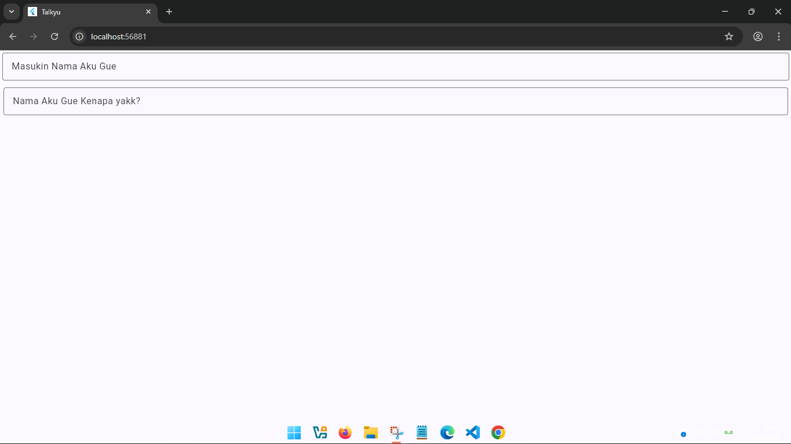

<div align="center">
  <br />
  <h1>LAPORAN PRAKTIKUM <br>APLIKASI BERBASIS PLATFORM</h1>
  <br />
  <h3>MODUL 05-06 - Mobile <br> Flutter  </h3>
  <br />
   
  <br />
  <br />
  <br />
  <h3>Disusun Oleh :</h3>
  <p>
    <strong>Rizal Dwi Anggoro</strong><br>
    <strong>2311102034</strong><br>
    <strong>IF-11-REG01</strong>
  </p>
  <br />
  <h3>Dosen Pengampu :</h3>
  <p>
    <strong>Dimas Fanny Hebrasianto Permadi, S.ST., M.Kom</strong>
  </p>
  <br />
  <br />
    <h4>Asisten Praktikum :</h4>
    <strong> Apri Pandu Wicaksono </strong> <br>
    <strong>Rangga Pradarrell Fathi</strong>
  <br />
  <h3>LABORATORIUM HIGH PERFORMANCE
 <br>FAKULTAS INFORMATIKA <br>UNIVERSITAS TELKOM PURWOKERTO <br>2026</h3>
</div>

---
## 1. Code dan Penjelasan
### Code :
```dart
import 'package:flutter/material.dart';

void main() {
  runApp(const MyApp());
}

class MyApp extends StatelessWidget {
  const MyApp({super.key});

  // This widget is the root of your application.
  @override
  Widget build(BuildContext context) {
    return MaterialApp(
      title: 'Talkyu',
      theme: ThemeData(
        colorScheme: .fromSeed(seedColor: const Color.fromARGB(255, 58, 60, 183)),
      ),
      home: const MyHomePage(title: 'Talkyu'),
      debugShowCheckedModeBanner: false,
    );
  }
}

class MyHomePage extends StatefulWidget {
  const MyHomePage({super.key, required this.title});

  final String title;

  @override
  State<MyHomePage> createState() => _MyHomePageState();
}
class _MyHomePageState extends State<MyHomePage> {
  @override
  Widget build(BuildContext context) {
    return Scaffold(
      body: Column(
        crossAxisAlignment: CrossAxisAlignment.end,
        children: <Widget>[
          const Padding(
            padding: EdgeInsets.symmetric(
              horizontal: 4,
              vertical: 4,
            ),
            child: TextField(
              decoration: InputDecoration(
                labelText: "Masukin Nama Aku Gue",
                border: OutlineInputBorder(),
              ),
            ),
          ),

          const Padding(
            padding: EdgeInsets.symmetric(
              horizontal: 6,
              vertical: 8,
            ),
            child: TextField(
              decoration: InputDecoration(
                labelText: "Nama Aku Gue Kenapa yakk?",
                border: OutlineInputBorder(),
              ),
            ),
          ),
        ],
      ),
    );
  }
}
```
### Penjelasan Code Flutter

### 1. Import Package Flutter

```dart
import 'package:flutter/material.dart';
```
Digunakan untuk mengambil library Flutter Material Design.

Library ini berisi widget seperti:

- Scaffold
- TextField
- Column
- MaterialApp, dll

### 2. Fungsi main()
```dart
void main() {
  runApp(const MyApp());
}
```
`main()` adalah fungsi pertama yang dijalankan saat aplikasi dibuka.

Fungsi `runApp()`

Digunakan untuk menjalankan widget utama aplikasi.

Widget utama pada aplikasi ini adalah: `MyApp()`

### 3. Class MyApp
```dart
class MyApp extends StatelessWidget
```
`MyApp` merupakan widget utama aplikasi yang menggunakan StatelessWidget.

Artinya: Tampilan bersifat statis dan tidak memiliki data yang berubah.

### 4. Constructor MyApp
```dart
const MyApp({super.key});
```
Digunakan untuk membuat object `MyApp.`

`super.key`

Digunakan Flutter untuk identitas widget.

### 5. Method build()
```dart
Widget build(BuildContext context)
```
Method untuk membuat tampilan UI.

### 6. MaterialApp
```dart
return MaterialApp(
```
Widget utama untuk aplikasi berbasis Material Design.

Berfungsi untuk:

- mengatur tema aplikasi
- halaman utama
- title aplikasi
- debug banner

### 7. Title Aplikasi
```dart
title: 'Talkyu',
```
Menentukan nama aplikasi.

### 8. ThemeData
```dart
theme: ThemeData(
```
Digunakan untuk mengatur tema aplikasi.

### 9. Color Scheme
```dart
colorScheme: ColorScheme.fromSeed(
```
Digunakan untuk membuat kombinasi warna otomatis berdasarkan warna utama.

### 10. Seed Color
```dart
seedColor: const Color.fromARGB(255, 58, 60, 183)
```
Menentukan warna utama aplikasi.

### 11. Home
```dart
home: const MyHomePage(title: 'Talkyu'),
```
Menentukan halaman pertama yang dibuka saat aplikasi berjalan.

### 12. Debug Banner
```dart
debugShowCheckedModeBanner: false,
```
Menghilangkan tulisan DEBUG di pojok aplikasi.

### 13. StatefulWidget
```dart
class MyHomePage extends StatefulWidget
```
Menggunakan `StatefulWidget.`

Artinya halaman:
- dapat berubah
- `dapat menyimpan data/state

### 14. Constructor
```dart
const MyHomePage({super.key, required this.title});
```
required `this.title` berarti parameter `title` wajib diisi.

### 15. Variable Title
```dart
final String title;
```
Menyimpan data `title`. `final` berarti nilainya tidak dapat diubah kembali.

### 16. createState()
```dart
State<MyHomePage> createState() => _MyHomePageState();
```
Digunakan untuk menghubungkan widget dengan state-nya.

### 17. Class State
```dart
class _MyHomePageState extends State<MyHomePage>
```
Tempat untuk:
- menyimpan data
- membuat logic aplikasi
- mengatur perubahan tampilan

### 18. Scaffold
```dart
return Scaffold(
```
Kerangka dasar halaman Flutter.

Biasanya berisi:
- AppBar
- Body
- Drawer
- FloatingActionButton

### 19. Body
```dart
body: Column(
```
Isi utama halaman aplikasi.

### 20. Column
```dart
Column(
```
Widget untuk menyusun widget secara vertikal (ke bawah).

### 21. CrossAxisAlignment
```dart
crossAxisAlignment: CrossAxisAlignment.end,
```
Mengatur posisi horizontal widget di dalam Column. `end` berarti rata kanan.

### 22. Children
```dart
children: <Widget>[
```
Berisi daftar widget di dalam Column.

### 23. Padding
```dart
Padding(
```
Digunakan untuk memberikan jarak/spasi.

### 24. EdgeInsets.symmetric
```dart
EdgeInsets.symmetric(
  horizontal: 4,
  vertical: 4,
)
```
Memberikan padding:
- kanan kiri = 4
- atas bawah = 4

### 25. TextField
```dart
TextField(
```
Widget input text.

### 26. InputDecoration
```dart
decoration: InputDecoration(
```
Digunakan untuk mengatur tampilan TextField.

### 27. Label Text
```dart
labelText: "Masukin Nama Aku Gue",
```
Tulisan petunjuk pada TextField.

### 28. OutlineInputBorder
```dart
border: OutlineInputBorder(),
```
Memberikan border kotak pada TextField.

---
## 2. Hasil



