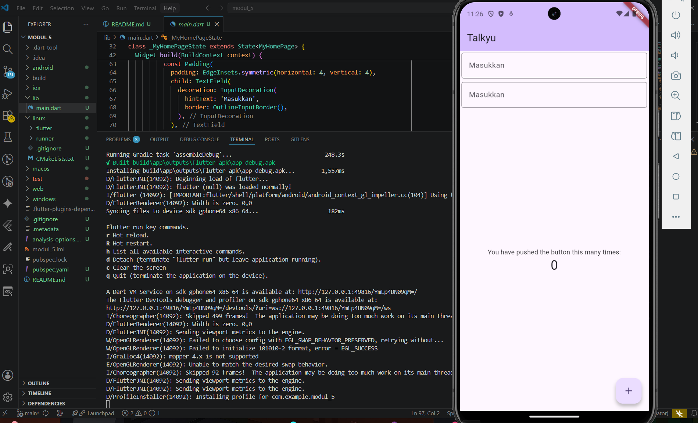

<div align="center">
  <br />

  <h1>LAPORAN PRAKTIKUM <br>
  APLIKASI BERBASIS PLATFORM
  </h1>

  <br />

  <h3>Modul 5- 6 Flutter</h3>
FONT & TEXTFIELD
  <br>
  
  </h3>

  <br />

  <p align="center">

</p>

  <br />
  <br />
  <br />

  <h3>Disusun Oleh :</h3>

  <p>
    <strong>Abda Firas Rahman</strong><br>
    <strong>2311102049</strong><br>
    <strong>S1 IF-11-REG01</strong>
  </p>

  <br />

  <h3>Dosen Pengampu :</h3>

  <p>
    <strong>Dimas Fanny Hebrasianto Permadi, S.ST., M.Kom</strong>
  </p>
  
  <br />
  <br />
    <h4>Asisten Praktikum :</h4>
    <strong>Apri Pandu Wicaksono </strong> <br>
    <strong>Rangga Pradarrell Fathi</strong>
  <br />

  <h3>LABORATORIUM HIGH PERFORMANCE
 <br>FAKULTAS INFORMATIKA <br>UNIVERSITAS TELKOM PURWOKERTO <br>2026</h3>
</div>

<hr>

### Dasar Teori
Dalam pengembangan aplikasi menggunakan Flutter, terdapat beberapa widget dasar yang berperan penting dalam membangun tampilan antarmuka pengguna (UI). Widget Scaffold digunakan sebagai kerangka utama halaman aplikasi karena menyediakan bagian-bagian penting seperti AppBar, body, dan FloatingActionButton. Kemudian, widget Column berfungsi untuk menyusun beberapa widget secara vertikal dari atas ke bawah agar tata letak lebih terstruktur.

Selain itu, widget Padding digunakan untuk memberikan jarak antar komponen sehingga tampilan aplikasi menjadi lebih rapi dan nyaman dilihat. Program ini juga memanfaatkan TextField sebagai tempat pengguna memasukkan teks, yang dilengkapi dengan InputDecoration untuk menambahkan hintText serta garis tepi pada kolom input agar lebih mudah dipahami pengguna.

Selanjutnya, FloatingActionButton digunakan sebagai tombol aksi untuk menambahkan nilai counter. Aplikasi ini juga menerapkan StatefulWidget supaya data dapat berubah secara dinamis dan tampilan aplikasi bisa diperbarui menggunakan method setState() ketika terjadi perubahan data.

### Code Program
```dart
import 'package:flutter/material.dart';

void main() {
  runApp(const MyApp());
}

class MyApp extends StatelessWidget {
  const MyApp({super.key});

  @override
  Widget build(BuildContext context) {
    return MaterialApp(
      title: 'Talkyu',
      theme: ThemeData(
        colorScheme: ColorScheme.fromSeed(seedColor: Colors.deepPurple),
        useMaterial3: true,
      ),
      home: const MyHomePage(title: 'Talkyu'),
    );
  }
}

class MyHomePage extends StatefulWidget {
  const MyHomePage({super.key, required this.title});

  final String title;

  @override
  State<MyHomePage> createState() => _MyHomePageState();
}

class _MyHomePageState extends State<MyHomePage> {
  int _counter = 0;

  void _incrementCounter() {
    setState(() {
      _counter++;
    });
  }

  @override
  Widget build(BuildContext context) {
    return Scaffold(
      appBar: AppBar(
        backgroundColor: Theme.of(context).colorScheme.inversePrimary,
        title: Text(widget.title),
      ),
      body: Column(
        crossAxisAlignment: CrossAxisAlignment.end,
        children: <Widget>[
          // Input pertama
          const Padding(
            padding: EdgeInsets.symmetric(horizontal: 4, vertical: 4),
            child: TextField(
              decoration: InputDecoration(
                hintText: 'Masukkan',
                border: OutlineInputBorder(),
              ),
            ),
          ),

          
          const Padding(
            padding: EdgeInsets.symmetric(horizontal: 4, vertical: 4),
            child: TextField(
              decoration: InputDecoration(
                hintText: 'Masukkan',
                border: OutlineInputBorder(),
              ),
            ),
          ),

          
          Expanded(
            child: Column(
              mainAxisAlignment: MainAxisAlignment.center,
              children: [
                const Center(
                  child: Text('You have pushed the button this many times:'),
                ),
                Text(
                  '$_counter',
                  style: Theme.of(context).textTheme.headlineMedium,
                ),
              ],
            ),
          ),
        ],
      ),
      floatingActionButton: FloatingActionButton(
        onPressed: _incrementCounter,
        tooltip: 'Increment',
        child: const Icon(Icons.add),
      ),
    );
  }
}
```

## Tampilan


Program di atas merupakan aplikasi sederhana berbasis Flutter yang menampilkan dua kolom input serta fitur counter yang dapat bertambah ketika tombol ditekan. Aplikasi ini dibuat menggunakan konsep dasar Flutter seperti StatelessWidget, StatefulWidget, Scaffold, Column, TextField, dan FloatingActionButton.

Pada bagian main(), program menjalankan widget utama yaitu MyApp menggunakan fungsi runApp(). Widget MyApp merupakan turunan dari StatelessWidget yang digunakan untuk mengatur konfigurasi awal aplikasi, seperti judul aplikasi (title), tema (ThemeData), serta halaman utama aplikasi melalui home.

Halaman utama aplikasi berada pada class MyHomePage yang menggunakan StatefulWidget. Penggunaan StatefulWidget bertujuan agar data pada aplikasi dapat berubah secara dinamis, khususnya pada nilai counter. Perubahan data tersebut dikelola pada class _MyHomePageState.

Di dalam _MyHomePageState, terdapat variabel integer _counter yang digunakan untuk menyimpan jumlah penekanan tombol. Method _incrementCounter() berfungsi untuk menambah nilai counter menggunakan setState(). Fungsi setState() digunakan agar tampilan aplikasi diperbarui secara otomatis ketika nilai berubah.

Bagian tampilan aplikasi dibangun menggunakan widget Scaffold. Widget ini menyediakan struktur dasar halaman seperti AppBar, body, dan FloatingActionButton. Pada AppBar, ditampilkan judul aplikasi yaitu “Talkyu”.

Isi utama aplikasi berada pada bagian body yang menggunakan widget Column untuk menyusun komponen secara vertikal. Di dalamnya terdapat dua TextField yang dibungkus menggunakan Padding agar memiliki jarak antar komponen sehingga tampilan lebih rapi. Masing-masing TextField menggunakan InputDecoration dengan hintText “Masukkan” dan OutlineInputBorder() untuk memberikan garis tepi pada kolom input.

Selain itu, terdapat widget Expanded yang digunakan agar bagian counter mengisi sisa ruang pada layar. Di dalamnya terdapat teks informasi dan nilai counter yang ditampilkan menggunakan widget Text. Nilai counter akan bertambah setiap kali pengguna menekan tombol FloatingActionButton yang berada di pojok kanan bawah aplikasi.