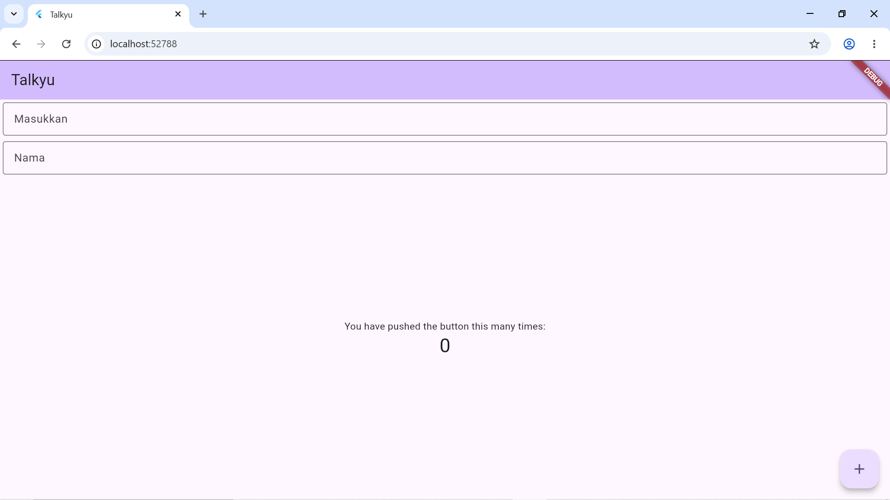

<div align="center">
  <br />

  <h1>
    LAPORAN PRAKTIKUM <br>
    APLIKASI BERBASIS PLATFORM
  </h1>

  <br />

  <h3>Modul 5-6 Flutter</h3>
  <h3>FONT & TEXTFIELD</h3>

  <br />

  <p align="center">
    
  </p>

  <br />
  <br />
  <br />

  <h3>Disusun Oleh :</h3>

  <p>
    <strong>Nia Novela Ariandini</strong><br>
    <strong>2311102057</strong><br>
    <strong>S1 IF-11-01</strong>
  </p>

  <br />

  <h3>Dosen Pengampu :</h3>

  <p>
    <strong>Dimas Fanny Hebrasianto Permadi, S.ST., M.Kom</strong>
  </p>
  
  <br />
  <br />

  <h4>Asisten Praktikum :</h4>

  <strong>Apri Pandu Wicaksono</strong><br>
  <strong>Rangga Pradarrell Fathi</strong>

  <br />
  <br />

  <h3>
    LABORATORIUM HIGH PERFORMANCE
    <br>FAKULTAS INFORMATIKA
    <br>UNIVERSITAS TELKOM PURWOKERTO
    <br>2026
  </h3>
</div>

<hr>

## Dasar Teori

Flutter merupakan framework yang digunakan untuk membuat aplikasi multiplatform dengan satu basis kode. Dalam Flutter, tampilan aplikasi dibangun menggunakan widget. Setiap bagian pada aplikasi, seperti teks, tombol, layout, dan input, dapat dibuat menggunakan widget yang sudah disediakan oleh Flutter.

Pada program ini, widget `MaterialApp` digunakan sebagai struktur utama aplikasi. Widget ini berfungsi untuk mengatur tema, judul aplikasi, dan halaman utama yang akan ditampilkan. Selanjutnya, `Scaffold` digunakan sebagai kerangka dasar halaman aplikasi yang berisi beberapa bagian seperti `AppBar`, `body`, dan `FloatingActionButton`.

Widget `Column` digunakan untuk menyusun beberapa komponen secara vertikal dari atas ke bawah. Selain itu, `Padding` digunakan untuk memberikan jarak pada setiap komponen agar tampilan tidak terlalu mepet dan terlihat lebih rapi. Pada program ini juga digunakan widget `TextField` sebagai kolom input teks dari pengguna.

Untuk memperjelas fungsi dari kolom input, digunakan `InputDecoration` yang berisi `hintText`. Pada `TextField` pertama, hint yang ditampilkan adalah “Masukkan”, sedangkan pada `TextField` kedua adalah “Nama”. Selain itu, kedua `TextField` menggunakan `OutlineInputBorder()` agar kolom input memiliki garis tepi.

Program ini menggunakan `StatefulWidget` karena terdapat data yang dapat berubah, yaitu nilai counter. Nilai counter akan bertambah ketika tombol `FloatingActionButton` ditekan. Perubahan nilai dilakukan melalui method `_incrementCounter()` dengan bantuan `setState()`, sehingga tampilan aplikasi dapat diperbarui secara otomatis ketika nilai counter berubah.


## Code Program

```dart
import 'package:flutter/material.dart';

void main() {
  runApp(const MyApp());
}

class MyApp extends StatelessWidget {
  const MyApp({super.key});

  @override
  Widget build(BuildContext context) {
    return MaterialApp(
      title: 'Talkyu',
      theme: ThemeData(
        // Menambahkan ColorScheme yang benar
        colorScheme: ColorScheme.fromSeed(seedColor: Colors.deepPurple),
        useMaterial3: true,
      ),
      home: const MyHomePage(title: 'Talkyu'),
    );
  }
}

class MyHomePage extends StatefulWidget {
  const MyHomePage({super.key, required this.title});

  final String title;

  @override
  State<MyHomePage> createState() => _MyHomePageState();
}

class _MyHomePageState extends State<MyHomePage> {
  int _counter = 0;

  void _incrementCounter() {
    setState(() {
      _counter++;
    });
  }

  @override
  Widget build(BuildContext context) {
    return Scaffold(
      appBar: AppBar(
        backgroundColor: Theme.of(context).colorScheme.inversePrimary,
        title: Text(widget.title),
      ),
      body: Column(
        crossAxisAlignment: CrossAxisAlignment.end,
        children: <Widget>[
          const Padding(
            padding: EdgeInsets.symmetric(horizontal: 4, vertical: 4),
            child: TextField(
              decoration: InputDecoration(
                hintText: "Masukkan",
                border: OutlineInputBorder(),
              ),
            ),
          ),
          const Padding(
            padding: EdgeInsets.symmetric(horizontal: 4, vertical: 4),
            child: TextField(
              decoration: InputDecoration(
                hintText: "Nama",
                border: OutlineInputBorder(),
              ),
            ),
          ),
          Expanded(
            child: Column(
              mainAxisAlignment: MainAxisAlignment.center,
              children: [
                const Center(
                  child: Text('You have pushed the button this many times:'),
                ),
                Text(
                  '$_counter',
                  style: Theme.of(context).textTheme.headlineMedium,
                ),
              ],
            ),
          ),
        ],
      ),
      floatingActionButton: FloatingActionButton(
        onPressed: _incrementCounter,
        tooltip: 'Increment',
        child: const Icon(Icons.add),
      ),
    );
  }
}
```
## Penjelasan Program

Program Flutter ini diawali dengan melakukan import package material melalui kode `import 'package:flutter/material.dart';`. Package tersebut digunakan karena aplikasi memakai komponen Material Design seperti `MaterialApp`, `Scaffold`, `AppBar`, `TextField`, dan `FloatingActionButton`.

Selanjutnya, terdapat fungsi `main()` sebagai fungsi utama yang pertama kali dijalankan saat aplikasi dibuka. Di dalam fungsi tersebut terdapat `runApp(const MyApp());` yang berfungsi untuk menjalankan widget utama aplikasi, yaitu `MyApp`.

Class `MyApp` merupakan turunan dari `StatelessWidget`. Pada bagian ini, aplikasi menggunakan `MaterialApp` sebagai struktur utama. Di dalam `MaterialApp`, terdapat title aplikasi dengan nama `Talkyu`, pengaturan tema menggunakan `ThemeData`, serta penggunaan `ColorScheme.fromSeed` dengan warna dasar `Colors.deepPurple`. Aplikasi juga menggunakan `useMaterial3: true`, sehingga tampilan mengikuti gaya Material Design versi terbaru.

Halaman utama aplikasi diarahkan ke `MyHomePage` dengan judul `Talkyu`. Class `MyHomePage` dibuat sebagai `StatefulWidget` karena terdapat data counter yang nilainya dapat berubah selama aplikasi berjalan. Data counter tersebut disimpan dalam variabel `_counter` dengan nilai awal `0`.

Pada class `_MyHomePageState`, terdapat method `_incrementCounter()` yang digunakan untuk menambahkan nilai counter. Di dalam method tersebut terdapat `setState()`, yang berfungsi untuk memperbarui tampilan ketika nilai `_counter` berubah. Jadi, setiap tombol tambah ditekan, nilai counter akan bertambah satu dan langsung muncul di layar.

Bagian tampilan utama aplikasi dibuat menggunakan `Scaffold`. Pada bagian `AppBar`, judul aplikasi ditampilkan menggunakan `Text(widget.title)`. Warna `AppBar` diambil dari tema aplikasi dengan kode `Theme.of(context).colorScheme.inversePrimary`.

Pada bagian `body`, widget disusun menggunakan `Column`. Properti `crossAxisAlignment: CrossAxisAlignment.end` digunakan agar isi dalam `Column` mengikuti posisi ke arah kanan pada sumbu horizontal. Di dalam `Column` terdapat dua buah `TextField` yang masing-masing dibungkus dengan widget `Padding`.

`TextField` pertama memiliki `hintText` berupa “Masukkan”, sedangkan `TextField` kedua memiliki `hintText` berupa “Nama”. Kedua `TextField` juga menggunakan `OutlineInputBorder()` agar memiliki garis tepi pada kolom input. Padding pada masing-masing `TextField` menggunakan `EdgeInsets.symmetric(horizontal: 4, vertical: 4)` untuk memberikan jarak horizontal dan vertikal.

Selanjutnya, terdapat widget `Expanded` yang digunakan untuk mengisi sisa ruang kosong pada layar. Di dalamnya terdapat `Column` dengan `mainAxisAlignment: MainAxisAlignment.center`, sehingga teks counter berada di tengah area yang tersedia. Teks pertama menampilkan keterangan “You have pushed the button this many times:”, sedangkan teks kedua menampilkan nilai dari variabel `_counter`.

Pada bagian bawah halaman terdapat `FloatingActionButton` dengan ikon tambah. Tombol ini menjalankan method `_incrementCounter` ketika ditekan. Jadi, setiap pengguna menekan tombol tersebut, nilai counter akan bertambah dan tampilan akan diperbarui secara otomatis.

## Tampilan



## Kesimpulan

Berdasarkan praktikum yang telah dilakukan, dapat disimpulkan bahwa Flutter menyediakan berbagai widget yang dapat digunakan untuk membuat tampilan aplikasi secara mudah dan terstruktur. Pada program ini, `MaterialApp` digunakan sebagai struktur utama aplikasi, sedangkan `Scaffold` digunakan sebagai kerangka halaman yang berisi `AppBar`, `body`, dan `FloatingActionButton`.

Program ini juga menggunakan dua buah `TextField` sebagai kolom input teks dengan bantuan `InputDecoration`, `hintText`, dan `OutlineInputBorder` agar tampilan input menjadi lebih jelas dan rapi. Selain itu, penggunaan `Padding` membuat jarak antar komponen menjadi lebih tertata.

Aplikasi ini menggunakan `StatefulWidget` karena terdapat nilai counter yang dapat berubah ketika tombol ditekan. Dengan menggunakan `setState()`, perubahan nilai counter dapat langsung ditampilkan pada layar. Dari praktikum ini, dapat dipahami bahwa penggunaan widget dasar seperti `Column`, `Padding`, `TextField`, `Expanded`, dan `FloatingActionButton` sangat penting dalam membangun tampilan aplikasi Flutter yang interaktif.