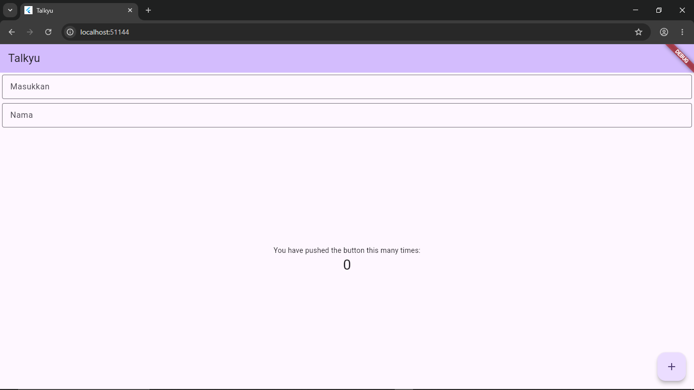

<div align="center">
  <br />
  <h1>LAPORAN PRAKTIKUM <br>APLIKASI BERBASIS PLATFORM</h1>
  <br />
  <h3>MODUL 05 06  <br> Mobile Flutter  </h3>
  <br />
   
  <br />
  <br />
  <br />
  <h3>Disusun Oleh :</h3>
  <p>
    <strong>Muhammad Hamzah Haifan Ma'ruf</strong><br>
    <strong>2311102091</strong><br>
    <strong>IF-11-REG01</strong>
  </p>
  <br />
  <h3>Dosen Pengampu :</h3>
  <p>
    <strong>Dimas Fanny Hebrasianto Permadi, S.ST., M.Kom</strong>
  </p>
  <br />
  <br />
    <h4>Asisten Praktikum :</h4>
    <strong> Apri Pandu Wicaksono </strong> <br>
    <strong>Rangga Pradarrell Fathi</strong>
  <br />
  <h3>LABORATORIUM HIGH PERFORMANCE
 <br>FAKULTAS INFORMATIKA <br>UNIVERSITAS TELKOM PURWOKERTO <br>2026</h3>
</div>

---

# Dasar Teori

## Pengertian Flutter

Flutter merupakan framework open-source yang dikembangkan oleh Google untuk membangun aplikasi mobile, web, dan desktop menggunakan satu basis kode (single codebase). Flutter menggunakan bahasa pemrograman Dart dan menyediakan berbagai widget yang dapat digunakan untuk membuat antarmuka aplikasi secara modern dan responsif.

Flutter memiliki keunggulan pada performa yang cepat karena menggunakan rendering engine sendiri serta mendukung fitur hot reload yang memudahkan developer dalam proses pengembangan aplikasi.

## Widget pada Flutter

Dalam Flutter, seluruh tampilan aplikasi dibangun menggunakan widget. Widget dibedakan menjadi dua jenis utama:

### 1. StatelessWidget

StatelessWidget adalah widget yang bersifat statis dan tidak memiliki perubahan state selama aplikasi berjalan.

Contoh:
- Text
- Icon
- AppBar

### 2. StatefulWidget

StatefulWidget adalah widget yang dapat berubah sesuai interaksi pengguna karena memiliki state yang dapat diperbarui menggunakan fungsi `setState()`.

Contoh:
- Counter
- Form input
- Checkbox

## Material Design

Flutter menyediakan package `material.dart` yang berisi kumpulan widget dengan desain Material Design milik Google seperti:
- Scaffold
- AppBar
- FloatingActionButton
- TextField
- Column

---

# Source Code Program

```dart
import 'package:flutter/material.dart';

void main() {
  runApp(const MyApp());
}

class MyApp extends StatelessWidget {
  const MyApp({super.key});

  @override
  Widget build(BuildContext context) {
    return MaterialApp(
      title: 'Talkyu',
      theme: ThemeData(
        colorScheme: ColorScheme.fromSeed(seedColor: Colors.deepPurple),
        useMaterial3: true,
      ),
      home: const MyHomePage(title: 'Talkyu'),
    );
  }
}

class MyHomePage extends StatefulWidget {
  const MyHomePage({super.key, required this.title});

  final String title;

  @override
  State<MyHomePage> createState() => _MyHomePageState();
}

class _MyHomePageState extends State<MyHomePage> {
  int _counter = 0;

  void _incrementCounter() {
    setState(() {
      _counter++;
    });
  }

  @override
  Widget build(BuildContext context) {
    return Scaffold(
      appBar: AppBar(
        backgroundColor: Theme.of(context).colorScheme.inversePrimary,
        title: Text(widget.title),
      ),
      body: Column(
        crossAxisAlignment: CrossAxisAlignment.end,
        children: <Widget>[
          const Padding(
            padding: EdgeInsets.symmetric(horizontal: 4, vertical: 4),
            child: TextField(
              decoration: InputDecoration(
                hintText: "Masukkan",
                border: OutlineInputBorder(),
              ),
            ),
          ),
          const Padding(
            padding: EdgeInsets.symmetric(horizontal: 4, vertical: 4),
            child: TextField(
              decoration: InputDecoration(
                hintText: "Nama",
                border: OutlineInputBorder(),
              ),
            ),
          ),
          Expanded(
            child: Column(
              mainAxisAlignment: MainAxisAlignment.center,
              children: [
                const Center(
                  child: Text('You have pushed the button this many times:'),
                ),
                Text(
                  '$_counter',
                  style: Theme.of(context).textTheme.headlineMedium,
                ),
              ],
            ),
          ),
        ],
      ),
      floatingActionButton: FloatingActionButton(
        onPressed: _incrementCounter,
        tooltip: 'Increment',
        child: const Icon(Icons.add),
      ),
    );
  }
}
```

---

# Penjelasan Code

## 1. Import Package

```dart
import 'package:flutter/material.dart';
```

Digunakan untuk mengimpor library Material Design Flutter yang berisi widget-widget utama seperti Scaffold, TextField, AppBar, dan lainnya.

---

## 2. Fungsi Main

```dart
void main() {
  runApp(const MyApp());
}
```

Fungsi `main()` merupakan titik awal program Flutter.  
`runApp()` digunakan untuk menjalankan widget utama aplikasi yaitu `MyApp`.

---

## 3. Class MyApp

```dart
class MyApp extends StatelessWidget
```

Class ini merupakan StatelessWidget yang digunakan sebagai root aplikasi.

### Fungsi MaterialApp

```dart
return MaterialApp(
```

Digunakan untuk konfigurasi aplikasi Flutter seperti:
- Title aplikasi
- Theme aplikasi
- Halaman utama

---

## 4. ThemeData dan ColorScheme

```dart
theme: ThemeData(
  colorScheme: ColorScheme.fromSeed(seedColor: Colors.deepPurple),
  useMaterial3: true,
),
```

Digunakan untuk mengatur tema aplikasi menggunakan Material Design 3 dengan warna utama ungu.

---

## 5. StatefulWidget

```dart
class MyHomePage extends StatefulWidget
```

Digunakan karena aplikasi memiliki data yang berubah yaitu nilai counter.

---

## 6. Variabel Counter

```dart
int _counter = 0;
```

Digunakan untuk menyimpan jumlah penekanan tombol.

---

## 7. Fungsi Increment

```dart
void _incrementCounter() {
  setState(() {
    _counter++;
  });
}
```

Fungsi ini digunakan untuk menambahkan nilai counter setiap tombol ditekan.

`setState()` digunakan untuk memperbarui tampilan UI secara otomatis.

---

## 8. Scaffold

```dart
return Scaffold(
```

Scaffold merupakan struktur dasar tampilan aplikasi Flutter.

Scaffold berisi:
- AppBar
- Body
- FloatingActionButton

---

## 9. TextField

```dart
TextField(
  decoration: InputDecoration(
    hintText: "Masukkan",
  ),
)
```

Digunakan untuk menerima input teks dari pengguna.

Pada program terdapat dua TextField:
1. Input “Masukkan”
2. Input “Nama”

---

## 10. FloatingActionButton

```dart
FloatingActionButton(
  onPressed: _incrementCounter,
)
```

Digunakan sebagai tombol aksi untuk menambah nilai counter.

---

# Hasil Tampilan Program


---

# Kesimpulan

Berdasarkan praktikum yang telah dilakukan, dapat disimpulkan bahwa Flutter mempermudah proses pengembangan aplikasi mobile karena menggunakan sistem widget yang fleksibel dan modern. Pada praktikum ini berhasil dibuat aplikasi sederhana menggunakan:
- StatelessWidget
- StatefulWidget
- TextField
- AppBar
- FloatingActionButton

Selain itu, penggunaan fungsi `setState()` memungkinkan tampilan aplikasi diperbarui secara dinamis ketika terjadi perubahan data.
