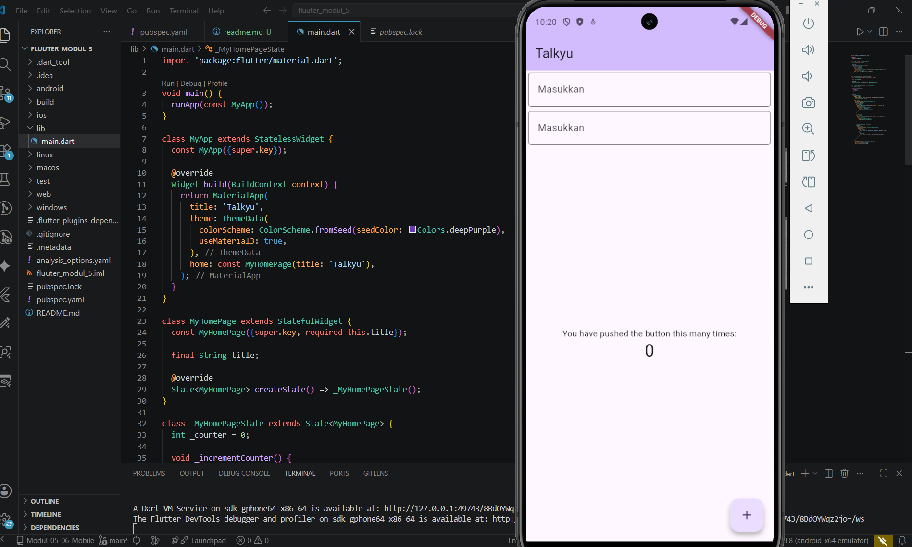

<div align="center">
  <br />

  <h1>LAPORAN PRAKTIKUM <br>
  APLIKASI BERBASIS PLATFORM
  </h1>

  <br />

  <h3>Modul 5- 6 Flutter</h3>
FONT & TEXTFIELD
  <br>
  
  </h3>

  <br />

  <p align="center">

</p>

  <br />
  <br />
  <br />

  <h3>Disusun Oleh :</h3>

  <p>
    <strong>Aisyah Anis Mazaya </strong><br>
    <strong>2311102095</strong><br>
    <strong>S1 IF-11-REG01</strong>
  </p>

  <br />

  <h3>Dosen Pengampu :</h3>

  <p>
    <strong>Dimas Fanny Hebrasianto Permadi, S.ST., M.Kom</strong>
  </p>
  
  <br />
  <br />
    <h4>Asisten Praktikum :</h4>
    <strong>Apri Pandu Wicaksono </strong> <br>
    <strong>Rangga Pradarrell Fathi</strong>
  <br />

  <h3>LABORATORIUM HIGH PERFORMANCE
 <br>FAKULTAS INFORMATIKA <br>UNIVERSITAS TELKOM PURWOKERTO <br>2026</h3>
</div>

<hr>

### Dasar Teori
Dalam pengembangan aplikasi menggunakan Flutter, terdapat beberapa widget dasar yang digunakan untuk membangun antarmuka pengguna (UI). Scaffold digunakan sebagai struktur dasar halaman aplikasi yang menyediakan area seperti AppBar, body, dan FloatingActionButton. Widget Column berfungsi untuk menyusun beberapa widget secara vertikal dari atas ke bawah. Selanjutnya, Padding digunakan untuk memberikan jarak antar komponen agar tampilan lebih rapi dan nyaman dilihat. Program ini juga menggunakan TextField sebagai media input teks dari pengguna dengan tambahan InputDecoration untuk menampilkan hintText dan garis tepi input. Selain itu, digunakan FloatingActionButton sebagai tombol aksi untuk menambahkan nilai counter sedangkan StatefulWidget digunakan agar data pada aplikasi dapat berubah dan diperbarui secara dinamis menggunakan setState().


## Tampilan


Program Flutter di atas menggunakan MaterialApp sebagai struktur utama aplikasi dengan halaman utama berupa StatefulWidget agar data counter dapat berubah secara dinamis. Pada bagian Scaffold terdapat AppBar, body, dan FloatingActionButton. Isi halaman disusun menggunakan widget Column supaya komponen dapat ditampilkan secara vertikal dari atas ke bawah.

Di dalam body terdapat dua buah TextField yang dibungkus dengan Padding untuk memberikan jarak antar komponen agar tampilan lebih rapi. Kedua input menggunakan OutlineInputBorder() sehingga memiliki garis tepi serta hintText sebagai teks petunjuk input. Selain itu, digunakan widget Expanded agar sisa ruang layar dapat dimanfaatkan untuk menampilkan counter di bagian tengah halaman.

Nilai counter disimpan pada variabel _counter dan akan bertambah setiap tombol FloatingActionButton ditekan. Perubahan nilai dilakukan melalui method _incrementCounter() yang menggunakan setState() sehingga tampilan aplikasi dapat diperbarui secara otomatis.
 
### Code Program
```dart
import 'package:flutter/material.dart';

void main() {
  runApp(const MyApp());
}

class MyApp extends StatelessWidget {
  const MyApp({super.key});

  @override
  Widget build(BuildContext context) {
    return MaterialApp(
      title: 'Talkyu',
      theme: ThemeData(
        colorScheme: ColorScheme.fromSeed(seedColor: Colors.deepPurple),
        useMaterial3: true,
      ),
      home: const MyHomePage(title: 'Talkyu'),
    );
  }
}

class MyHomePage extends StatefulWidget {
  const MyHomePage({super.key, required this.title});

  final String title;

  @override
  State<MyHomePage> createState() => _MyHomePageState();
}

class _MyHomePageState extends State<MyHomePage> {
  int _counter = 0;

  void _incrementCounter() {
    setState(() {
      _counter++;
    });
  }

  @override
  Widget build(BuildContext context) {
    return Scaffold(
      appBar: AppBar(
        backgroundColor: Theme.of(context).colorScheme.inversePrimary,
        title: Text(widget.title),
      ),
      body: Column(
        crossAxisAlignment: CrossAxisAlignment.end,
        children: <Widget>[
          // Input pertama
          const Padding(
            padding: EdgeInsets.symmetric(horizontal: 4, vertical: 4),
            child: TextField(
              decoration: InputDecoration(
                hintText: 'Masukkan',
                border: OutlineInputBorder(),
              ),
            ),
          ),

          
          const Padding(
            padding: EdgeInsets.symmetric(horizontal: 4, vertical: 4),
            child: TextField(
              decoration: InputDecoration(
                hintText: 'Masukkan',
                border: OutlineInputBorder(),
              ),
            ),
          ),

          
          Expanded(
            child: Column(
              mainAxisAlignment: MainAxisAlignment.center,
              children: [
                const Center(
                  child: Text('You have pushed the button this many times:'),
                ),
                Text(
                  '$_counter',
                  style: Theme.of(context).textTheme.headlineMedium,
                ),
              ],
            ),
          ),
        ],
      ),
      floatingActionButton: FloatingActionButton(
        onPressed: _incrementCounter,
        tooltip: 'Increment',
        child: const Icon(Icons.add),
      ),
    );
  }
}
```