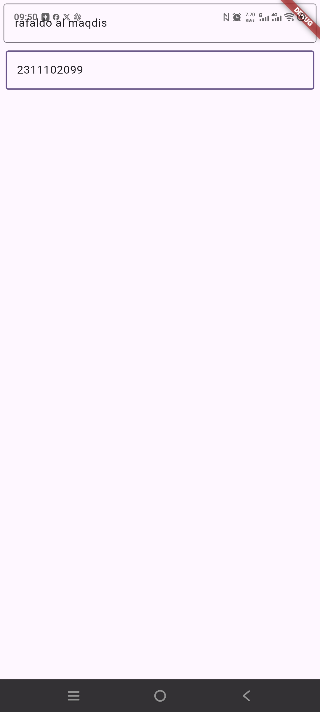

<div align="center">
  <br />
  <h1>LAPORAN PRAKTIKUM <br>APLIKASI BERBASIS PLATFORM</h1>
  <br />
  <h2>MODUL 5 & 6 FLUTTER <br>FONT & TEXTFIELD</h2>
  <br /><br />

  

  <br /><br /><br />

  <h3>Disusun Oleh :</h3>

  <p>
    <strong>Rafaldo Al Maqdis</strong><br>
    <strong>2311102099</strong><br>
    <strong>S1 IF-11-REG 01</strong>
  </p>

  <br />

  <h3>Dosen Pengampu :</h3>

  <p>
    <strong>Dimas Fanny Hebrasianto Permadi, S.ST., M.Kom</strong>
  </p>

  <br /><br />

  <h4>Asisten Praktikum :</h4>

  <p>
    <strong>Apri Pandu Wicaksono</strong><br>
    <strong>Rangga Pradarrell Fathi</strong>
  </p>

  <br />

  <h2>
  LABORATORIUM HIGH PERFORMANCE <br>
  FAKULTAS INFORMATIKA <br>
  UNIVERSITAS TELKOM PURWOKERTO <br>
  2026
  </h2>
</div>

---

## 1. Pendahuluan

Flutter merupakan framework yang digunakan untuk membangun aplikasi multiplatform dengan satu basis kode. Dalam Flutter, tampilan aplikasi dibangun menggunakan widget. Setiap komponen antarmuka seperti teks, kolom input, tombol, warna, layout, dan halaman dibuat menggunakan widget yang saling disusun dalam bentuk *widget tree*.

Pada praktikum ini, fokus pembahasan adalah penggunaan **Font** dan **TextField** pada Flutter. Font berkaitan dengan tampilan teks pada aplikasi, seperti ukuran huruf, warna, ketebalan, dan gaya tulisan. Sementara itu, `TextField` digunakan untuk menerima input teks dari pengguna.

Aplikasi yang dibuat pada praktikum ini bernama `Talkyu`. Program menampilkan dua buah kolom input menggunakan widget `TextField`. Masing-masing `TextField` memiliki teks petunjuk atau `hintText` dan menggunakan garis tepi berupa `OutlineInputBorder`.

---


## 2. Dasar Teori

### 2.1 Flutter

Flutter adalah framework UI yang digunakan untuk membangun aplikasi pada berbagai platform, seperti Android, iOS, web, dan desktop. Flutter menggunakan bahasa pemrograman Dart dan menerapkan konsep pengembangan berbasis widget.

Dalam Flutter, setiap tampilan dibentuk dari kumpulan widget. Widget tersebut dapat berupa struktur halaman, teks, kolom input, tombol, gambar, ikon, maupun layout. Susunan widget akan membentuk tampilan akhir yang dilihat oleh pengguna.

### 2.2 Dart

Dart adalah bahasa pemrograman yang digunakan pada Flutter. Dart mendukung konsep pemrograman berorientasi objek, sehingga aplikasi dapat disusun menggunakan class dan object.

Pada Flutter, program biasanya dimulai dari fungsi `main()`. Fungsi tersebut menjalankan aplikasi menggunakan `runApp()`. Widget yang dimasukkan ke dalam `runApp()` akan menjadi akar dari aplikasi Flutter.

### 2.3 Font pada Flutter

Font berhubungan dengan tampilan teks di dalam aplikasi. Dalam Flutter, tampilan teks dapat diatur menggunakan widget `Text` dan properti `TextStyle`. Beberapa pengaturan yang sering digunakan pada font adalah `fontSize`, `fontWeight`, `color`, `fontStyle`, dan `fontFamily`.

Contoh penggunaan gaya font pada Flutter adalah sebagai berikut.

```dart
Text(
  'Contoh Teks',
  style: TextStyle(
    fontSize: 20,
    fontWeight: FontWeight.bold,
    color: Colors.deepPurple,
  ),
)
```

Pada `TextField`, gaya teks yang diketik pengguna juga dapat diatur menggunakan properti `style`, sedangkan gaya teks petunjuk dapat diatur menggunakan `hintStyle` pada `InputDecoration`.

### 2.4 TextField

`TextField` adalah widget Flutter yang digunakan untuk menerima input teks dari pengguna. Widget ini sering digunakan pada form, halaman login, halaman pencarian, komentar, dan fitur lain yang membutuhkan input teks.

Pada praktikum ini, `TextField` digunakan sebanyak dua kali. TextField pertama memiliki `hintText` berupa `Masukkan teks`, sedangkan TextField kedua memiliki `hintText` berupa `Masukkan teks 2`.

### 2.5 InputDecoration

`InputDecoration` adalah properti yang digunakan untuk mengatur tampilan pada `TextField`. Dengan `InputDecoration`, pengembang dapat menambahkan `hintText`, label, ikon, border, warna, dan berbagai dekorasi lain pada input.

Contoh penggunaan `InputDecoration` adalah sebagai berikut.

```dart
TextField(
  decoration: InputDecoration(
    hintText: 'Masukkan teks',
    border: OutlineInputBorder(),
  ),
)
```

Pada kode tersebut, `hintText` berfungsi sebagai teks petunjuk, sedangkan `OutlineInputBorder` digunakan untuk memberikan garis tepi pada kolom input.

### 2.6 OutlineInputBorder

`OutlineInputBorder` digunakan untuk membuat garis tepi pada `TextField`. Dengan border ini, kolom input terlihat lebih jelas karena memiliki batas berbentuk kotak.

Pada praktikum ini, kedua `TextField` menggunakan `OutlineInputBorder`, sehingga tampilan input menjadi lebih rapi dan mudah dikenali oleh pengguna.

### 2.7 Padding

`Padding` adalah widget yang digunakan untuk memberikan jarak di sekitar widget lain. Pada praktikum ini, `Padding` digunakan untuk memberi jarak vertikal dan horizontal pada setiap `TextField`.

Dengan penggunaan `Padding`, komponen input tidak menempel langsung ke sisi layar dan tampilan menjadi lebih rapi.

### 2.8 Column

`Column` adalah widget layout yang digunakan untuk menyusun widget secara vertikal dari atas ke bawah. Pada praktikum ini, `Column` digunakan untuk menampilkan dua buah `TextField` secara berurutan.

Properti `crossAxisAlignment: CrossAxisAlignment.end` digunakan untuk mengatur posisi widget anak pada sumbu horizontal.

### 2.9 StatefulWidget

`StatefulWidget` adalah jenis widget yang dapat memiliki perubahan data atau kondisi selama aplikasi berjalan. Pada praktikum ini, halaman utama menggunakan `StatefulWidget` melalui class `MyHomePage`.

Meskipun kode praktikum belum menyimpan nilai input dari `TextField`, penggunaan `StatefulWidget` tetap dapat digunakan apabila di kemudian hari input teks ingin diproses atau ditampilkan kembali pada layar.

---

## 3. Alat dan Bahan

Alat dan bahan yang digunakan pada praktikum ini adalah sebagai berikut.

1. Laptop atau komputer.
2. Sistem operasi Windows.
3. Flutter SDK.
4. Dart SDK.
5. Android Studio atau Android SDK.
6. Visual Studio Code.
7. Ekstensi Flutter dan Dart pada Visual Studio Code.
8. Emulator Android atau perangkat Android fisik.
9. File proyek Flutter.

---

## 4. Langkah-Langkah Praktikum

### 4.1 Membuat Proyek Flutter

Langkah pertama adalah membuat proyek Flutter baru melalui terminal atau Visual Studio Code. Proyek Flutter dibuat agar memiliki struktur folder dan file utama seperti `lib/main.dart`.

Contoh perintah pembuatan proyek:

```bash
flutter create praktikum_font_textfield
```

Setelah proyek dibuat, masuk ke dalam folder proyek:

```bash
cd praktikum_font_textfield
```

### 4.2 Membuka Proyek di Visual Studio Code

Setelah proyek dibuat, proyek dibuka menggunakan Visual Studio Code. File utama yang digunakan dalam praktikum ini adalah:

```text
lib/main.dart
```

File tersebut digunakan untuk menulis kode utama aplikasi Flutter.

### 4.3 Mengimpor Package Material

Langkah awal dalam penulisan kode adalah mengimpor package `material.dart`. Package ini berisi berbagai widget Material Design yang digunakan dalam Flutter.

```dart
import 'package:flutter/material.dart';
```

Dengan mengimpor package tersebut, program dapat menggunakan widget seperti `MaterialApp`, `Scaffold`, `Column`, `Padding`, `TextField`, dan `InputDecoration`.

### 4.4 Membuat Fungsi Main

Fungsi `main()` merupakan titik awal program Dart. Pada fungsi ini, aplikasi dijalankan menggunakan `runApp()`.

```dart
void main() {
  runApp(const MyApp());
}
```

Kode tersebut menjalankan widget `MyApp` sebagai akar aplikasi Flutter.

### 4.5 Membuat Class MyApp

Class `MyApp` merupakan widget utama aplikasi. Class ini menggunakan `StatelessWidget` karena tidak memiliki perubahan state secara langsung.

```dart
class MyApp extends StatelessWidget {
  const MyApp({super.key});

  @override
  Widget build(BuildContext context) {
    return MaterialApp(
      title: 'Talkyu',
      theme: ThemeData(
        colorScheme: ColorScheme.fromSeed(seedColor: Colors.deepPurple),
      ),
      home: const MyHomePage(title: 'Talkyu'),
    );
  }
}
```

Pada bagian ini, `MaterialApp` digunakan untuk membungkus aplikasi. Properti `title` berisi nama aplikasi, yaitu `Talkyu`. Bagian `theme` digunakan untuk mengatur tema warna aplikasi dengan warna dasar `deepPurple`.

### 4.6 Membuat StatefulWidget MyHomePage

Class `MyHomePage` dibuat menggunakan `StatefulWidget`. Widget ini menerima parameter `title` dan memiliki state yang dikelola oleh class `_MyHomePageState`.

```dart
class MyHomePage extends StatefulWidget {
  const MyHomePage({super.key, required this.title});

  final String title;

  @override
  State<MyHomePage> createState() => _MyHomePageState();
}
```

Penggunaan `StatefulWidget` cocok apabila nantinya input dari `TextField` ingin disimpan atau diproses.

### 4.7 Membuat Struktur Halaman dengan Scaffold

Pada class `_MyHomePageState`, tampilan halaman dibuat menggunakan `Scaffold`.

```dart
return Scaffold(
  body: Column(
    crossAxisAlignment: CrossAxisAlignment.end,
    children: <Widget>[
      // TextField diletakkan di sini
    ],
  ),
);
```

`Scaffold` digunakan sebagai kerangka halaman. Pada bagian `body`, digunakan widget `Column` untuk menyusun beberapa komponen secara vertikal.

### 4.8 Membuat TextField Pertama

TextField pertama dibuat menggunakan widget `TextField` yang dibungkus oleh `Padding`.

```dart
const Padding(
  padding: EdgeInsets.symmetric(vertical: 5, horizontal: 5),
  child: TextField(
    decoration: InputDecoration(
      hintText: 'Masukkan teks',
      border: OutlineInputBorder(),
    ),
  ),
),
```

Pada kode tersebut, `Padding` memberi jarak sebesar 5 pada sisi vertikal dan horizontal. `hintText` menampilkan teks petunjuk `Masukkan teks`, sedangkan `OutlineInputBorder` membuat garis tepi pada kolom input.

### 4.9 Membuat TextField Kedua

TextField kedua memiliki struktur yang hampir sama dengan TextField pertama, tetapi menggunakan teks petunjuk yang berbeda.

```dart
Padding(
  padding: const EdgeInsets.symmetric(vertical: 6, horizontal: 8),
  child: TextField(
    decoration: InputDecoration(
      hintText: 'Masukkan teks 2',
      border: OutlineInputBorder(),
    ),
  ),
),
```

Pada bagian ini, `Padding` menggunakan jarak vertikal 6 dan horizontal 8. Teks petunjuk yang digunakan adalah `Masukkan teks 2`.

### 4.10 Menjalankan Aplikasi

Setelah kode selesai ditulis, aplikasi dapat dijalankan menggunakan perintah berikut.

```bash
flutter run
```

Jika tidak ada error, aplikasi akan menampilkan dua kolom input teks pada layar.

---

## 5. Source Code Lengkap

Berikut adalah source code lengkap pada file `lib/main.dart`.

> Catatan: Pada kode yang digunakan untuk laporan ini, penulisan `ColorScheme.fromSeed` dibuat lengkap agar sesuai dengan sintaks Dart.

```dart
import 'package:flutter/material.dart';

void main() {
  runApp(const MyApp());
}

class MyApp extends StatelessWidget {
  const MyApp({super.key});

  // This widget is the root of your application.
  @override
  Widget build(BuildContext context) {
    return MaterialApp(
      title: 'Talkyu',
      theme: ThemeData(colorScheme: ColorScheme.fromSeed(seedColor: Colors.deepPurple)),
      home: const MyHomePage(title: 'Talkyu'),
    );
  }
}

class MyHomePage extends StatefulWidget {
  const MyHomePage({super.key, required this.title});

  final String title;

  @override
  State<MyHomePage> createState() => _MyHomePageState();
}

class _MyHomePageState extends State<MyHomePage> {

  @override
  Widget build(BuildContext context) {
    return Scaffold(
      body: Column(
        crossAxisAlignment: CrossAxisAlignment.end,
        children: <Widget>[
          const Padding(
            padding: EdgeInsets.symmetric(vertical: 5, horizontal: 5),
            child: TextField(
              decoration: InputDecoration(
                hintText: 'Masukkan teks',
                border: OutlineInputBorder()
              ),
            ),
          ),
          Padding(
            padding: const EdgeInsets.symmetric(vertical: 6, horizontal: 8),
            child: TextField(
              decoration: InputDecoration(
                hintText: 'Masukkan teks 2',
                border: OutlineInputBorder()
              ),
            ),
          )
        ],
      ),
    );
  }
}
```

---

## 6. Hasil Praktikum

Setelah kode dijalankan, aplikasi menampilkan halaman sederhana dengan dua buah kolom input teks. Kolom input pertama memiliki teks petunjuk `Masukkan teks`, sedangkan kolom input kedua memiliki teks petunjuk `Masukkan teks 2`.

Kedua input menggunakan `OutlineInputBorder`, sehingga terlihat seperti kotak isian. Penggunaan `Padding` membuat kedua kolom input memiliki jarak dari tepi layar sehingga tampilan menjadi lebih rapi.

Kode untuk memasukkan screenshot hasil program:




---

## 7. Pembahasan

Pada praktikum ini, aplikasi Flutter dibuat dengan fokus pada penggunaan `TextField`. Widget `TextField` digunakan untuk membuat kolom input teks yang dapat diisi oleh pengguna. Komponen ini sangat penting dalam pengembangan aplikasi karena banyak fitur membutuhkan input, seperti form login, pencarian, komentar, dan pengisian data.

Aplikasi menggunakan `MaterialApp` sebagai widget utama. Di dalam `MaterialApp`, terdapat properti `title`, `theme`, dan `home`. Properti `title` digunakan untuk memberi nama aplikasi, yaitu `Talkyu`. Properti `theme` digunakan untuk mengatur tema warna aplikasi menggunakan `ThemeData`. Properti `home` digunakan untuk menentukan halaman utama aplikasi.

Halaman utama dibuat menggunakan `StatefulWidget`. Meskipun program belum menyimpan atau memproses input teks, penggunaan `StatefulWidget` memungkinkan aplikasi dikembangkan lebih lanjut, misalnya dengan menambahkan `TextEditingController`, validasi input, atau menampilkan hasil input ke layar.

Pada bagian tampilan, digunakan widget `Scaffold` sebagai struktur dasar halaman. Di dalam `Scaffold`, terdapat `body` yang berisi `Column`. Widget `Column` digunakan untuk menyusun dua buah `TextField` secara vertikal.

Setiap `TextField` dibungkus menggunakan `Padding`. Penggunaan `Padding` bertujuan agar kolom input tidak menempel pada sisi layar. TextField pertama menggunakan padding vertikal dan horizontal sebesar 5, sedangkan TextField kedua menggunakan padding vertikal 6 dan horizontal 8.

Tampilan `TextField` diatur menggunakan `InputDecoration`. Properti `hintText` digunakan untuk memberikan petunjuk kepada pengguna mengenai teks yang harus dimasukkan. Pada input pertama, `hintText` yang digunakan adalah `Masukkan teks`. Pada input kedua, `hintText` yang digunakan adalah `Masukkan teks 2`.

Selain itu, kedua `TextField` menggunakan `OutlineInputBorder`. Border ini membuat kolom input memiliki garis tepi berbentuk kotak sehingga lebih mudah dikenali sebagai area input.

Dari sisi font, teks pada aplikasi dapat dikembangkan lebih lanjut menggunakan `TextStyle`. Pengaturan font dapat diterapkan pada teks biasa menggunakan widget `Text`, pada input pengguna menggunakan properti `style`, atau pada teks petunjuk menggunakan `hintStyle`. Dengan demikian, tampilan teks dapat dibuat lebih menarik dan sesuai dengan tema aplikasi.

Secara keseluruhan, praktikum ini menunjukkan bahwa Flutter menyediakan widget yang sederhana namun fleksibel untuk membuat kolom input teks. Dengan menggabungkan `TextField`, `InputDecoration`, `OutlineInputBorder`, `Padding`, dan `Column`, aplikasi dapat menampilkan form input yang rapi dan mudah digunakan.

---

## 8. Kesimpulan

Berdasarkan praktikum yang telah dilakukan, dapat disimpulkan bahwa `TextField` merupakan widget Flutter yang digunakan untuk menerima input teks dari pengguna. Widget ini dapat dikombinasikan dengan `InputDecoration` untuk mengatur tampilan input, seperti menambahkan `hintText` dan border.

Praktikum ini berhasil membuat aplikasi sederhana bernama `Talkyu` yang menampilkan dua buah `TextField`. Setiap `TextField` memiliki teks petunjuk dan garis tepi menggunakan `OutlineInputBorder`.

Penggunaan `Padding` membuat tampilan input lebih rapi karena memberikan jarak dari tepi layar. Penggunaan `Column` membantu menyusun dua buah `TextField` secara vertikal.

Melalui praktikum ini, mahasiswa dapat memahami konsep dasar penggunaan font dan input teks pada Flutter. Pemahaman ini menjadi dasar penting dalam pembuatan form, halaman login, halaman pendaftaran, pencarian, serta fitur lain yang membutuhkan input dari pengguna.

---

## Referensi

1. Flutter Documentation. *Flutter Documentation*. https://docs.flutter.dev/
2. Flutter Documentation. *Building user interfaces with Flutter*. https://docs.flutter.dev/ui
3. Flutter API Documentation. *MaterialApp class*. https://api.flutter.dev/flutter/material/MaterialApp-class.html
4. Flutter API Documentation. *Scaffold class*. https://api.flutter.dev/flutter/material/Scaffold-class.html
5. Flutter API Documentation. *Text class*. https://api.flutter.dev/flutter/widgets/Text-class.html
6. Flutter API Documentation. *TextStyle class*. https://api.flutter.dev/flutter/painting/TextStyle-class.html
7. Flutter API Documentation. *TextField class*. https://api.flutter.dev/flutter/material/TextField-class.html
8. Flutter API Documentation. *InputDecoration class*. https://api.flutter.dev/flutter/material/InputDecoration-class.html
9. Flutter API Documentation. *OutlineInputBorder class*. https://api.flutter.dev/flutter/material/OutlineInputBorder-class.html
10. Dart Documentation. *Dart Overview*. https://dart.dev/overview