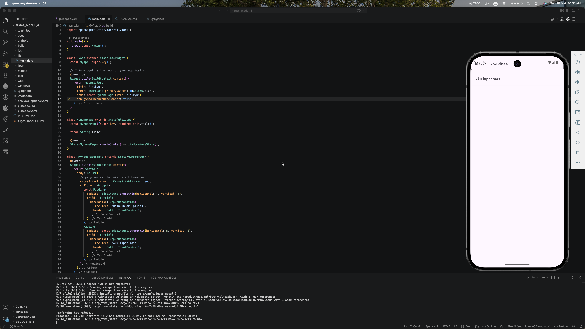

<div align="center">
  <br />
  <h1>LAPORAN PRAKTIKUM</h1>
  <h2>APLIKASI BERBASIS PLATFORM</h2>
  <br />
  <h3>Modul 5-6 Mobile</h3>
  <br />
  <br />
  
  <br />
  <br />
  <h3>Disusun Oleh :</h3>
  <p>
    <strong>NAUFAL LUTHFI ASSARY</strong><br>
    <strong>2311102125</strong><br>
    <strong>S1 IF-11-REG01</strong>
  </p>
  <br />
  <h3>Dosen Pengampu :</h3>
  <p>
    <strong>Dimas Fanny Hebrasianto Permadi, S.ST., M.Kom</strong>
  </p>
  <br />
  <h4>Asisten Praktikum :</h4>
  <p>
    <strong>Apri Pandu Wicaksono</strong><br>
    <strong>Rangga Pradarrell Fathi</strong>
  </p>
  <br />
  <h3>
    LABORATORIUM HIGH PERFORMANCE<br>
    FAKULTAS INFORMATIKA<br>
    UNIVERSITAS TELKOM PURWOKERTO<br>
    2026
  </h3>
</div>

---

## 1. Dasar Teori

Dasar Teori

Flutter merupakan framework yang digunakan untuk membangun aplikasi mobile dengan bahasa pemrograman Dart. Dalam Flutter, tampilan aplikasi dibentuk menggunakan konsep widget, yaitu komponen penyusun antarmuka seperti teks, input, tombol, layout, dan elemen lainnya. Setiap widget dapat disusun menjadi struktur yang disebut widget tree, sehingga tampilan aplikasi dapat dibuat secara teratur dan fleksibel. Pada modul praktikum, Flutter dijelaskan sebagai framework yang menggunakan widget sebagai dasar pembentukan antarmuka pengguna.  

Pada program ini, aplikasi dibuat menggunakan MaterialApp sebagai kerangka utama aplikasi dan Scaffold sebagai struktur dasar halaman. Widget MaterialApp digunakan untuk mengatur konfigurasi aplikasi seperti judul, tema warna, dan halaman utama, sedangkan Scaffold digunakan sebagai wadah tampilan utama. Di dalam Scaffold, terdapat widget Column yang berfungsi untuk menyusun elemen secara vertikal dari atas ke bawah. Penggunaan Column termasuk bagian dari konsep layout Flutter yang digunakan untuk mengatur posisi komponen dalam antarmuka aplikasi.

Selain layout, program ini juga menggunakan widget TextField sebagai komponen input teks dari pengguna. Setiap TextField diberi Padding agar memiliki jarak dengan tepi layar sehingga tampilan lebih rapi. Pada bagian dekorasi input, digunakan InputDecoration dengan labelText untuk menampilkan keterangan pada kolom input dan OutlineInputBorder untuk memberikan garis tepi berbentuk kotak. Secara keseluruhan, program ini menerapkan dasar pembuatan antarmuka pengguna Flutter, khususnya penggunaan widget, layout vertikal, dan input teks sederhana.

---

## 2. Penjelasan Kode

```dart
  @override
  Widget build(BuildContext context) {
    return MaterialApp(
      title: 'Talkyu',
      theme: ThemeData(primarySwatch: Colors.blue),
      home: const MyHomePage(title: 'Talkyu'),
      debugShowCheckedModeBanner: false,
    );
  }
```
### Penjelasan Kode

Potongan kode tersebut merupakan bagian dari method build() pada widget utama aplikasi. Method `build(BuildContext context)` berfungsi untuk membangun tampilan atau struktur utama aplikasi Flutter. Di dalam method ini, program mengembalikan widget `MaterialApp` sebagai kerangka dasar aplikasi yang menggunakan konsep Material Design.

Pada `MaterialApp`, properti `title: 'Talkyu'`digunakan untuk memberikan nama aplikasi. Properti `theme: ThemeData(primarySwatch: Colors.blue)` berfungsi untuk mengatur tema warna utama aplikasi menjadi biru. Selanjutnya, properti `home: const MyHomePage(title: 'Talkyu')` menentukan halaman pertama yang akan ditampilkan ketika aplikasi dijalankan, yaitu halaman `MyHomePage` dengan judul Talkyu.

Properti `debugShowCheckedModeBanner: false` digunakan untuk menghilangkan tulisan atau banner DEBUG yang biasanya muncul di pojok kanan atas saat aplikasi dijalankan dalam mode debug. Secara keseluruhan, kode ini berfungsi untuk mengatur konfigurasi awal aplikasi, mulai dari nama aplikasi, tema warna, halaman utama, hingga tampilan debug.

```dart
class _MyHomePageState extends State<MyHomePage> {
  @override
  Widget build(BuildContext context) {
    return Scaffold(
      body: Column(
        // yang serius itu pakai start bukan end
        crossAxisAlignment: CrossAxisAlignment.end,
        children: <Widget>[
          const Padding(
            padding: EdgeInsets.symmetric(horizontal: 4, vertical: 4),
            child: TextField(
              decoration: InputDecoration(
                labelText: 'Masakin aku plisss',
                border: OutlineInputBorder(),
              ),
            ),
          ),
          Padding(
            padding: const EdgeInsets.symmetric(horizontal: 6, vertical: 8),
            child: TextField(
              decoration: InputDecoration(
                labelText: 'Aku lapar mas',
                border: OutlineInputBorder(),
              ),
            ),
          ),
        ],
      ),
    );
  }
}
```
### Penjelasan Kode

Potongan kode tersebut merupakan bagian dari `class _MyHomePageState` yang berfungsi untuk membangun tampilan utama aplikasi. Method `build(BuildContext context)` digunakan untuk merender antarmuka pengguna, kemudian mengembalikan widget Scaffold sebagai struktur dasar halaman. Pada kode ini, bagian yang digunakan dari Scaffold adalah body, yaitu area utama tempat komponen tampilan diletakkan.

Di dalam body, terdapat widget Column yang digunakan untuk menyusun widget secara vertikal dari atas ke bawah. Properti `crossAxisAlignment: CrossAxisAlignment.end` berfungsi untuk mengatur posisi widget anak agar berada di sisi kanan pada sumbu horizontal. Namun, karena TextField secara default memenuhi lebar ruang yang tersedia, efek perataan ke kanan tidak terlalu terlihat pada tampilan.

Isi dari Column terdiri dari dua buah TextField yang berfungsi sebagai kolom input teks bagi pengguna. Masing-masing TextField dibungkus dengan widget Padding untuk memberikan jarak dari tepi layar dan antar elemen. TextField pertama memiliki label “Masakin aku plisss” dengan padding horizontal dan vertikal sebesar 4, sedangkan TextField kedua memiliki label “Aku lapar mas” dengan padding horizontal sebesar 6 dan vertikal sebesar 8. Keduanya menggunakan `OutlineInputBorder`, sehingga kolom input ditampilkan dalam bentuk kotak bergaris.


---

## 3. Screenshot Hasil



---

## 4. Referensi

- Flutter Docs: [https://docs.flutter.dev](https://docs.flutter.dev)
- Dart: [https://dart.dev](https://dart.dev)
- Modul:[https://telkomuniversityofficial-my.sharepoint.com/:b:/g/personal/dimasfhp_telkomuniversity_ac_id/IQAzpAVjVmeTRYI3rgKxGZE7AcpC_xRo2dpbh8ZyHd3c1lQ?e=pZRgq9]
