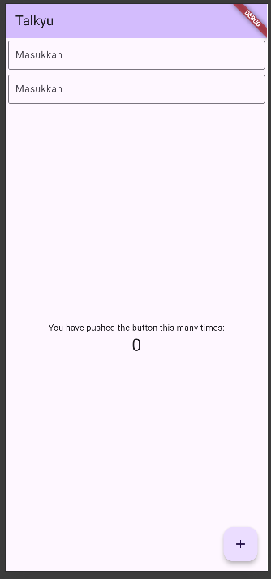

<div align="center">
  <br />
  <h1>LAPORAN PRAKTIKUM <br>APLIKASI BERBASIS PLATFORM</h1>
  <br />
  <h3> Modul 05-06 Mobile <br> TEXTFIELD </h3>
  <br />
   
  <br />
  <br />
  <br />
  <h3>Disusun Oleh :</h3>
  <p>
    <strong>Agnes Refilina Fiska</strong><br>
    <strong>2311102126</strong><br>
    <strong>S1 IF-11-01</strong>
  </p>
  <br />
  <h3>Dosen Pengampu :</h3>
  <p>
    <strong>Dimas Fanny Hebrasianto Permadi, S.ST., M.Kom</strong>
  </p>
  <br />
  <br />
    <h4>Asisten Praktikum :</h4>
    <strong> Apri Pandu Wicaksono </strong> <br>
    <strong>Rangga Pradarrell Fathi</strong>
  <br />
  <h3>LABORATORIUM HIGH PERFORMANCE
 <br>FAKULTAS INFORMATIKA <br>UNIVERSITAS TELKOM PURWOKERTO <br>2026</h3>
</div>

## 1. Latar Belakang

## A. Apa itu Flutter? Revolusi Pengembangan Aplikasi Multi-Platform

Flutter bukan sekadar alat pembuat aplikasi biasa; ia adalah *Software Development Kit* (SDK) UI sumber terbuka yang dirancang oleh Google. Diluncurkan pertama kali pada tahun 2018 dengan fokus awal pada aplikasi seluler (Android dan iOS), Flutter kini telah bertransformasi menjadi kerangka kerja yang sangat kuat untuk  **enam platform sekaligus** : iOS, Android, Web, Windows, macOS, dan Linux.

Konsep utama yang ditawarkan Flutter adalah **"Write Once, Run Anywhere"** (Tulis Sekali, Jalankan di Mana Saja). Artinya, pengembang tidak perlu menulis kode terpisah untuk Android (menggunakan Kotlin/Java) dan iOS (menggunakan Swift/Objective-C). Cukup dengan satu basis kode tunggal, aplikasi bisa berjalan mulus di berbagai perangkat, yang secara drastis memangkas waktu pengembangan dan biaya operasional perusahaan.

### Keunggulan Utama Flutter

* **Performa Setara Aplikasi Native (Asli):** Banyak kerangka kerja lintas platform lain yang menggunakan "jembatan" JavaScript untuk berkomunikasi dengan perangkat, yang sering kali membuat aplikasi terasa lambat. Flutter berbeda. Kode program Flutter dikompilasi langsung menjadi kode mesin (basa komputer asli) melalui bahasa Dart. Hasilnya? Aplikasi berjalan sangat cepat, responsif, dan efisien tanpa beban performa tambahan.
* **Rendering Grafis yang Konsisten (Mesin Skia/Impeller):** Flutter tidak menggunakan komponen UI bawaan dari sistem operasi perangkat. Sebagai gantinya, Flutter menggambar setiap piksel UI-nya sendiri menggunakan pustaka grafis internal (seperti Skia atau Impeller). Keuntungannya, tampilan aplikasi Anda akan terlihat **100% sama** di semua perangkat—baik itu di iPhone terbaru, ponsel Android jadul, maupun di browser web. Anda tidak perlu khawatir tampilan berantakan karena perbedaan sistem operasi.
* **Pengalaman Pengembang (Developer Experience) yang Luar Biasa:** Google merancang Flutter agar ramah bagi para  *programmer* . Fitur andalannya meliputi:
  * **Hot Reload:** Mengubah kode dan melihat hasilnya di layar HP secara instan (kurang dari satu detik) tanpa harus mengulang aplikasi dari awal atau kehilangan data yang sedang diinput.
  * **Widget Inspector:** Alat visual untuk membedah tata letak (layout) UI, sehingga mendeteksi *bug* atau kesalahan desain menjadi jauh lebih mudah.

## B. Mengenal Dart: Otak dan Penggerak di Balik Flutter

Jika Flutter adalah tubuhnya, maka **Dart** adalah otaknya. Dart adalah bahasa pemrograman modern berorientasi objek yang juga diciptakan oleh Google. Salah satu alasan mengapa Flutter sangat fleksibel adalah karena arsitektur bahasa Dart yang unik, terutama berkat adanya **Dart Virtual Machine (VM)** yang mendukung dua metode kompilasi:

1. **Just-In-Time (JIT) Compilation:** Digunakan saat masa pengembangan ( *development* ). Metode inilah yang memungkinkan fitur *Hot Reload* berjalan, karena Dart VM dapat menyuntikkan kode baru ke dalam aplikasi yang sedang berjalan secara  *real-time* .
2. **Ahead-Of-Time (AOT) Compilation:** Digunakan saat aplikasi siap dirilis ke publik ( *production* ). Kode Dart akan diubah total menjadi kode mesin biner yang super cepat sebelum aplikasi dijalankan oleh pengguna, memastikan performa maksimal dan waktu tunggu ( *loading* ) yang minim.

## C. Mengulik Lebih Dalam Widget `TextField`

Dalam dunia Flutter, hampir semua komponen visual disebut sebagai  **Widget** . Salah satu widget paling krusial dalam membangun aplikasi interaktif adalah `TextField`. Widget ini berfungsi sebagai gerbang utama bagi pengguna untuk memasukkan informasi teks melalui papan ketik ( *keyboard* ) virtual maupun fisik.

Berikut adalah penjelasan mendalam mengenai tiga fungsi utama `TextField` dalam arsitektur aplikasi:

* **Jembatan Interaksi Dua Arah:** Tanpa `TextField`, aplikasi akan terasa pasif (hanya bisa dilihat). Widget ini memungkinkan pengguna untuk berkomunikasi dengan sistem, mulai dari mengetik kata kunci di kolom pencarian, memperbarui informasi profil, hingga menulis pesan dalam aplikasi  *chatting* .
* **Pengumpulan Data yang Responsif (Real-Time):** `TextField` di Flutter dapat dihubungkan dengan pengontrol khusus (`TextEditingController`) dan pendengar data ( *listeners* ). Artinya, setiap kali pengguna mengetikkan satu huruf, aplikasi dapat langsung membaca, menyimpan, atau bahkan memproses data tersebut saat itu juga tanpa perlu menunggu pengguna menekan tombol "Kirim" terlebih dahulu.
* **Validasi Keamanan dan Akurasi Data:** Mengizinkan pengguna mengetik secara bebas bisa menjadi bumerang jika data yang masuk tidak sesuai (misalnya, salah mengetik format email atau mengosongkan kolom penting). `TextField` (atau variannya `TextFormField`) dapat diprogram untuk memeriksa input secara otomatis. Jika pengguna lupa memasukkan simbol "@" pada email atau mengosongkan kolom kata sandi, widget ini akan langsung menampilkan pesan error berwarna merah untuk memandu pengguna memperbaiki kesalahannya.

## 2. Sourcecode

### Sourcecode main.dart

```Dart
import 'package:flutter/material.dart';

void main() {
  runApp(const MyApp());
}

class MyApp extends StatelessWidget {
  const MyApp({super.key});

  @override
  Widget build(BuildContext context) {
    return MaterialApp(
      title: 'Talkyu',
      theme: ThemeData(
        // Menambahkan ColorScheme yang benar
        colorScheme: ColorScheme.fromSeed(seedColor: Colors.deepPurple),
        useMaterial3: true,
      ),
      home: const MyHomePage(title: 'Talkyu'),
    );
  }
}

class MyHomePage extends StatefulWidget {
  const MyHomePage({super.key, required this.title});

  final String title;

  @override
  State<MyHomePage> createState() => _MyHomePageState();
}

class _MyHomePageState extends State<MyHomePage> {
  int _counter = 0;

  void _incrementCounter() {
    setState(() {
      _counter++;
    });
  }

  @override
  Widget build(BuildContext context) {
    return Scaffold(
      appBar: AppBar(
        backgroundColor: Theme.of(context).colorScheme.inversePrimary,
        title: Text(widget.title),
      ),
      body: Column(
        // Menggunakan crossAxisAlignment sesuai permintaanmu
        crossAxisAlignment: CrossAxisAlignment.end,
        children: <Widget>[
          const Padding(
            padding: EdgeInsets.symmetric(horizontal: 4, vertical: 4),
            child: TextField(
              decoration: InputDecoration(
                hintText: "Masukkan", // Menghapus titik dua berlebih
                border: OutlineInputBorder(),
              ),
            ),
          ),
          const Padding(
            padding: EdgeInsets.symmetric(horizontal: 4, vertical: 4),
            child: TextField(
              decoration: InputDecoration(
                hintText: "Masukkan",
                border: OutlineInputBorder(),
              ),
            ),
          ),
          // Menggunakan Expanded agar Column counter berada di tengah sisa layar
          Expanded(
            child: Column(
              mainAxisAlignment: MainAxisAlignment.center,
              children: [
                const Center(
                  child: Text('You have pushed the button this many times:'),
                ),
                Text(
                  '$_counter',
                  style: Theme.of(context).textTheme.headlineMedium,
                ),
              ],
            ),
          ),
        ],
      ),
      floatingActionButton: FloatingActionButton(
        onPressed: _incrementCounter,
        tooltip: 'Increment',
        child: const Icon(Icons.add),
      ),
    );
  }
}
```

### 3. Hasil Penugasan



## 4. Penjelasan dan Kesimpulan

Kode di atas adalah sebuah aplikasi **Stateful Flutter** bernama "Talkyu" yang mengintegrasikan komponen input data dengan logika manajemen status ( *state management* ) sederhana.

Hasil  **output** -nya menampilkan antarmuka pengguna (UI) modern berbasis **Material 3** dengan skema warna ungu, yang terdiri dari sebuah *AppBar* di bagian atas, dua kolom input teks (`TextField`) bergaris tepi untuk interaksi pengguna, serta teks penghitung ( *counter* ) yang diposisikan persis di tengah layar berkat widget `Expanded`. Pengguna dapat menekan tombol tambah (`+`) di pojok kanan bawah untuk meningkatkan angka penghitung secara *real-time* tanpa memuat ulang seluruh halaman.
