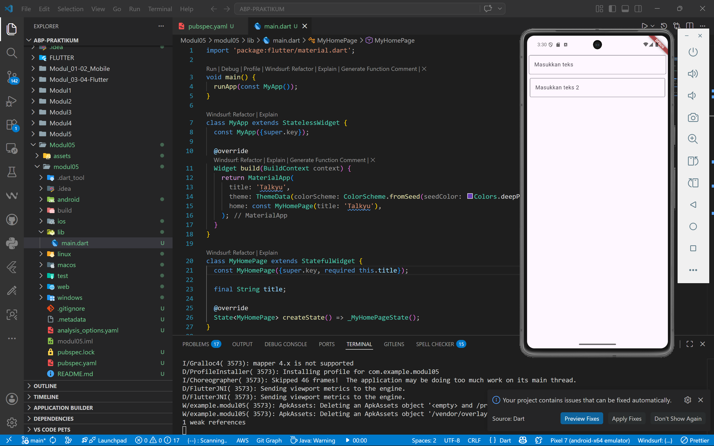

<div align="center">
  <br />
  <h1>LAPORAN PRAKTIKUM <br>APLIKASI BERBASIS PLATFORM</h1>
  <br />
  <h3>MODUL 5 & 6 <br> FONT & TEXTFIELD</h3>
  <br />
  <br />
  
  <br />
  <br />
  <br />
  <h3>Disusun Oleh :</h3>
  <p>
    <strong>Qonita Rahayu Atmi</strong><br>
    <strong>2311102128</strong><br>
    <strong>S1 IF-11-REG01</strong><br>
  </p>
  <br />
  <h3>Dosen Pengampu :</h3>
  <p>
    <strong>Dimas Fanny Hebrasianto Permadi, S.ST., M.Kom</strong>
  </p>
  <br />
  <h3>Asisten Praktikum :</h3>
  <p>
    <strong>Apri Pandu Wicaksono</strong><br>
    <strong>Rangga Pradarrell Fathi</strong><br>
  </p>
  <br />
  <h3>LABORATORIUM HIGH PERFORMANCE<br>FAKULTAS INFORMATIKA <br>TELKOM UNIVERSITY PURWOKERTO <br>2026</h3>
</div>

---

# A. Dasar Teori

- **Flutter** adalah framework atau Software Development Kit (SDK) open source yang dikembangkan oleh Google untuk membangun aplikasi mobile, web, dan desktop dalam satu basis kode (single codebase). Flutter digunakan untuk mengembangkan aplikasi pada sistem operasi Android dan iOS secara lebih efisien karena pengembang hanya perlu menulis satu kali kode program untuk berbagai platform. Flutter menggunakan bahasa pemrograman Dart serta didukung oleh Skia Graphics Engine sehingga mampu menghasilkan tampilan antarmuka pengguna (user interface/UI) yang menarik, responsif, dan memiliki performa tinggi. Selain itu, Flutter menyediakan berbagai widget yang dapat disesuaikan, seperti Material Design dan Cupertino, sehingga memudahkan pengembang dalam membuat antarmuka aplikasi yang modern dan interaktif.

- **Widget** adalah unit dasar pembangunan antarmuka pengguna (UI) dalam Flutter. Setiap elemen visual yang ditampilkan di layar merupakan sebuah widget. Terdapat dua jenis widget utama, yaitu *StatelessWidget* (tidak menyimpan perubahan state) dan *StatefulWidget* (menyimpan dan merespons perubahan state).

- **TextField** adalah widget input teks interaktif yang memungkinkan pengguna memasukkan data melalui papan ketik (keyboard). Widget ini merupakan salah satu komponen formulir yang paling mendasar dalam Flutter. `TextField` dapat dikustomisasi melalui properti `decoration` bertipe `InputDecoration`, yang mengatur tampilan visual seperti teks petunjuk (*hint text*), label, ikon, serta garis tepi (*border*).

- **InputDecoration** adalah kelas dekorasi yang digunakan bersama `TextField` untuk mendefinisikan tampilan visual dari kolom masukan. Properti utamanya meliputi `hintText` (teks petunjuk abu-abu yang muncul saat kolom kosong), `labelText` (label mengambang di atas kolom), `prefixIcon`/`suffixIcon` (ikon di sisi kiri/kanan), dan `border` (garis tepi kolom masukan).

- **OutlineInputBorder** adalah salah satu varian `InputBorder` yang digunakan untuk menampilkan garis tepi berbentuk persegi panjang di sekeliling kolom masukan `TextField`. Berbeda dengan `UnderlineInputBorder` yang hanya menampilkan garis di bagian bawah, `OutlineInputBorder` mengelilingi seluruh sisi widget masukan tersebut.

- **Scaffold** adalah widget kerangka halaman utama (*page skeleton*) dalam Flutter yang menyediakan struktur tata letak standar Material Design, termasuk `AppBar` di bagian atas, `body` sebagai area konten utama, dan `FloatingActionButton` di bagian bawah.

- **SafeArea** adalah widget pembungkus yang memastikan konten di dalamnya tidak tertutup oleh elemen sistem seperti *status bar*, *notch*, maupun *navigation bar*. Penggunaannya sangat disarankan agar tampilan antarmuka aplikasi tetap terlihat dengan sempurna di berbagai perangkat.

- **Column** adalah widget tata letak yang menyusun widget-widget anaknya secara vertikal (dari atas ke bawah). Properti `crossAxisAlignment` digunakan untuk mengatur perataan horizontal anak-anaknya, sementara `mainAxisAlignment` mengatur perataan vertikalnya.

- **Padding** adalah widget yang menambahkan jarak atau ruang kosong di sekeliling widget anaknya berdasarkan nilai `EdgeInsets` yang ditentukan. Penggunaan `Padding` menjaga tata letak antarmuka agar terlihat lebih rapi dan tidak terlalu berdekatan dengan tepi layar atau elemen lainnya.

---

# B. Kode Program

### 1. Fungsi `main()` dan Widget `MyApp`

```dart
void main() {
  runApp(const MyApp());
}

class MyApp extends StatelessWidget {
  const MyApp({super.key});

  @override
  Widget build(BuildContext context) {
    return MaterialApp(
      title: 'Talkyu',
      theme: ThemeData(colorScheme: ColorScheme.fromSeed(seedColor: Colors.deepPurple)),
      home: const MyHomePage(title: 'Talkyu'),
    );
  }
}
```

**Penjelasan:**  
Fungsi `main()` merupakan titik masuk utama aplikasi Flutter yang memanggil fungsi `runApp()` untuk menginisialisasi dan menjalankan widget root aplikasi, yaitu `MyApp`. Kelas `MyApp` merupakan turunan dari `StatelessWidget` karena tidak memerlukan perubahan state internal. Di dalamnya, `MaterialApp` dikembalikan sebagai widget utama yang membungkus seluruh aplikasi dengan konfigurasi berupa judul aplikasi (`title: 'Talkyu'`), tema warna berbasis *deep purple* menggunakan `ColorScheme.fromSeed`, dan halaman awal (`home`) yang ditetapkan sebagai `MyHomePage`.

---

### 2. Widget `MyHomePage` (StatefulWidget)

```dart
class MyHomePage extends StatefulWidget {
  const MyHomePage({super.key, required this.title});

  final String title;

  @override
  State<MyHomePage> createState() => _MyHomePageState();
}
```

**Penjelasan:**  
Kelas `MyHomePage` dideklarasikan sebagai `StatefulWidget`  dirancang untuk mendukung interaksi dinamis dari pengguna. Widget ini menerima satu parameter wajib bertipe `String` bernama `title`, yang diteruskan melalui konstruktor. Metode `createState()` mengembalikan instansi dari kelas `_MyHomePageState` yang bertugas mengelola dan merender tampilan dinamis halaman tersebut.

---

### 3. Widget `Scaffold` dan `SafeArea`

```dart
return Scaffold(
  body: SafeArea(
    child: Column( ... ),
  ),
);
```

**Penjelasan:**  
`Scaffold` digunakan sebagai kerangka halaman yang menyediakan struktur tata letak standar Material Design. Properti `body` diisi dengan widget `SafeArea` yang memastikan seluruh konten di dalamnya ditampilkan di dalam area yang aman, sehingga tidak bertumpang tindih dengan elemen sistem seperti *status bar* di bagian atas maupun *navigation bar* di bagian bawah layar perangkat.

---

### 4. Widget `Column` dengan Dua `TextField`

```dart
Column(
  crossAxisAlignment: CrossAxisAlignment.end,
  children: <Widget>[
    const Padding(
      padding: EdgeInsets.symmetric(vertical: 5, horizontal: 5),
      child: TextField(
        decoration: InputDecoration(
          hintText: 'Masukkan teks',
          border: OutlineInputBorder()
        ),
      ),
    ),
    const Padding(
      padding: EdgeInsets.symmetric(vertical: 6, horizontal: 8),
      child: TextField(
        decoration: InputDecoration(
          hintText: 'Masukkan teks 2',
          border: OutlineInputBorder()
        ),
      ),
    )
  ],
)
```

**Penjelasan:**  
Widget `Column` digunakan untuk menyusun dua kolom masukan teks secara vertikal. Properti `crossAxisAlignment: CrossAxisAlignment.end` memposisikan anak-anaknya rata ke sisi kanan pada sumbu horizontal.

Setiap `TextField` dibungkus di dalam widget `Padding` untuk memberikan ruang jarak di sekelilingnya agar tampilan tidak terlalu rapat dengan batas layar:
- **TextField pertama** diberi `Padding` dengan jarak vertikal 5 dan horizontal 5 piksel. Widget ini dilengkapi dengan `InputDecoration` yang menetapkan teks petunjuk `'Masukkan teks'` dan garis tepi berbentuk persegi panjang melalui `OutlineInputBorder()`.
- **TextField kedua** diberi `Padding` dengan jarak vertikal 6 dan horizontal 8 piksel. Secara konseptual sama dengan `TextField` pertama, namun memiliki teks petunjuk yang berbeda yaitu `'Masukkan teks 2'` dan margin yang sedikit lebih lebar untuk membedakan posisi visualnya.

Penggunaan konstanta `const` di depan setiap widget memastikan widget tersebut dikompilasi sebagai objek konstanta, sehingga tidak perlu direkonstruksi ulang saat proses *rebuild* widget berlangsung, yang berdampak positif pada efisiensi performa aplikasi.

---

# C. Hasil Tampilan (Screenshot)



---

# D. Kesimpulan

Praktikum Modul 5 ini penggunaan widget **TextField** dalam Flutter sebagai komponen utama untuk menerima masukan teks dari pengguna. Melalui properti `InputDecoration` dengan `OutlineInputBorder`, tampilan kolom masukan dapat dikustomisasi sehingga terlihat lebih rapi dan profesional. Penggunaan `SafeArea` memastikan antarmuka tidak tertutup elemen sistem, sementara `Column` dan `Padding` berperan dalam menyusun tata letak yang terstruktur.

---

# E. Referensi

- [R. Fadilla and T. Wiharko, "Penerapan Metode Forward Chaining Dalam Sistem Pakar Deteksi Kerusakan Hardware Komputer Berbasis Android," Digital Transformation Technology (Digitech), vol. 3, no. 2, Sep. 2023.](https://itscience-indexing.com/jurnal/index.php/digitech/article/view/2784/2205)

