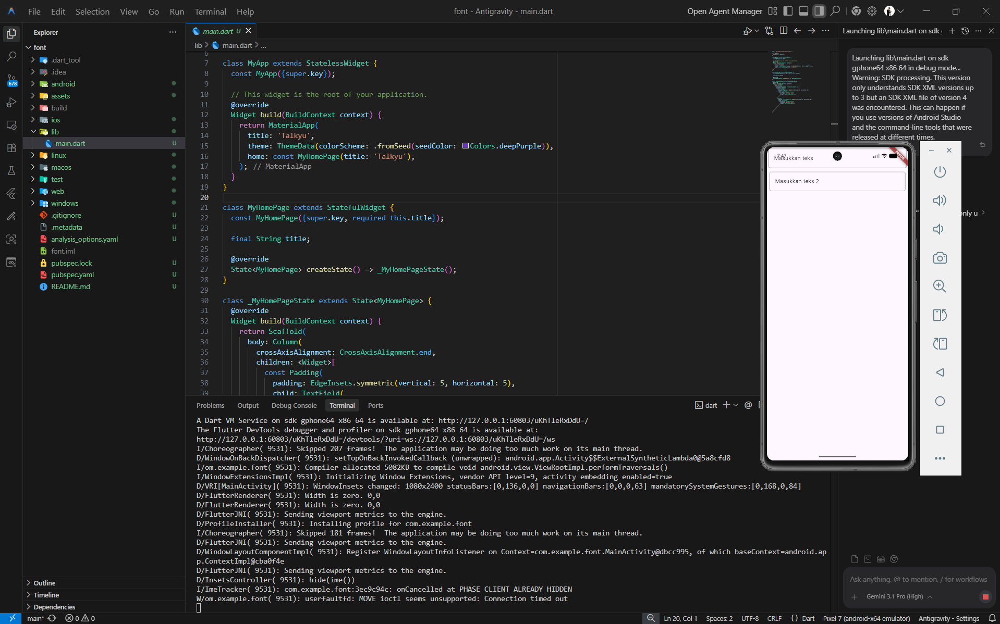

<div align="center">
  <br />
  <h1>LAPORAN PRAKTIKUM <br>APLIKASI BERBASIS PLATFORM</h1>
  <br />
  <h3>MODUL 5 & 6<br> FONT & TEXTFIELD</h3>
  <br />
   
  <br />
  <br />
  <br />
  <h3>Disusun Oleh :</h3>
  <p>
    <strong>HAMID SABIRIN</strong><br>
    <strong>2311102129</strong><br>
    <strong>S1 IF-11-REG01</strong>
  </p>
  <br />
  <br />
  <h3>Dosen Pengampu :</h3>
  <p>
    <strong>Dimas Fanny Hebrasianto Permadi, S.ST., M.Kom</strong>
  </p>
  <br />
  <br />
    <h4>Asisten Praktikum :</h4>
    <strong> Apri Pandu Wicaksono </strong> <br>
    <strong>Rangga Pradarrell Fathi</strong>
  <br />
  <h3>LABORATORIUM HIGH PERFORMANCE
 <br>FAKULTAS INFORMATIKA <br>UNIVERSITAS TELKOM PURWOKERTO <br>2026</h3>
</div>

---

## 1. Dasar Teori

Dalam pengembangan aplikasi menggunakan Flutter, terdapat beberapa komponen (widget) dasar yang sangat penting untuk membangun antarmuka pengguna (UI):

- **Scaffold**: Merupakan kerangka kerja atau struktur visual dasar untuk mengimplementasikan layout Material Design. Scaffold menyediakan ruang untuk mengatur berbagai elemen layar seperti *body*, *app bar*, dan *floating action button*.
- **Column**: Sebuah widget tata letak (layout) fleksibel yang menyusun widget anak-anaknya (*children*) secara vertikal (berbaris dari atas ke bawah).
- **Padding**: Widget ini berguna untuk memberikan ruang kosong (jarak/margin bagian dalam) di sekitar widget yang dibungkusnya. Hal ini sangat berguna agar elemen-elemen UI tidak saling berdempetan.
- **TextField**: Widget input teks interaktif yang memungkinkan pengguna memasukkan teks menggunakan keyboard. Widget ini dapat dikonfigurasi lebih lanjut menggunakan properti `decoration` (seperti `InputDecoration`) untuk memberikan *hint text* (teks bayangan/placeholder) dan bentuk *border*.

---

## 2. Pembahasan Code dan Implementasi

Berikut adalah kode dari implementasi Modul 5 yang menggunakan widget-widget dasar untuk membentuk form input teks:

### A. Implementasi Widget (Column, Padding, dan TextField)

```dart
class _MyHomePageState extends State<MyHomePage> {
  @override
  Widget build(BuildContext context) {
    return Scaffold(
      body: Column(
        crossAxisAlignment: CrossAxisAlignment.end,
        children: <Widget>[
          const Padding(
            padding: EdgeInsets.symmetric(vertical: 5, horizontal: 5),
            child: TextField(
              decoration: InputDecoration(
                hintText: 'Masukkan teks',
                border: OutlineInputBorder(),
              ),
            ),
          ),
          const Padding(
            padding: EdgeInsets.symmetric(vertical: 6, horizontal: 8),
            child: TextField(
              decoration: InputDecoration(
                hintText: 'Masukkan teks 2',
                border: OutlineInputBorder(),
              ),
            ),
          ),
        ],
      ),
    );
  }
}
```

**Penjelasan:**

1. **Scaffold & Column**: Halaman dibungkus menggunakan `Scaffold`, dan pada bagian `body`-nya diisi dengan `Column`. Tujuannya agar kita dapat menampilkan lebih dari satu form input secara bersusun ke bawah. Pada widget `Column`, disematkan properti `crossAxisAlignment: CrossAxisAlignment.end` yang memberikan instruksi agar *children* di dalamnya ditarik perataannya ke arah kanan layar (bergantung pada lebar layar dan ukuran konten).
2. **TextField Pertama**: Dibungkus dengan widget `Padding` berukuran vertikal 5 dan horizontal 5 piksel. Menggunakan `OutlineInputBorder()` untuk memberikan bentuk kotak input yang memiliki garis batas, serta *hintText* bertuliskan "Masukkan teks".
3. **TextField Kedua**: Implementasinya hampir sama dengan form pertama, namun diberikan konfigurasi `Padding` yang sedikit berbeda, yaitu vertikal 6 dan horizontal 8 piksel, dengan tulisan *hintText* "Masukkan teks 2".

---

## 3. Hasil Tampilan (*Output*)

Berikut adalah *screenshot* hasil eksekusi program dari pembuatan form input dengan TextField:


