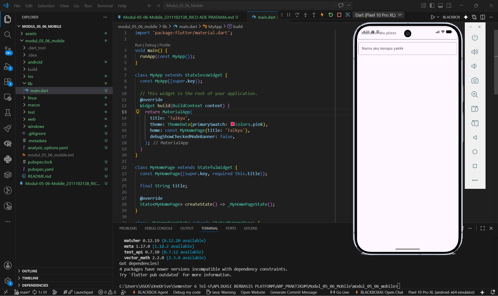

<div align="center">
   <h2>LAPORAN PRAKTIKUM<br>APLIKASI BERBASIS PLATFORM</h2>
   <h>
   <br>
   <h4>MODUL 05, 06 Mobile<br>FONT & TEXTFIELD</h4>
   <br>
   
   <br><br>
 
**Disusun Oleh :**<br>
RICO ADE PRATAMA<br>
2311102138<br>
PS1IF-11-REG01
<br><br>
 
**Dosen Pengampu :**<br>
Dimas Fanny Hebrasianto Permadi, S.ST., M.Kom
<br><br>
 
**Assisten Praktikum :**<br>
Apri Pandu Wicaksono
<br>Rangga Pradarrell Fathi
<br><br>
 
PROGRAM STUDI S1 TEKNIK INFORMATIKA<br>
FAKULTAS INFORMATIKA<br>
UNIVERSITAS TELKOM PURWOKERTO<br>
2026

</div>

---

## 1. Dasar Teori

**BAB 5. ANTARMUKA PENGGUNA LANJUTAN**<br>

**Row** adalah widget dalam Flutter yang berfungsi untuk menyusun beberapa widget anak (`children`) secara horizontal atau berjajar ke samping. Penerapannya cocok untuk deretan tombol, ikon, atau teks+gambar. Sering dipadukan dengan `Expanded` untuk mencegah _overflow_ agar tetap responsif.

**Column** Berfungsi untuk menyusun beberapa widget anakya Menyusun widget secara vertikal (ke bawah). Cocok untuk form atau daftar informasi. Menggunakan properti `crossAxisAlignment` dan `mainAxisSize` untuk mengatur posisi dan ukuran komponen.

**Nested Rows & Columns** adalah definisi Teknik menggabungkan `Row` dan `Column` secara bertingkat (_nesting_). Kegunaannya Membuat layout kompleks seperti kartu informasi (_card_), halaman detail produk, dasbor, atau linimasa media sosial.

**CustomScrollView** adalah definisi Widget _scroll_ tingkat lanjut yang menggunakan konsep **Sliver** (komponen gulir kustom) untuk menciptakan efek transisi yang dinamis. Komponen Utama:

- `SliverAppBar`: Bilah aplikasi fleksibel (_collapsing_).
- `SliverGrid`: Tampilan data berbentuk kisi-kisi.
- `SliverList` / `SliverFixedExtentList`: Tampilan daftar data linier.

**BAB 6. INTERAKSI PENGGUNA**<br>

**Packages** adalah definisi Kumpulan pustaka (_library_) tambahan di repositori resmi **pub.dev** untuk mempercepat pengembangan. Mekanismenya didaftarkan pada `pubspec.yaml`, lalu diinstal via perintah `flutter pub get`. Contoh Popular: `http` (API), `google_fonts` (font), `provider` (_state management_), dan `fluro` (navigasi/rute).

**Stateful dan Stateless Widget**

- **a. Stateless Widget (`StatelessWidget`):** Widget statis (_immutable_) yang tidak berubah setelah dirender. Cocok untuk teks, ikon, dan gambar statis.
- **b. Stateful Widget (`StatefulWidget`):** Widget dinamis yang kondisinya dapat berubah via metode `setState()` untuk memicu render ulang. Cocok untuk form, _checkbox_, atau data _real-time_.

**Form** Berfungsi menghimpun input dari pengguna (seperti fitur login, registrasi, pencarian, dan input profil). Komponen utamanya menggunakan `TextField` atau `TextFormField`. `TextFormField` lebih direkomendasikan karena memiliki fitur validasi data bawaan.

**Menu** Berfungsi untuk sistem navigasi antarhalaman berbasis _Material Design_. Jenis Utamanya:

- **a. Bottom Navigation Bar:** Menu di bawah layar untuk akses cepat halaman utama (Home, Search, Profile).
- **b. Tab Bar:** Navigasi berbasis tab horizontal yang dipadukan dengan `TabBarView` dan `DefaultTabController`.

**Button** Berfungsi untuk Elemen interaktif untuk mengeksekusi aksi tertentu (seperti _submit form_ atau pindah halaman). Memiliki varian: `ElevatedButton` (tombol utama), `TextButton` (tanpa garis tepi), `OutlinedButton` (garis tepi penegas), dan `IconButton` (tombol ikon).

## 2. Kode Program Unguided

Tugas Praktikum Modul 5 dan 6 Flutter

### Struktur Project

```php
modul_05_06_mobile/  # Folder utama proyek Flutter
│   └── lib/                # Direktori utama penyimpanan kode Dart
│       └── main.dart       # Titik awal eksekusi program
```

### Kode main.dart (Folder lib)

```dart
import 'package:flutter/material.dart';

void main() {
  runApp(const MyApp());
}

class MyApp extends StatelessWidget {
  const MyApp({super.key});

  // This widget is the root of your application.
  @override
  Widget build(BuildContext context) {
    return MaterialApp(
      title: 'Talkyu',
      theme: ThemeData(primarySwatch: Colors.pink),
      home: const MyHomePage(title: 'Talkyu'),
      debugShowCheckedModeBanner: false,
    );
  }
}

class MyHomePage extends StatefulWidget {
  const MyHomePage({super.key, required this.title});

  final String title;

  @override
  State<MyHomePage> createState() => _MyHomePageState();
}

class _MyHomePageState extends State<MyHomePage> {
  @override
  Widget build(BuildContext context) {
    return Scaffold(
      body: Column(
        // yang serius itu pakai start bukan end
        crossAxisAlignment: CrossAxisAlignment.end,
        children: <Widget>[
          const Padding(
            padding: EdgeInsets.symmetric(horizontal: 4, vertical: 4),
            child: TextField(
              decoration: InputDecoration(
                labelText: 'Masukkin aku plisss',
                border: OutlineInputBorder(),
              ),
            ),
          ),
          Padding(
            padding: const EdgeInsets.symmetric(horizontal: 6, vertical: 8),
            child: TextField(
              decoration: InputDecoration(
                labelText: 'Nama aku kenapa yakkk',
                border: OutlineInputBorder(),
              ),
            ),
          ),
        ],
      ),
    );
  }
}

```

### Hasil Output



### Penjelasan Kode

Program ini adalah kerangka antarmuka aplikasi Flutter sederhana bernama **Talkyu**, menggunakan `MaterialApp` sebagai fondasi utama untuk mengatur tema dasar aplikasi (merah muda) dan menyembunyikan _banner debug_. Halaman utamanya dibangun menggunakan `StatefulWidget`. Penggunaan _stateful_ memungkinkan aplikasi untuk diperbarui secara _real-time_, misalnya untuk menangkap dan memproses teks yang diketikkan pengguna ke dalam form.

Untuk pengaturan tata letaknya, menggunakan `Scaffold`. Di dalamnya, widget `Column` bertugas menyusun dua buah form input (`TextField`) secara vertikal dari atas ke bawah. Penataan elemen di dalam kolom menggunakan properti `crossAxisAlignment: CrossAxisAlignment.end`, memaksa posisi elemen bergeser ke sisi kanan layar. Agar tampilan tetap proporsional dan tidak saling berdempetan, setiap form input dibungkus dengan widget `Padding` yang memberikan jarak spasi di sekeliling kotak isian tersebut.

## 3. Kesimpulan dan Penutup

Tugas Praktikum Modul 05 dan 06 ini mengimplementasikan perancangan antarmuka lanjutan dan interaksi pengguna menggunakan framework Flutter. Fokus utamanya adalah penyusunan tata letak kompleks melalui kombinasi Row, Column, dan CustomScrollView, serta pengintegrasian elemen interaktif dinamis seperti Form, Button, dan sistem navigasi menu dengan memanfaatkan Stateful Widget. Cocok digunakan sebagai pembelajaran praktikum bagi mahasiswa program studi Informatika untuk merancang UI/UX aplikasi mobile.

## 4. Referensi

- [1] [Materi Modul 05, 06 Mobile](https://telkomuniversityofficial-my.sharepoint.com/personal/dimasfhp_telkomuniversity_ac_id/_layouts/15/onedrive.aspx?id=%2Fpersonal%2Fdimasfhp_telkomuniversity_ac_id%2FDocuments%2FAplikasi+Berbasis+Platform%2FMODUL+PRAKTIKUM+Pemrograman+Perangkat+Bergerak+2024.pdf&parent=%2Fpersonal%2Fdimasfhp_telkomuniversity_ac_id%2FDocuments%2FAplikasi+Berbasis+Platform&ga=1)
