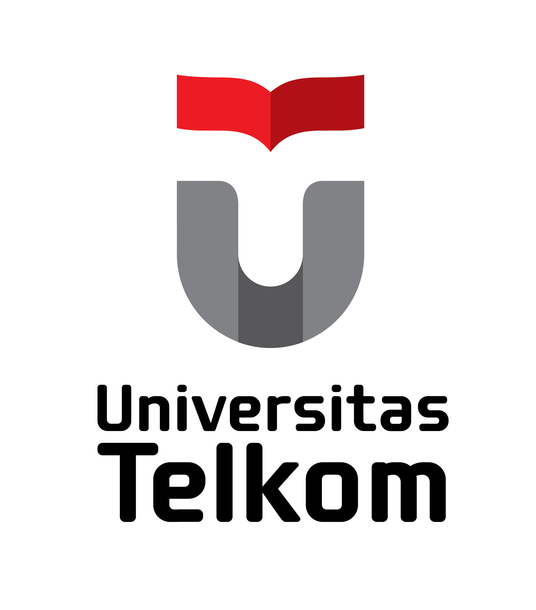
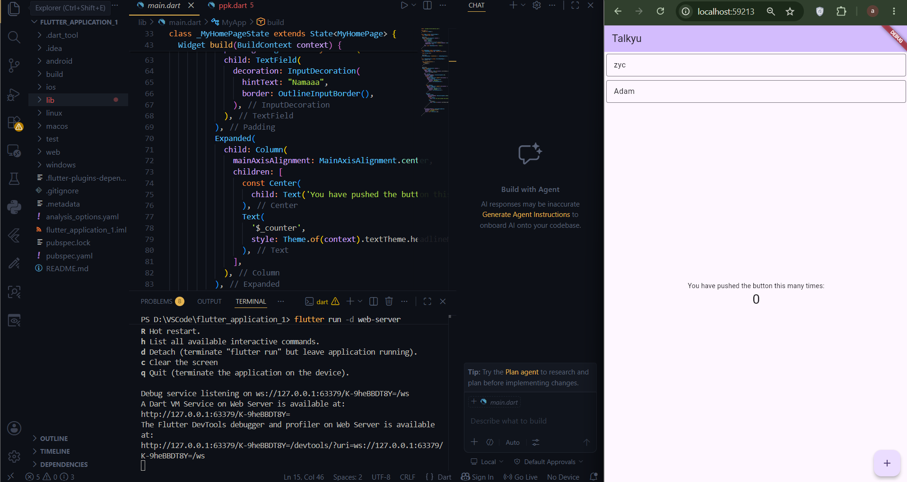

<div align="center">

<br>

# LAPORAN PRAKTIKUM  
# APLIKASI BERBASIS PLATFORM

<br>

## MODUL 05-06  
## Mobile - FONT DAN TEXTFIELD

<br>



<br><br>

### Disusun Oleh

**Syamsul Adam**  
**2311102144**  
**S1 IF-11-REG01**

<br>

### Dosen Pengampu

**Dimas Fanny Hebrasianto Permadi, S.ST., M.Kom**

<br>

### Asisten Praktikum

**Apri Pandu Wicaksono**  
**Rangga Pradarrell Fathi**

<br><br>

### LABORATORIUM HIGH PERFORMANCE  
### FAKULTAS INFORMATIKA  
### UNIVERSITAS TELKOM PURWOKERTO  
### 2026

</div>

---

## 1. Dasar Teori
 
### Komponen Utama dalam Pengembangan UI Flutter
 
Dalam membangun antarmuka pengguna (UI) menggunakan Flutter, terdapat beberapa komponen (*widget*) dasar yang memiliki peran penting:
 
* **`Scaffold`** Merupakan fondasi atau cetak biru visual utama untuk menerapkan desain berbasis *Material Design*. Komponen ini berfungsi sebagai wadah besar yang memudahkan pengaturan elemen-elemen halaman, seperti area konten utama (`body`), bilah navigasi atas (`appBar`), hingga tombol melayang (`floatingActionButton`).
* **`Column`** Sebuah *widget* tata letak (*layout*) yang bersifat fleksibel untuk menyusun berbagai elemen di dalamnya secara vertikal, berjejer dari atas ke bawah.
* **`Padding`** *Widget* yang berfungsi untuk menyisipkan ruang atau jarak kosong di sekeliling komponen yang dibungkusnya. Penerapan *padding* ini menjaga agar elemen-elemen antarmuka tetap proporsional dan tidak saling menempel satu sama lain.
* **`TextField`** Komponen interaktif yang menyediakan kolom pengisian bagi pengguna untuk mengetikkan teks melalui papan ketik (*keyboard*). Tampilannya dapat dikustomisasi lebih lanjut menggunakan properti `decoration` (seperti `InputDecoration`) untuk menyisipkan teks petunjuk (*placeholder/hint*) serta mengatur gaya bingkai (*border*).
---
 
## 2. Sourcecode
 
```dart
import 'package:flutter/material.dart';

void main() {
  runApp(const MyApp());
}

class MyApp extends StatelessWidget {
  const MyApp({super.key});

  @override
  Widget build(BuildContext context) {
    return MaterialApp(
      title: 'Talkyu',
      theme: ThemeData(
        // Menambahkan ColorScheme yang benar
        colorScheme: ColorScheme.fromSeed(seedColor: Colors.deepPurple),
        useMaterial3: true,
      ),
      home: const MyHomePage(title: 'Talkyu'),
    );
  }
}

class MyHomePage extends StatefulWidget {
  const MyHomePage({super.key, required this.title});

  final String title;

  @override
  State<MyHomePage> createState() => _MyHomePageState();
}

class _MyHomePageState extends State<MyHomePage> {
  int _counter = 0;

  void _incrementCounter() {
    setState(() {
      _counter++;
    });
  }

  @override
  Widget build(BuildContext context) {
    return Scaffold(
      appBar: AppBar(
        backgroundColor: Theme.of(context).colorScheme.inversePrimary,
        title: Text(widget.title),
      ),
      body: Column(
        crossAxisAlignment: CrossAxisAlignment.end,
        children: <Widget>[
          const Padding(
            padding: EdgeInsets.symmetric(horizontal: 4, vertical: 4),
            child: TextField(
              decoration: InputDecoration(
                hintText: "Masukkan",
                border: OutlineInputBorder(),
              ),
            ),
          ),
          const Padding(
            padding: EdgeInsets.symmetric(horizontal: 4, vertical: 4),
            child: TextField(
              decoration: InputDecoration(
                hintText: "Namaaa",
                border: OutlineInputBorder(),
              ),
            ),
          ),
          Expanded(
            child: Column(
              mainAxisAlignment: MainAxisAlignment.center,
              children: [
                const Center(
                  child: Text('You have pushed the button this many times:'),
                ),
                Text(
                  '$_counter',
                  style: Theme.of(context).textTheme.headlineMedium,
                ),
              ],
            ),
          ),
        ],
      ),
      floatingActionButton: FloatingActionButton(
        onPressed: _incrementCounter,
        tooltip: 'Increment',
        child: const Icon(Icons.add),
      ),
    );
  }
}

```
 
### Penjelasan
 
Di bagian awal, ada MyApp yang berfungsi sebagai gerbang utama buat ngatur tema aplikasi. Di sini aplikasi dikasih nama "Talkyu" dan disetel pakai tema Material 3 dengan warna dasar ungu tua (deepPurple).

Masuk ke bagian halaman utama (MyHomePage), strukturnya dibuat vertikal dari atas ke bawah menggunakan Column. Di paling atas ada AppBar (batang judul warna ungu muda), lalu tepat di bawahnya dipasang dua kotak input (TextField) berdampingan yang bisa diketik satu dapet petunjuk "Masukkan" dan satunya lagi "Namaaa". Sisa ruang ke bawahnya dipakai buat naruh teks counter di tengah layar. Terakhir, ada tombol bulat ikon tambah (+) di pojok kanan bawah yang kalau diklik bakal langsung memicu fungsi setState buat nge-refresh layar dan nambahin angka hitungannya secara real time.

---
 
## 3. Screenshot Hasil
 

 
---
 
## 4. Referensi
 
- Dart: [https://dart.dev](https://dart.dev)

 