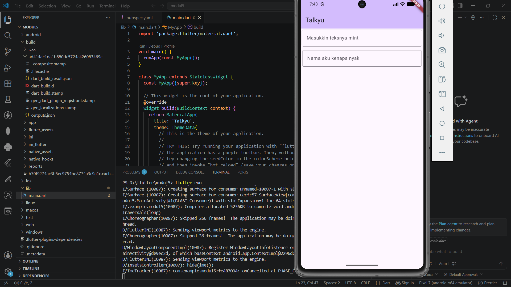

<div align="center">
  <br />
  <h1>LAPORAN PRAKTIKUM <br>APLIKASI BERBASIS PLATFORM</h1>
  <br />
  <h3>MODUL 5 & 6<br> FONT & TEXTFIELD</h3>
  <br />
   
  <br />
  <br />
  <br />
  <h3>Disusun Oleh :</h3>
  <p>
    <strong>DANENDRA ARDEN SHADUQ</strong><br>
    <strong>2311102146</strong><br>
    <strong>S1 IF-11-REG01</strong>
  </p>
  <br />
  <br />
  <h3>Dosen Pengampu :</h3>
  <p>
    <strong>Dimas Fanny Hebrasianto Permadi, S.ST., M.Kom</strong>
  </p>
  <br />
  <br />
    <h4>Asisten Praktikum :</h4>
    <strong> Apri Pandu Wicaksono </strong> <br>
    <strong>Rangga Pradarrell Fathi</strong>
  <br />
  <h3>LABORATORIUM HIGH PERFORMANCE
 <br>FAKULTAS INFORMATIKA <br>UNIVERSITAS TELKOM PURWOKERTO <br>2026</h3>
</div>

---

## 1. Dasar Teori

## Dasar Teori Widget Flutter

### Column

`Column` merupakan widget pada Flutter yang digunakan untuk menyusun beberapa widget secara vertikal dari atas ke bawah. Widget ini memiliki properti `children` yang berisi kumpulan widget lain yang akan ditampilkan dalam satu kolom. Selain itu, `Column` juga dapat diatur menggunakan properti seperti `crossAxisAlignment` dan `mainAxisAlignment` untuk menentukan posisi widget di dalamnya. 

### Padding

`Padding` adalah widget yang digunakan untuk memberikan jarak atau ruang kosong di sekitar widget lain. Padding berfungsi agar tampilan antarmuka menjadi lebih rapi dan tidak terlalu rapat dengan komponen lain. Pada Flutter, padding biasanya menggunakan `EdgeInsets` untuk menentukan ukuran jarak pada sisi atas, bawah, kanan, maupun kiri. 

### TextField

`TextField` merupakan widget input pada Flutter yang digunakan untuk menerima masukan teks dari pengguna. Widget ini sering digunakan pada form login, pencarian, maupun input data lainnya. `TextField` dapat dikustomisasi menggunakan properti `decoration` seperti `hintText`, `labelText`, dan `border` untuk memperjelas fungsi input kepada pengguna. 

---

## 2. Code & Penjelasan

**Code**

```dart
class _MyHomePageState extends State<MyHomePage> {
  @override
  Widget build(BuildContext context) {
    return Scaffold(
      appBar: AppBar(
        backgroundColor: Theme.of(context).colorScheme.inversePrimary,
        title: Text(widget.title),
      ),
      body: Column(
        crossAxisAlignment: CrossAxisAlignment.end,
        children: <Widget> [
          const Padding(
            padding: EdgeInsetsGeometry.symmetric(horizontal: 4, vertical: 4),
            child: TextField(
              decoration: InputDecoration(
                hintText: "Masukkin teksnya mint",
                border: OutlineInputBorder()
              ),
            ),
          ),
          Padding(
            padding: EdgeInsetsGeometry.symmetric(horizontal: 6, vertical: 8),
            child: TextField(
              decoration: InputDecoration(
                labelText: "Nama aku kenapa nyak",
                border: OutlineInputBorder()
              ),
            ),
          )
        ],
      )
    );
  }
}
```

**Penjelasan:**

Pada bagian `body`, digunakan widget `Column` untuk menyusun komponen secara vertikal. Properti `crossAxisAlignment: CrossAxisAlignment.end` berfungsi untuk meratakan posisi widget ke sisi kanan.

Di dalam `Column` terdapat dua widget `Padding` yang digunakan untuk memberikan jarak di sekitar komponen input agar tampilan lebih rapi. Setiap `Padding` membungkus widget `TextField` yang berfungsi sebagai tempat pengguna memasukkan teks. `TextField` pertama menggunakan `hintText` untuk menampilkan petunjuk input, sedangkan `TextField` kedua menggunakan `labelText` sebagai label pada kolom input. Keduanya juga menggunakan `OutlineInputBorder` untuk memberikan garis tepi pada area input sehingga tampil lebih jelas dan terstruktur.

---

## 3. Hasil Tampilan (*Output*)


