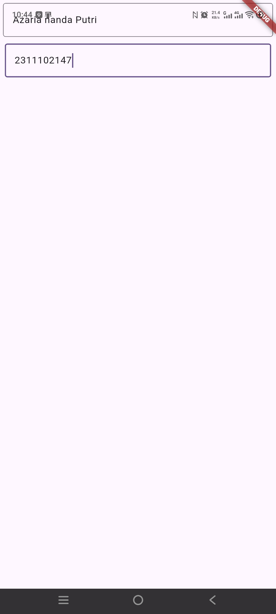

<div align="center">
  <br />
  <h1>LAPORAN PRAKTIKUM <br>APLIKASI BERBASIS PLATFORM</h1>
  <br />
  <h2>MODUL 5 & 6 FLUTTER <br>FONT & TEXTFIELD</h2>
  <br /><br />

  <!-- Masukkan logo pada folder assets dengan nama Logo.png -->
  

  <br /><br /><br />

  <h3>Disusun Oleh :</h3>

  <p>
    <strong>Azaria Nanda Putri</strong><br>
    <strong>2311102147</strong><br>
    <strong>S1 IF-11-REG 01</strong>
  </p>

  <br />

  <h3>Dosen Pengampu :</h3>

  <p>
    <strong>Dimas Fanny Hebrasianto Permadi, S.ST., M.Kom</strong>
  </p>

  <br /><br />

  <h4>Asisten Praktikum :</h4>

  <p>
    <strong>Apri Pandu Wicaksono</strong><br>
    <strong>Rangga Pradarrell Fathi</strong>
  </p>

  <br />

  <h2>
  LABORATORIUM HIGH PERFORMANCE <br>
  FAKULTAS INFORMATIKA <br>
  UNIVERSITAS TELKOM PURWOKERTO <br>
  2026
  </h2>
</div>

---

## 1. Pendahuluan

Flutter merupakan framework yang mendukung pengembangan aplikasi dengan pendekatan berbasis widget. Pada Flutter, tampilan aplikasi tidak dibuat sebagai elemen yang terpisah-pisah, tetapi dibangun melalui susunan widget yang membentuk struktur antarmuka. Komponen seperti teks, input, layout, warna, dan halaman dapat diatur menggunakan widget yang tersedia di dalam Flutter.

Pada praktikum modul 5 dan 6 ini, materi yang dipelajari berfokus pada penggunaan **Font** dan **TextField**. Font berhubungan dengan pengaturan tampilan tulisan, seperti ukuran huruf, warna, ketebalan, dan gaya teks. Sementara itu, `TextField` digunakan sebagai kolom input agar pengguna dapat memasukkan teks ke dalam aplikasi.

Aplikasi yang dibuat bernama `Talkyu`. Tampilan aplikasi menampilkan dua buah kolom input teks. Setiap kolom input menggunakan widget `TextField`, memiliki teks petunjuk berupa `hintText`, dan diberi garis tepi menggunakan `OutlineInputBorder` agar area input terlihat lebih jelas.

---

## 2. Dasar Teori

### 2.1 Flutter

Flutter adalah framework untuk membuat tampilan aplikasi pada berbagai platform, seperti Android, iOS, web, dan desktop. Flutter menggunakan bahasa Dart dan menerapkan konsep antarmuka berbasis widget. Dengan konsep tersebut, pengembang dapat menyusun tampilan aplikasi secara fleksibel melalui kombinasi beberapa widget.

Setiap bagian antarmuka pada Flutter merupakan widget. Widget dapat berupa teks, tombol, gambar, kolom input, struktur halaman, maupun layout. Susunan dari banyak widget tersebut membentuk *widget tree* yang menentukan tampilan akhir aplikasi.

### 2.2 Dart

Dart adalah bahasa pemrograman yang digunakan dalam Flutter. Dart mendukung konsep pemrograman berorientasi objek, sehingga kode program dapat dibuat menggunakan class, method, dan object.

Dalam aplikasi Flutter, fungsi `main()` menjadi bagian pertama yang dijalankan. Fungsi tersebut memanggil `runApp()` untuk menjalankan widget utama. Widget utama kemudian menjadi dasar dari seluruh tampilan aplikasi.

### 2.3 Font pada Flutter

Font pada Flutter berkaitan dengan cara teks ditampilkan pada layar. Pengaturan tampilan teks dapat dilakukan menggunakan widget `Text` dan properti `TextStyle`. Melalui `TextStyle`, pengembang dapat mengatur ukuran teks, warna, ketebalan huruf, gaya miring, serta jenis font.

Contoh pengaturan gaya teks pada Flutter adalah sebagai berikut.

```dart
Text(
  'Contoh Teks',
  style: TextStyle(
    fontSize: 20,
    fontWeight: FontWeight.bold,
    color: Colors.deepPurple,
  ),
)
```

Pada `TextField`, pengaturan font juga dapat diterapkan. Teks yang diketik oleh pengguna dapat diatur melalui properti `style`, sedangkan teks petunjuk dapat diatur melalui `hintStyle` pada `InputDecoration`.

### 2.4 TextField

`TextField` merupakan widget yang digunakan untuk membuat kolom masukan teks. Widget ini memungkinkan pengguna mengetikkan data menggunakan keyboard. `TextField` banyak digunakan pada fitur login, registrasi, pencarian, komentar, maupun form pengisian data.

Pada praktikum ini, aplikasi menggunakan dua buah `TextField`. TextField pertama memiliki teks petunjuk `Masukkan teks`, sedangkan TextField kedua memiliki teks petunjuk `Masukkan teks 2`.

### 2.5 InputDecoration

`InputDecoration` digunakan untuk mengatur dekorasi atau tampilan pada `TextField`. Dengan properti ini, pengembang dapat menambahkan teks petunjuk, label, ikon, border, dan pengaturan visual lain pada kolom input.

Contoh penggunaan `InputDecoration` adalah sebagai berikut.

```dart
TextField(
  decoration: InputDecoration(
    hintText: 'Masukkan teks',
    border: OutlineInputBorder(),
  ),
)
```

Pada contoh tersebut, `hintText` menampilkan arahan kepada pengguna sebelum teks diketik. Sementara itu, `OutlineInputBorder` digunakan untuk memberi garis tepi pada area input.

### 2.6 OutlineInputBorder

`OutlineInputBorder` adalah border yang membentuk garis di sekeliling `TextField`. Dengan border ini, kolom input terlihat seperti kotak isian sehingga pengguna dapat lebih mudah mengenali area yang harus diisi.

Dalam program praktikum, kedua `TextField` memakai `OutlineInputBorder`. Penggunaan border tersebut membuat tampilan input lebih tegas dan rapi.

### 2.7 Padding

`Padding` adalah widget yang digunakan untuk memberikan jarak pada sisi luar widget lain. Dalam praktikum ini, `Padding` membungkus setiap `TextField` agar kolom input tidak menempel langsung pada tepi layar.

Pengaturan padding membuat tampilan aplikasi menjadi lebih nyaman dilihat. Selain itu, padding membantu menjaga jarak antarkomponen agar susunan tampilan terlihat lebih teratur.

### 2.8 Column

`Column` merupakan widget layout yang digunakan untuk menyusun beberapa widget secara vertikal. Widget ini cocok digunakan ketika beberapa komponen perlu ditampilkan dari atas ke bawah.

Pada program praktikum, `Column` digunakan sebagai wadah dari dua buah `TextField`. Properti `crossAxisAlignment: CrossAxisAlignment.end` digunakan untuk mengatur posisi komponen pada arah horizontal.

### 2.9 StatefulWidget

`StatefulWidget` adalah jenis widget yang dapat menyimpan dan memperbarui kondisi selama aplikasi berjalan. Widget ini biasanya digunakan ketika tampilan perlu berubah karena adanya interaksi pengguna atau perubahan data.

Pada praktikum ini, halaman utama menggunakan `StatefulWidget` melalui class `MyHomePage`. Walaupun input teks belum diproses lebih lanjut, struktur ini tetap dapat dikembangkan untuk menambahkan controller, validasi, atau fitur untuk menampilkan data yang diketik pengguna.

---

## 3. Alat dan Bahan

Alat dan bahan yang digunakan pada praktikum ini adalah sebagai berikut.

1. Laptop atau komputer.
2. Sistem operasi Windows.
3. Flutter SDK.
4. Dart SDK.
5. Android Studio atau Android SDK.
6. Visual Studio Code.
7. Ekstensi Flutter dan Dart pada Visual Studio Code.
8. Emulator Android atau perangkat Android fisik.
9. File proyek Flutter.

---

## 4. Langkah-Langkah Praktikum

### 4.1 Membuat Proyek Flutter

Langkah awal yang dilakukan adalah membuat proyek Flutter baru. Proyek ini dibuat agar struktur dasar aplikasi Flutter, seperti folder `lib` dan file `main.dart`, tersedia secara otomatis.

Contoh perintah pembuatan proyek adalah sebagai berikut.

```bash
flutter create praktikum_font_textfield
```

Setelah proyek selesai dibuat, masuk ke folder proyek menggunakan perintah berikut.

```bash
cd praktikum_font_textfield
```

### 4.2 Membuka Proyek di Visual Studio Code

Setelah berada di dalam folder proyek, proyek dapat dibuka menggunakan Visual Studio Code. File utama yang digunakan untuk menulis program berada pada lokasi berikut.

```text
lib/main.dart
```

File `main.dart` menjadi tempat utama untuk menuliskan struktur aplikasi Flutter.

### 4.3 Mengimpor Package Material

Langkah pertama dalam kode adalah mengimpor package `material.dart`.

```dart
import 'package:flutter/material.dart';
```

Package tersebut menyediakan berbagai widget Material Design yang digunakan dalam program, seperti `MaterialApp`, `Scaffold`, `Column`, `Padding`, `TextField`, dan `InputDecoration`.

### 4.4 Membuat Fungsi Main

Fungsi `main()` merupakan titik awal aplikasi. Di dalam fungsi ini, `runApp()` digunakan untuk menjalankan widget utama.

```dart
void main() {
  runApp(const MyApp());
}
```

Kode tersebut menjalankan `MyApp` sebagai root widget dari aplikasi.

### 4.5 Membuat Class MyApp

Class `MyApp` berperan sebagai widget utama. Class ini menggunakan `StatelessWidget` karena tidak melakukan perubahan data secara langsung.

```dart
class MyApp extends StatelessWidget {
  const MyApp({super.key});

  @override
  Widget build(BuildContext context) {
    return MaterialApp(
      title: 'Talkyu',
      theme: ThemeData(
        colorScheme: ColorScheme.fromSeed(seedColor: Colors.deepPurple),
      ),
      home: const MyHomePage(title: 'Talkyu'),
    );
  }
}
```

Pada bagian ini, `MaterialApp` digunakan sebagai pembungkus aplikasi. Properti `title` berisi nama aplikasi, yaitu `Talkyu`. Properti `theme` digunakan untuk mengatur warna dasar aplikasi, sedangkan properti `home` menentukan halaman pertama yang ditampilkan.

### 4.6 Membuat StatefulWidget MyHomePage

Class `MyHomePage` dibuat sebagai `StatefulWidget`. Class ini menerima parameter `title` dan memiliki state yang diatur oleh `_MyHomePageState`.

```dart
class MyHomePage extends StatefulWidget {
  const MyHomePage({super.key, required this.title});

  final String title;

  @override
  State<MyHomePage> createState() => _MyHomePageState();
}
```

Penggunaan `StatefulWidget` memberikan kemungkinan agar aplikasi dapat dikembangkan menjadi lebih interaktif, terutama ketika input pengguna perlu disimpan atau diproses.

### 4.7 Membuat Struktur Halaman dengan Scaffold

Tampilan halaman dibuat pada method `build()` di dalam `_MyHomePageState`. Struktur halaman menggunakan `Scaffold`.

```dart
return Scaffold(
  body: Column(
    crossAxisAlignment: CrossAxisAlignment.end,
    children: <Widget>[
      // TextField diletakkan di sini
    ],
  ),
);
```

`Scaffold` berfungsi sebagai kerangka halaman. Pada bagian `body`, digunakan `Column` agar dua kolom input dapat disusun secara vertikal.

### 4.8 Membuat TextField Pertama

TextField pertama dibuat dengan membungkus widget `TextField` menggunakan `Padding`.

```dart
const Padding(
  padding: EdgeInsets.symmetric(vertical: 5, horizontal: 5),
  child: TextField(
    decoration: InputDecoration(
      hintText: 'Masukkan teks',
      border: OutlineInputBorder(),
    ),
  ),
),
```

Pada kode tersebut, padding memberikan jarak sebesar 5 pada sisi vertikal dan horizontal. `hintText` digunakan untuk menampilkan teks petunjuk, sedangkan `OutlineInputBorder` memberikan garis tepi pada input.

### 4.9 Membuat TextField Kedua

TextField kedua memiliki struktur yang sama, tetapi menggunakan teks petunjuk dan ukuran padding yang berbeda.

```dart
Padding(
  padding: const EdgeInsets.symmetric(vertical: 6, horizontal: 8),
  child: TextField(
    decoration: InputDecoration(
      hintText: 'Masukkan teks 2',
      border: OutlineInputBorder(),
    ),
  ),
),
```

Pada input kedua, `hintText` yang digunakan adalah `Masukkan teks 2`. Padding vertikal bernilai 6 dan padding horizontal bernilai 8.

### 4.10 Menjalankan Aplikasi

Setelah kode selesai dibuat, aplikasi dapat dijalankan dengan perintah berikut.

```bash
flutter run
```

Jika konfigurasi Flutter sudah sesuai, aplikasi akan menampilkan dua kolom input teks pada layar.

---

## 5. Source Code Lengkap

Berikut adalah source code lengkap pada file `lib/main.dart`.

> Catatan: Pada bagian `ColorScheme`, penulisan dibuat menjadi `ColorScheme.fromSeed` agar sesuai dengan sintaks Dart.

```dart
import 'package:flutter/material.dart';

void main() {
  runApp(const MyApp());
}

class MyApp extends StatelessWidget {
  const MyApp({super.key});

  // This widget is the root of your application.
  @override
  Widget build(BuildContext context) {
    return MaterialApp(
      title: 'Talkyu',
      theme: ThemeData(colorScheme: ColorScheme.fromSeed(seedColor: Colors.deepPurple)),
      home: const MyHomePage(title: 'Talkyu'),
    );
  }
}

class MyHomePage extends StatefulWidget {
  const MyHomePage({super.key, required this.title});

  final String title;

  @override
  State<MyHomePage> createState() => _MyHomePageState();
}

class _MyHomePageState extends State<MyHomePage> {

  @override
  Widget build(BuildContext context) {
    return Scaffold(
      body: Column(
        crossAxisAlignment: CrossAxisAlignment.end,
        children: <Widget>[
          const Padding(
            padding: EdgeInsets.symmetric(vertical: 5, horizontal: 5),
            child: TextField(
              decoration: InputDecoration(
                hintText: 'Masukkan teks',
                border: OutlineInputBorder()
              ),
            ),
          ),
          Padding(
            padding: const EdgeInsets.symmetric(vertical: 6, horizontal: 8),
            child: TextField(
              decoration: InputDecoration(
                hintText: 'Masukkan teks 2',
                border: OutlineInputBorder()
              ),
            ),
          )
        ],
      ),
    );
  }
}
```

---

## 6. Hasil Praktikum

Setelah program dijalankan, aplikasi menampilkan halaman sederhana yang berisi dua kolom input. Kolom pertama menampilkan teks petunjuk `Masukkan teks`, sedangkan kolom kedua menampilkan teks petunjuk `Masukkan teks 2`.

Kedua kolom input memiliki garis tepi karena menggunakan `OutlineInputBorder`. Selain itu, setiap input diberi `Padding` sehingga posisinya tidak terlalu dekat dengan tepi layar dan tampilan aplikasi terlihat lebih rapi.

Kode untuk memasukkan screenshot hasil program:



---

## 7. Pembahasan

Praktikum ini memperlihatkan cara membuat kolom input sederhana pada Flutter menggunakan widget `TextField`. Widget ini berfungsi sebagai tempat pengguna memasukkan teks melalui keyboard.

Aplikasi diawali dengan `MaterialApp` sebagai widget utama. Di dalamnya terdapat pengaturan judul aplikasi, tema, dan halaman awal. Judul aplikasi menggunakan nama `Talkyu`, sedangkan tema warna dibuat menggunakan `ThemeData` dengan warna dasar `deepPurple`.

Halaman utama dibuat menggunakan `StatefulWidget`. Meskipun pada program ini data input belum disimpan atau diproses, penggunaan `StatefulWidget` memudahkan pengembangan fitur berikutnya. Misalnya, aplikasi dapat ditambahkan `TextEditingController`, validasi input, atau fitur untuk menampilkan teks yang sudah diketik pengguna.

Bagian tampilan utama menggunakan `Scaffold`. Pada properti `body`, terdapat widget `Column` yang menyusun dua `TextField` dari atas ke bawah. Dengan penggunaan `Column`, susunan komponen menjadi sederhana dan mudah dipahami.

Setiap `TextField` dibungkus dengan `Padding`. TextField pertama menggunakan padding vertikal dan horizontal sebesar 5, sedangkan TextField kedua menggunakan padding vertikal 6 dan horizontal 8. Pemberian padding bertujuan agar kolom input tidak menempel langsung pada sisi layar.

Tampilan input diatur menggunakan `InputDecoration`. Properti `hintText` digunakan sebagai teks petunjuk sebelum pengguna mengetikkan data. Pada kolom pertama, teks petunjuk yang muncul adalah `Masukkan teks`, sedangkan pada kolom kedua adalah `Masukkan teks 2`.

Kedua input juga diberi `OutlineInputBorder`. Border tersebut membuat area input memiliki garis kotak sehingga lebih mudah dikenali. Dengan begitu, pengguna dapat memahami bagian mana yang digunakan untuk memasukkan teks.

Materi font pada praktikum ini berkaitan dengan pengaturan tampilan tulisan. Flutter menyediakan `TextStyle` untuk mengubah ukuran, warna, ketebalan, dan jenis huruf. Pada `TextField`, pengaturan tersebut dapat diterapkan pada teks input ataupun teks petunjuk.

Secara keseluruhan, program ini menunjukkan bahwa pembuatan form input sederhana pada Flutter dapat dilakukan dengan menggabungkan beberapa widget dasar. Kombinasi `TextField`, `InputDecoration`, `OutlineInputBorder`, `Padding`, dan `Column` dapat menghasilkan tampilan input yang jelas dan rapi.

---

## Referensi

1. Flutter Documentation. *Flutter Documentation*. https://docs.flutter.dev/
2. Flutter Documentation. *Building user interfaces with Flutter*. https://docs.flutter.dev/ui
3. Flutter API Documentation. *MaterialApp class*. https://api.flutter.dev/flutter/material/MaterialApp-class.html
4. Flutter API Documentation. *Scaffold class*. https://api.flutter.dev/flutter/material/Scaffold-class.html
5. Flutter API Documentation. *Text class*. https://api.flutter.dev/flutter/widgets/Text-class.html
6. Flutter API Documentation. *TextStyle class*. https://api.flutter.dev/flutter/painting/TextStyle-class.html
7. Flutter API Documentation. *TextField class*. https://api.flutter.dev/flutter/material/TextField-class.html
8. Flutter API Documentation. *InputDecoration class*. https://api.flutter.dev/flutter/material/InputDecoration-class.html
9. Flutter API Documentation. *OutlineInputBorder class*. https://api.flutter.dev/flutter/material/OutlineInputBorder-class.html
10. Dart Documentation. *Dart Overview*. https://dart.dev/overview