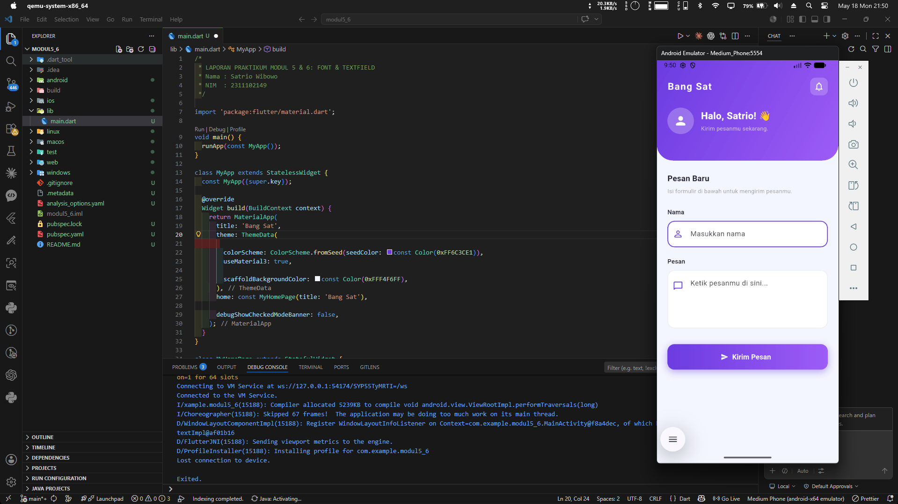

<div align="center">
  <br />
  <h1>LAPORAN PRAKTIKUM <br>APLIKASI BERBASIS PLATFORM</h1>
  <br />
  <h2>MODUL 5,6 <br>Mobile - FONT & TEXTFIELD</h2>
  <br />
  <br />
   
  <br />
  <br />
  <br />
  <h3>Disusun Oleh :</h3>
  <p>
    <strong>Satrio Wibowo</strong><br>
    <strong>2311102149</strong><br>
    <strong>S1 IF-11-REG 01</strong>
  </p>
  <br />
  <h3>Dosen Pengampu :</h3>
  <p>
    <strong>Dimas Fanny Hebrasianto Permadi, S.ST., M.Kom</strong>
  </p>
  <br />
  <br />
    <h4>Asisten Praktikum :</h4>
    <strong> Apri Pandu Wicaksono </strong> <br>
    <strong>Rangga Pradarrell Fathi</strong>
  <br />
  <h2>LABORATORIUM HIGH PERFORMANCE
 <br>FAKULTAS INFORMATIKA <br>UNIVERSITAS TELKOM PURWOKERTO <br>2026</h2>
</div>


---

## 1. Dasar Teori
 
#### 1.1 Mengenal Flutter
Flutter adalah sebuah *framework open-source* yang dikembangkan oleh Google, dirancang untuk memungkinkan pengembang membangun aplikasi multi-platform — mencakup mobile, web, dan desktop — hanya dengan satu basis kode tunggal (*single codebase*). Dikembangkan menggunakan bahasa pemrograman Dart, Flutter mengusung filosofi *"Everything is a Widget"*, yaitu setiap elemen antarmuka pengguna (UI) direpresentasikan sebagai widget. Pada project praktikum ini, Flutter digunakan untuk membangun sebuah antarmuka pesan interaktif yang menitikberatkan pada penerapan layouting, styling, dan form input.
 
#### 1.2 Konsep Widget
Widget merupakan unit penyusun paling dasar dalam ekosistem Flutter, baik yang bersifat visual maupun struktural. Flutter membagi widget ke dalam dua kategori besar:
* **StatelessWidget**: Widget yang bersifat statis, artinya tampilannya tidak dapat berubah setelah dirender karena tidak memiliki *internal state*.
* **StatefulWidget**: Widget yang bersifat dinamis dan mampu merespons perubahan data secara langsung dengan cara merender ulang tampilannya. Dalam proyek ini, `StatefulWidget` digunakan sebagai fondasi halaman utama supaya aplikasi dapat mengelola perubahan data dari area form input.
#### 1.3 Pengaturan Tata Letak dengan Column
`Column` merupakan widget tata letak yang bertugas menyusun deretan widget anak (*children*) secara vertikal dari atas ke bawah. Widget ini memiliki properti seperti `crossAxisAlignment` untuk mengatur posisi elemen secara horizontal. Dalam implementasi ini, `Column` dimanfaatkan sebagai kerangka utama yang menumpuk beberapa lapisan tampilan, mulai dari header bergradie, label, kolom input, hingga tombol kirim.
 
#### 1.4 Memberikan Ruang dengan Padding
Widget `Padding` digunakan untuk menambahkan ruang kosong (spasi internal) antara sebuah elemen dengan batas layar maupun dengan komponen lain di sekitarnya. Pada proyek ini, `Padding` diterapkan di beberapa titik — terutama membungkus area form — agar seluruh konten memiliki jarak yang proporsional dari tepi layar dan tidak terlihat terlalu padat. Selain `Padding`, widget `SizedBox` juga digunakan sebagai pemisah jarak vertikal antar-elemen untuk menjaga keterbacaan kode.
 
#### 1.5 Interaksi Pengguna melalui TextField
`TextField` merupakan komponen input teks yang memungkinkan pengguna mengetik dan memasukkan data ke dalam aplikasi. Widget ini memiliki berbagai properti yang dapat dikustomisasi, seperti `hintText` sebagai teks petunjuk placeholder, `prefixIcon` untuk menampilkan ikon di sisi kiri kolom, `maxLines` untuk mendukung input multi-baris, serta `controller` yang menghubungkan kolom input dengan objek `TextEditingController` agar nilai yang diketik dapat diakses secara programatik. Pada proyek ini, `TextField` dikustomisasi menggunakan `OutlineInputBorder` berradius untuk menghasilkan desain yang modern dan bersih.
 
#### 1.6 Standarisasi Material Design
Material Design adalah panduan desain visual resmi dari Google yang bertujuan menciptakan pengalaman pengguna yang konsisten dan intuitif di berbagai platform. Melalui penggunaan *library* `material.dart`, Flutter menyediakan berbagai komponen siap pakai seperti `Scaffold`, `ElevatedButton`, `TextField`, dan `ColorScheme`. Penerapan `MaterialApp` sebagai akar aplikasi memastikan seluruh widget yang digunakan secara otomatis mewarisi tema dan identitas visual yang telah didefinisikan — termasuk palet warna dan tipografi yang konsisten.
 
---
 
## 2. Source Code dan Implementasinya
 
```dart
/*
 * LAPORAN PRAKTIKUM MODUL 5 & 6: FONT & TEXTFIELD
 * Nama : Satrio Wibowo
 * NIM  : 2311102149
 */

import 'package:flutter/material.dart';

void main() {
  runApp(const MyApp());
}

class MyApp extends StatelessWidget {
  const MyApp({super.key});

  @override
  Widget build(BuildContext context) {
    return MaterialApp(
      title: 'Bang Sat',
      theme: ThemeData(
       
        colorScheme: ColorScheme.fromSeed(seedColor: const Color(0xFF6C3CE1)),
        useMaterial3: true,
        
        scaffoldBackgroundColor: const Color(0xFFF4F6FF),
      ),
      home: const MyHomePage(title: 'Bang Sat'),

      debugShowCheckedModeBanner: false,
    );
  }
}

class MyHomePage extends StatefulWidget {
  const MyHomePage({super.key, required this.title});
  final String title;

  @override
  State<MyHomePage> createState() => _MyHomePageState();
}

class _MyHomePageState extends State<MyHomePage> {
  // Controller untuk menangkap dan memanipulasi input teks dari pengguna
  final TextEditingController _nameController = TextEditingController();
  final TextEditingController _messageController = TextEditingController();

  @override
  Widget build(BuildContext context) {
    return Scaffold(
      body: Column(
        children: [
          // ─── HERO HEADER dengan Gradien ───────────────────────────────
          Container(
            width: double.infinity,
            decoration: const BoxDecoration(
              gradient: LinearGradient(
                colors: [Color(0xFF6C3CE1), Color(0xFF9D5CF6)],
                begin: Alignment.topLeft,
                end: Alignment.bottomRight,
              ),
              // Sudut bawah container dibuat melengkung untuk efek modern
              borderRadius: BorderRadius.only(
                bottomLeft: Radius.circular(36),
                bottomRight: Radius.circular(36),
              ),
            ),
            child: SafeArea(
              child: Padding(
                padding: const EdgeInsets.fromLTRB(24, 16, 24, 36),
                child: Column(
                  crossAxisAlignment: CrossAxisAlignment.start,
                  children: [
                    // Baris judul aplikasi dan ikon notifikasi
                    Row(
                      mainAxisAlignment: MainAxisAlignment.spaceBetween,
                      children: [
                        const Text(
                          'Bang Sat',
                          style: TextStyle(
                            color: Colors.white,
                            fontSize: 22,
                            fontWeight: FontWeight.bold,
                            letterSpacing: 1.5,
                          ),
                        ),
                        Container(
                          padding: const EdgeInsets.all(8),
                          decoration: BoxDecoration(
                            // Efek frosted-glass pada tombol notifikasi
                            color: Colors.white.withOpacity(0.2),
                            borderRadius: BorderRadius.circular(12),
                          ),
                          child: const Icon(
                            Icons.notifications_outlined,
                            color: Colors.white,
                          ),
                        ),
                      ],
                    ),
                    const SizedBox(height: 28),

                    // Baris avatar dan salam pengguna
                    Row(
                      children: [
                        CircleAvatar(
                          radius: 30,
                          backgroundColor: Colors.white.withOpacity(0.25),
                          child: const Icon(
                            Icons.person_rounded,
                            color: Colors.white,
                            size: 32,
                          ),
                        ),
                        const SizedBox(width: 16),
                        const Column(
                          crossAxisAlignment: CrossAxisAlignment.start,
                          children: [
                            Text(
                              'Halo, Satrio! 👋',
                              style: TextStyle(
                                fontSize: 22,
                                fontWeight: FontWeight.w800,
                                color: Colors.white,
                              ),
                            ),
                            SizedBox(height: 4),
                            Text(
                              'Kirim pesanmu sekarang.',
                              style: TextStyle(
                                fontSize: 13,
                                color: Colors.white70,
                              ),
                            ),
                          ],
                        ),
                      ],
                    ),
                  ],
                ),
              ),
            ),
          ),

          // ─── AREA FORM ────────────────────────────────────────────────
          Expanded(
            child: SingleChildScrollView(
              child: Padding(
                padding: const EdgeInsets.symmetric(
                  horizontal: 24.0,
                  vertical: 28,
                ),
                child: Column(
                  crossAxisAlignment: CrossAxisAlignment.start,
                  children: [
                    // Sub-judul seksi form
                    const Text(
                      'Pesan Baru',
                      style: TextStyle(
                        fontSize: 18,
                        fontWeight: FontWeight.w700,
                        color: Color(0xFF1A1A2E),
                      ),
                    ),
                    const SizedBox(height: 6),
                    const Text(
                      'Isi formulir di bawah untuk mengirim pesanmu.',
                      style: TextStyle(fontSize: 13, color: Colors.grey),
                    ),
                    const SizedBox(height: 28),

                    // ── Input 1: Nama ──────────────────────────────────
                    _buildInputLabel('Nama'),
                    const SizedBox(height: 10),
                    TextField(
                      controller: _nameController,
                      decoration: InputDecoration(
                        hintText: 'Masukkan nama',
                        // Ikon ungu senada tema di sisi kiri kolom input
                        prefixIcon: const Icon(
                          Icons.person_outline_rounded,
                          color: Color(0xFF6C3CE1),
                        ),
                        filled: true,
                        fillColor: Colors.white,
                        // Garis tepi default: abu tipis dengan sudut melengkung
                        enabledBorder: OutlineInputBorder(
                          borderRadius: BorderRadius.circular(16),
                          borderSide: BorderSide(
                            color: Colors.grey.shade200,
                            width: 1.5,
                          ),
                        ),
                        // Garis tepi saat aktif: ungu tebal sebagai visual feedback
                        focusedBorder: OutlineInputBorder(
                          borderRadius: BorderRadius.circular(16),
                          borderSide: const BorderSide(
                            color: Color(0xFF6C3CE1),
                            width: 2,
                          ),
                        ),
                        contentPadding:
                            const EdgeInsets.symmetric(vertical: 18),
                      ),
                    ),
                    const SizedBox(height: 22),

                    // ── Input 2: Pesan (multi-baris) ───────────────────
                    _buildInputLabel('Pesan'),
                    const SizedBox(height: 10),
                    TextField(
                      controller: _messageController,
                      // Memungkinkan pengguna menulis beberapa baris sekaligus
                      maxLines: 4,
                      decoration: InputDecoration(
                        hintText: 'Ketik pesanmu di sini...',
                        prefixIcon: const Padding(
                          // Ikon disesuaikan agar sejajar baris pertama teks
                          padding: EdgeInsets.only(bottom: 60),
                          child: Icon(
                            Icons.chat_bubble_outline_rounded,
                            color: Color(0xFF6C3CE1),
                          ),
                        ),
                        filled: true,
                        fillColor: Colors.white,
                        enabledBorder: OutlineInputBorder(
                          borderRadius: BorderRadius.circular(16),
                          borderSide: BorderSide(
                            color: Colors.grey.shade200,
                            width: 1.5,
                          ),
                        ),
                        focusedBorder: OutlineInputBorder(
                          borderRadius: BorderRadius.circular(16),
                          borderSide: const BorderSide(
                            color: Color(0xFF6C3CE1),
                            width: 2,
                          ),
                        ),
                        contentPadding: const EdgeInsets.symmetric(
                          vertical: 18,
                          horizontal: 16,
                        ),
                      ),
                    ),
                    const SizedBox(height: 36),

                    // ── Tombol Submit dengan Gradien ───────────────────
                    SizedBox(
                      width: double.infinity,
                      height: 58,
                      child: DecoratedBox(
                        decoration: BoxDecoration(
                          // Gradien ungu horizontal pada permukaan tombol
                          gradient: const LinearGradient(
                            colors: [Color(0xFF6C3CE1), Color(0xFF9D5CF6)],
                          ),
                          borderRadius: BorderRadius.circular(16),
                          // Bayangan ungu transparan untuk efek melayang (elevated)
                          boxShadow: [
                            BoxShadow(
                              color:
                                  const Color(0xFF6C3CE1).withOpacity(0.45),
                              blurRadius: 14,
                              offset: const Offset(0, 5),
                            ),
                          ],
                        ),
                        child: ElevatedButton.icon(
                          style: ElevatedButton.styleFrom(
                            // Latar transparan agar gradien di DecoratedBox tampak
                            backgroundColor: Colors.transparent,
                            shadowColor: Colors.transparent,
                            shape: RoundedRectangleBorder(
                              borderRadius: BorderRadius.circular(16),
                            ),
                          ),
                          onPressed: () {
                            // Placeholder aksi pengiriman pesan
                          },
                          icon: const Icon(
                            Icons.send_rounded,
                            color: Colors.white,
                          ),
                          label: const Text(
                            'Kirim Pesan',
                            style: TextStyle(
                              fontSize: 16,
                              fontWeight: FontWeight.bold,
                              color: Colors.white,
                            ),
                          ),
                        ),
                      ),
                    ),
                  ],
                ),
              ),
            ),
          ),
        ],
      ),
    );
  }

  // Helper method untuk membuat label konsisten di atas setiap TextField
  Widget _buildInputLabel(String label) {
    return Text(
      label,
      style: const TextStyle(
        fontSize: 14,
        fontWeight: FontWeight.w600,
        color: Color(0xFF1A1A2E),
      ),
    );
  }
}
```
 
Program ini menggunakan dua buah `TextField` dengan kustomisasi yang lebih lengkap dibandingkan implementasi dasar. Properti `controller` menghubungkan setiap kolom dengan `TextEditingController`-nya masing-masing sehingga nilai yang diketik pengguna dapat diakses kapan saja. `hintText` menampilkan teks petunjuk *placeholder* di dalam kolom saat belum ada isi. `prefixIcon` menampilkan ikon berwarna ungu senada tema aplikasi di sisi kiri kolom, membantu pengguna mengidentifikasi fungsi tiap kolom secara visual. Properti `filled` dan `fillColor` memberikan latar belakang putih solid pada area input. `enabledBorder` mendefinisikan garis tepi abu tipis dengan sudut membulat saat kolom dalam kondisi tidak aktif, sedangkan `focusedBorder` memberikan umpan balik visual berupa garis tepi ungu lebih tebal saat pengguna sedang mengetik. Untuk `TextField` pesan, ditambahkan properti `maxLines: 4` sehingga area input diperluas menjadi empat baris, cocok untuk pesan yang lebih panjang.
 
---
 
## 3. TAMPILAN OUTPUT
 
 