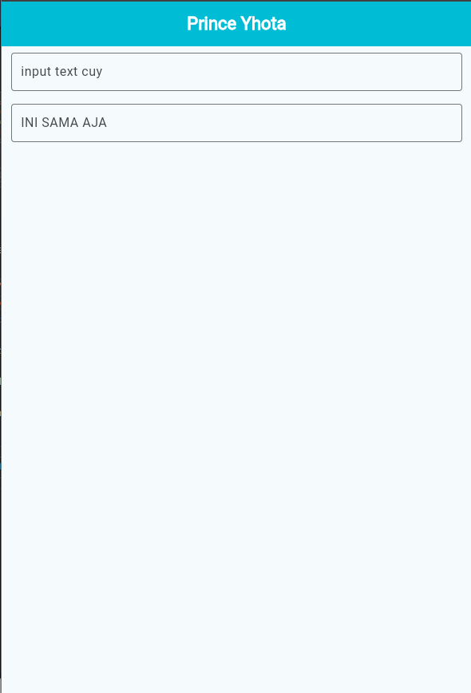

<div align="center">

<br>

# LAPORAN PRAKTIKUM  
# APLIKASI BERBASIS PLATFORM

<br>

## MODUL 05-06  
## Mobile - FONT DAN TEXTFIELD

<br>


<br><br>

### Disusun Oleh

**Yoga Hogantara**  
**2311102153**  
**S1 IF-11-REG01**

<br>

### Dosen Pengampu

**Dimas Fanny Hebrasianto Permadi, S.ST., M.Kom**

<br>

### Asisten Praktikum

**Apri Pandu Wicaksono**  
**Rangga Pradarrell Fathi**

<br><br>

### LABORATORIUM HIGH PERFORMANCE  
### FAKULTAS INFORMATIKA  
### UNIVERSITAS TELKOM PURWOKERTO  
### 2026

</div>

---

## 1. Dasar Teori
 
### Komponen Utama dalam Pengembangan UI Flutter
 
Dalam membangun antarmuka pengguna (UI) menggunakan Flutter, terdapat beberapa komponen (*widget*) dasar yang memiliki peran penting:
 
* **`Scaffold`** Merupakan fondasi atau cetak biru visual utama untuk menerapkan desain berbasis *Material Design*. Komponen ini berfungsi sebagai wadah besar yang memudahkan pengaturan elemen-elemen halaman, seperti area konten utama (`body`), bilah navigasi atas (`appBar`), hingga tombol melayang (`floatingActionButton`).
* **`Column`** Sebuah *widget* tata letak (*layout*) yang bersifat fleksibel untuk menyusun berbagai elemen di dalamnya secara vertikal, berjejer dari atas ke bawah.
* **`Padding`** *Widget* yang berfungsi untuk menyisipkan ruang atau jarak kosong di sekeliling komponen yang dibungkusnya. Penerapan *padding* ini menjaga agar elemen-elemen antarmuka tetap proporsional dan tidak saling menempel satu sama lain.
* **`TextField`** Komponen interaktif yang menyediakan kolom pengisian bagi pengguna untuk mengetikkan teks melalui papan ketik (*keyboard*). Tampilannya dapat dikustomisasi lebih lanjut menggunakan properti `decoration` (seperti `InputDecoration`) untuk menyisipkan teks petunjuk (*placeholder/hint*) serta mengatur gaya bingkai (*border*).
---
 
## 2. Sourcecode
 
```dart
import 'package:flutter/material.dart';
 
void main() {
  runApp(const MyApp());
}
 
class MyApp extends StatelessWidget {
  const MyApp({super.key});
 
  @override
  Widget build(BuildContext context) {
    return MaterialApp(
      title: 'Prince Yhota',
      theme: ThemeData(
        colorScheme: ColorScheme.fromSeed(
          seedColor: Colors.cyan,
          primary: Colors.cyan,
        ),
        useMaterial3: true,
      ),
      home: const MyHomePage(title: 'Prince Yhota'),
      debugShowCheckedModeBanner: false,
    );
  }
}
 
class MyHomePage extends StatefulWidget {
  const MyHomePage({super.key, required this.title});
 
  final String title;
 
  @override
  State<MyHomePage> createState() => _MyHomePageState();
}
 
class _MyHomePageState extends State<MyHomePage> {
  @override
  Widget build(BuildContext context) {
    return Scaffold(
      appBar: AppBar(
        title: Text(
          widget.title,
          style: const TextStyle(
            color: Colors.white,
            fontWeight: FontWeight.bold,
          ),
        ),
        backgroundColor: Colors.cyan,
        centerTitle: true,
      ),
      body: SafeArea(
        child: Column(
          crossAxisAlignment: CrossAxisAlignment.end,
          children: const <Widget>[
            Padding(
              padding: EdgeInsets.symmetric(horizontal: 12, vertical: 8),
              child: TextField(
                decoration: InputDecoration(
                  labelText: "input text cuy",
                  border: OutlineInputBorder(),
                ),
              ),
            ),
            Padding(
              padding: EdgeInsets.symmetric(horizontal: 12, vertical: 8),
              child: TextField(
                decoration: InputDecoration(
                  labelText: "INI SAMA AJA",
                  border: OutlineInputBorder(),
                ),
              ),
            ),
          ],
        ),
      ),
    );
  }
}
```
 
### Penjelasan
 
* **`main()` & `runApp()`**: Titik awal untuk menjalankan dan meluncurkan aplikasi Flutter.
* **`MyApp` (`StatelessWidget`)**: Mengatur konfigurasi dasar aplikasi, seperti mematikan banner debug dan menyetel tema warna utama menjadi Cyan.
* **`MyHomePage` (`StatefulWidget`)**: Halaman utama aplikasi yang bersifat dinamis (tampilannya bisa berubah jika ada interaksi data).
* **`Scaffold`**: Struktur dasar halaman yang menyediakan tempat untuk membuat AppBar dan area isi (`body`).
* **`AppBar`**: Bar navigasi atas berwarna cyan dengan teks judul "Prince Yhota" di posisi tengah.
* **`SafeArea`**: Menjaga agar konten aplikasi tidak terpotong oleh poni (*notch*) atau status bar ponsel.
* **`Column`**: Menyusun elemen di dalamnya secara vertikal (ke bawah) dan merapat ke kanan (`crossAxisAlignment.end`).
* **`Padding` & `TextField`**: Dua buah kotak input teks ("input text cuy" dan "INI SAMA AJA") yang diberi jarak pembatas agar terlihat rapi dengan bingkai kotak (`OutlineInputBorder`).
---
 
## 3. Screenshot Hasil
 

 
---
 
## 4. Referensi
 
- Dart: [https://dart.dev](https://dart.dev)

 