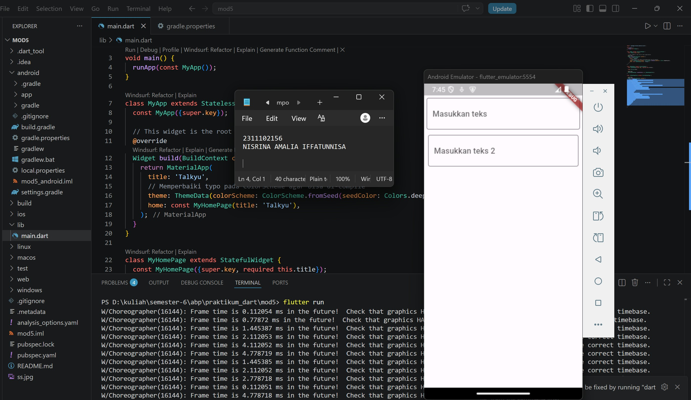

<div align="center">
  <br />
  <h1>LAPORAN PRAKTIKUM <br>APLIKASI BERBASIS PLATFORM</h1>
  <br />
  <h3> Modul 05-06 Mobile <br> TEXTFIELD </h3>
  <br />
   
  <br />
  <br />
  <br />
  <h3>Disusun Oleh :</h3>
  <p>
    <strong>Nisrina Amalia Iffatunnisa</strong><br>
    <strong>2311102156</strong><br>
    <strong>S1 IF-11-01</strong>
  </p>
  <br />
  <h3>Dosen Pengampu :</h3>
  <p>
    <strong>Dimas Fanny Hebrasianto Permadi, S.ST., M.Kom</strong>
  </p>
  <br />
  <br />
    <h4>Asisten Praktikum :</h4>
    <strong> Apri Pandu Wicaksono </strong> <br>
    <strong>Rangga Pradarrell Fathi</strong>
  <br />
  <h3>LABORATORIUM HIGH PERFORMANCE
 <br>FAKULTAS INFORMATIKA <br>UNIVERSITAS TELKOM PURWOKERTO <br>2026</h3>
</div>


## 1. Latar Belakang

### A. Flutter, Font, dan Text Field
Flutter adalah kerangka kerja sumber terbuka yang dikembangkan dan didukung oleh Google. Developer frontend dan full-stack menggunakan Flutter untuk membangun antarmuka pengguna (UI) aplikasi untuk beberapa platform dengan kode program tunggal. Saat Flutter diluncurkan pada tahun 2018, Flutter terutama mendukung pengembangan aplikasi seluler. Flutter kini mendukung pengembangan aplikasi di enam platform, yaitu iOS, Android, web, Windows, MacOS, dan Linux

Keuntungan Flutter
- Performa yang mendekati aslinya. Flutter menggunakan bahasa pemrograman Dart dan dikompilasi menjadi kode mesin. Perangkat host memahami kode ini sehingga memastikan performa yang cepat dan efektif.
- Rendering yang cepat, konsisten, dan dapat disesuaikan. Alih-alih mengandalkan alat rendering khusus platform, Flutter menggunakan pustaka grafis Skia sumber terbuka milik Google untuk me-render UI. Keuntungan ini memberi pengguna visual yang konsisten, apa pun platform yang digunakan untuk mengakses aplikasi. 
- Alat yang ramah developer. Google membuat Flutter dengan mengutamakan pada kemudahan penggunaan. Dengan alat seperti hot reload, developer dapat melihat seperti apa perubahan kode tanpa kehilangan status. Alat lain seperti pemeriksa widget memudahkan dalam memvisualisasikan dan memecahkan masalah tata letak UI.

Flutter menggunakan bahasa pemrograman sumber terbuka Dart, yang juga dikembangkan oleh Google. Dart dioptimalkan untuk membangun UI. Flutter berjalan menggunakan Dart Virtual Machine (VM) di sistem operasi Windows, Linux, dan macOS. Dart VM menggunakan kompilasi kode just-in-time (JIT) yang menyediakan fitur hot-reload untuk menghemat waktu pengembangan. Di Flutter, developer membuat tata letak UI dengan menggunakan widget. Untuk mengatur ukuran, warna, atau mengganti font khusus menggunakan properti style di dalam widget Text atau TextField. Text Field adalah sebuah widget pada Flutter yang digunakan untuk menerima inputan berupa teks dari pengguna. Widget ini dapat memungkinkan kita sebagai pengguna aplikasi untuk dapat memasukkan teks dengan menggunakan keyboard. Manfaat menggunakan Text Field ini sangat beragam, biasanya penggunaan Text Field ini digunakan pada formulir, kuesioner, dan input lainnya.

- Text Field dapat memberikan interaksi secara langsung dengan pengguna aplikasi seperti edit profil, bantuan pencarian, serta memasukkan data pada saat login ke aplikasi.
- Text Field dapat membantu untuk pengumpulan data yang lebih efisien. Biasanya data dapat dikumpulkan saat pengguna memasukkan data pada Text Field. sehingga data yang masuk secara real-time dapat disimpan dan diolah secara lanjut.
- Text Field dapat membantu pengguna untuk memvalidasi data yang diinput sudah sesuai. Contohnya seperti data email yang dimasukkan pada saat login, data email tersebut akan di validasi melalui Text Field, apakah data tersebut sudah sesuai dengan format dan tidak ada bagian yang kosong.
- Text Field dapat membantu developer dalam memasukkan atau menginput data seperti email pengguna untuk dapat didata dengan baik dan efektif. sehingga dengan adanya Text Field developer dapat menginput data dengan baik dan benar.

## 2. Sourcecode 

### Sourcecode main.dart
``` Dart
import 'package:flutter/material.dart';

void main() {
  runApp(const MyApp());
}

class MyApp extends StatelessWidget {
  const MyApp({super.key});

  // This widget is the root of your application.
  @override
  Widget build(BuildContext context) {
    return MaterialApp(
      title: 'Talkyu',
      // Memperbaiki typo pada ColorScheme agar bisa di-compile
      theme: ThemeData(colorScheme: ColorScheme.fromSeed(seedColor: Colors.deepPurple)),
      home: const MyHomePage(title: 'Talkyu'),
    );
  }
}

class MyHomePage extends StatefulWidget {
  const MyHomePage({super.key, required this.title});

  final String title;

  @override
  State<MyHomePage> createState() => _MyHomePageState();
}

class _MyHomePageState extends State<MyHomePage> {

  @override
  Widget build(BuildContext context) {
    return Scaffold(
      body: SafeArea( // SafeArea ditambahkan di sini
        child: Column(
          crossAxisAlignment: CrossAxisAlignment.end,
          children: <Widget>[
            const Padding(
              padding: EdgeInsets.symmetric(vertical: 5, horizontal: 5),
              child: TextField(
                decoration: InputDecoration(
                  hintText: 'Masukkan teks',
                  border: OutlineInputBorder()
                ),
              ),
            ),
            const Padding(
              padding: EdgeInsets.symmetric(vertical: 6, horizontal: 8),
              child: TextField(
                decoration: InputDecoration(
                  hintText: 'Masukkan teks 2',
                  border: OutlineInputBorder()
                ),
              ),
            )
          ],
        ),
      ),
    );
  }
}
```

### 3. Hasil Penugasan


## 4. Penjelasan dan Kesimpulan
Kode main.dart di atas membangun struktur dasar aplikasi Flutter bernama "Talkyu" menggunakan komponen StatefulWidget pada MyHomePage untuk menampilkan antarmuka yang dinamis. Di dalam metode build, aplikasi memanfaatkan widget SafeArea sebagai pelindung agar seluruh elemen teks tetap berada di area layar yang aman dan tidak terhalang oleh status bar atau takik (notch) pada perangkat seluler. Untuk tata letaknya, dua buah komponen TextField disusun secara vertikal menggunakan widget Column, di mana masing-masing input dibungkus oleh Padding untuk memberikan jarak renggang yang proporsional di sekelilingnya. Selain itu, setiap bidang input dikonfigurasi dengan properti InputDecoration serta OutlineInputBorder() guna menciptakan tampilan kotak teks bergaris tepi yang modern, lengkap dengan hint text ("Masukkan teks" dan "Masukkan teks 2") sebagai panduan visual bagi pengguna saat ingin mengetikkan data.


### 5. Daftar Pustaka
[1] Al Ayyubi, R. A., Nastiti, F. E., & Oktaviani, I. (2024). Inovasi Pembayaran Indekos Digital Menggunakan Framework Flutter Untuk Meningkatkan Efisiensi Transaksi. JEKIN-Jurnal Teknik Informatika, 4(3), 408-419.

[2] BuildWithAngga, “Mengenal fitur text field pada Flutter,” BuildWithAngga. [Online]. Available: https://buildwithangga.com/tips/mengenal-fitur-text-field-pada-flutter. [Accessed: 17-May-2026].

[3] Maulana, R., Andrianto, R., Nasution, A., Hasibuan, H. A., Siregar, A. R. R., & Hasibuan, A. H. (2023). Penerapan Flutter Dalam Pengembangan Aplikasi Mobile Resep Kue Indonesia. Jurnal Penelitian Teknologi Informasi dan Sains, 1(3), 103-110.

