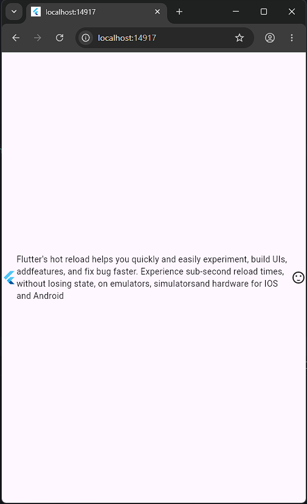
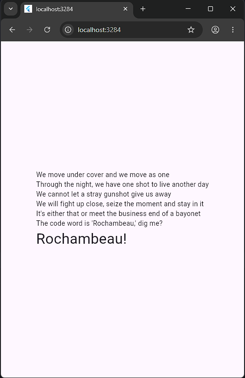
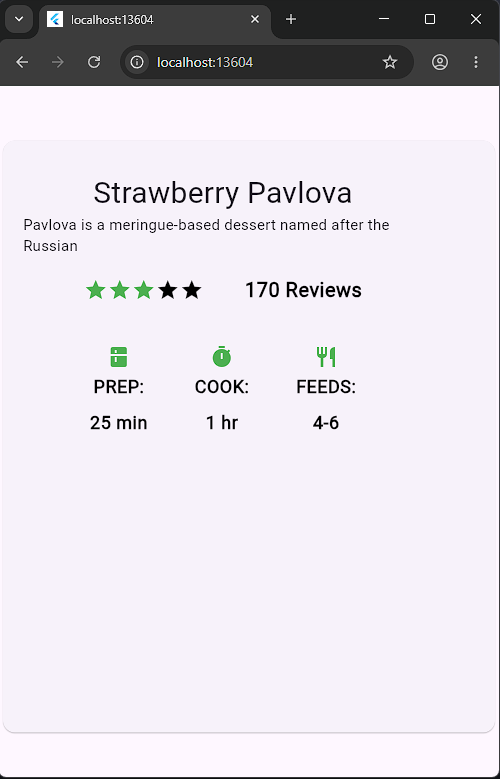
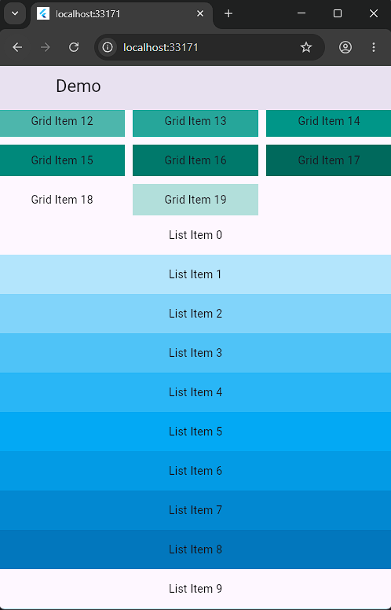
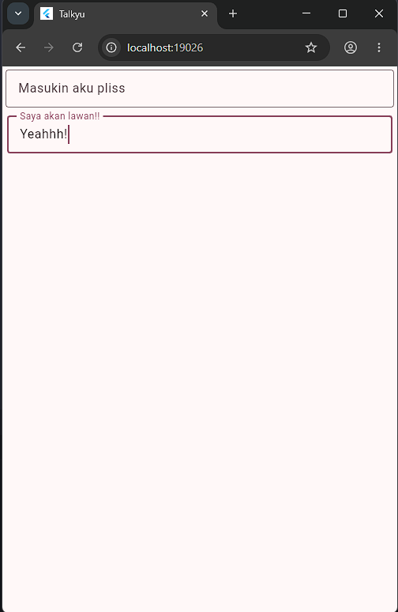

<div align="center">
  <br />

  <h1>LAPORAN PRAKTIKUM <br>
  APLIKASI BERBASIS PLATFORM
  </h1>

  <br />

  <h3>MODUL 5 & 6 <br>
  Antarmuka Pengguna Lanjutan & Interaksi Pengguna
  </h3>

  <br />

  

  <br />
  <br />
  <br />

  <h3>Disusun Oleh :</h3>

  <p>
    <strong>Fahreza Ilham Wicaksono</strong><br>
    <strong>2311102191</strong><br>
    <strong>S1 IF-11-REG01</strong>
  </p>

  <br />

  <h3>Dosen Pengampu :</h3>

  <p>
    <strong>Dimas Fanny Hebrasianto Permadi, S.ST., M.Kom</strong>
  </p>
  
  <br />
  <br />
    <h4>Asisten Praktikum :</h4>
    <strong> Apri Pandu Wicaksono </strong> <br>
    <strong>Rangga Pradarrell Fathi</strong>
  <br />

  <h3>LABORATORIUM HIGH PERFORMANCE
 <br>FAKULTAS INFORMATIKA <br>UNIVERSITAS TELKOM PURWOKERTO <br>2026</h3>
</div>

<hr>

## Row

```dart
import 'package:flutter/material.dart';

void main() {
  runApp(
    MaterialApp(
      debugShowCheckedModeBanner: false,
      home: Scaffold(
        body: Center(
          child: Row(
            children: [
              const FlutterLogo(),
              const Expanded(
                  child: Text( "Flutter's hot reload helps you quickly and easily experiment, build UIs, add"
                      "features, and fix bug faster. Experience sub-second reload times, without losing state, on emulators, simulators"
                      "and hardware for IOS and Android"
                  )
              ),
              const Icon(Icons.sentiment_satisfied)
            ],
          ),
        ),
      ),
    ),
  );
}
```

Kode tersebut digunakan untuk membuat elemen `row` pada flutter. Elemen `row` merupakan widget pada flutter yang digunakan untuk membuat layout seperti baris, jadi nanti element childern dari `row` akan berada bersebalahan secara horizontal. Berikut contoh output dari kode diatas:



## Column

```dart
import 'package:flutter/material.dart';

void main() {
  runApp(
    MaterialApp(
      debugShowCheckedModeBanner: false,
      home: Scaffold(
        body: Center(
          child: Column(
            children: [
              Text("Deliver features faster"),
              Text("Craft beautiful UI's"),
              Expanded(
                child: FittedBox(fit: BoxFit.contain, child: FlutterLogo()),
              ),
            ],
          ),
        ),
      ),
    ),
  );
}

import 'package:flutter/material.dart';

void main() {
  runApp(
    MaterialApp(
      debugShowCheckedModeBanner: false,
      home: Scaffold(
        body: Center(
          child: Column(
            crossAxisAlignment: CrossAxisAlignment.start,
            mainAxisSize: MainAxisSize.min,
            children: [
              Text("We move under cover and we move as one"),
              Text("Through the night, we have one shot to live another day"),
              Text("We cannot let a stray gunshot give us away"),
              Text("We will fight up close, seize the moment and stay in it"),
              Text("It's either that or meet the business end of a bayonet"),
              Text("The code word is 'Rochambeau,' dig me?"),
              Text("Rochambeau!", style: TextStyle(fontSize: 30)),
            ],
          ),
        ),
      ),
    ),
  );
}

```

Kode tersebut digunakan untuk membuat elemen `column` pada flutter. Elemen `column` merupakan widget pada flutter yang digunakan untuk membuat layout seperti kolom, jadi nanti element `childern` dari `column` akan berada bersebalahan secara vertikal. Berikut contoh output dari kode diatas:



## Nested Row

```dart
import 'package:flutter/material.dart';

void main() {
  var stars = Row(
    mainAxisSize: MainAxisSize.min,
    children: [
      Icon(Icons.star, color: Colors.green[500]),
      Icon(Icons.star, color: Colors.green[500]),
      Icon(Icons.star, color: Colors.green[500]),
      Icon(Icons.star, color: Colors.black),
      Icon(Icons.star, color: Colors.black),
    ],
  );

  final ratings = Container(
    padding: EdgeInsets.all(20),
    child: Row(
      mainAxisAlignment: MainAxisAlignment.spaceEvenly,
      children: [
        stars,
        Text(
          "170 Reviews",
          style: TextStyle(
            color: Colors.black,
            fontWeight: FontWeight.w800,
            fontFamily: "Roboto",
            letterSpacing: 0.5,
            fontSize: 20,
          ),
        ),
      ],
    ),
  );

  var descTextStyle = TextStyle(
    color: Colors.black,
    fontWeight: FontWeight.w800,
    fontFamily: "Roboto",
    letterSpacing: 0.5,
    fontSize: 18,
    height: 2,
  );

  final iconList = DefaultTextStyle.merge(
      style: descTextStyle,
      child: Container(
        padding: EdgeInsets.all(20),
        child: Row(
          mainAxisAlignment: MainAxisAlignment.spaceEvenly,
          children: [
            Column(
              children: [
                Icon(Icons.kitchen, color: Colors.green[500]),
                Text("PREP:"),
                Text("25 min"),
              ],
            ),
            Column(
              children: [
                Icon(Icons.timer, color: Colors.green[500]),
                Text("COOK:"),
                Text("1 hr"),
              ],
            ),
            Column(
              children: [
                Icon(Icons.restaurant, color: Colors.green[500]),
                Text("FEEDS:"),
                Text("4-6"),
              ],
            ),
          ],
        ),
      )
  );

  final leftColumn = Container(
    padding: EdgeInsets.fromLTRB(20, 30, 20, 20),
    child: Column(
      children: [
        Text("Strawberry Pavlova", style: TextStyle(fontSize: 30)),
        Text("Pavlova is a meringue-based dessert named after the Russian", style: TextStyle(fontSize: 15)),
        ratings,
        iconList
      ],
    ),
  );

  runApp(
    MaterialApp(
      debugShowCheckedModeBanner: false,
      home: Scaffold(
        body: Center(
          child: Container(
            margin: EdgeInsets.fromLTRB(0, 40, 0, 30),
            height: 600,
            child: Card(
              child: Row(
                crossAxisAlignment: CrossAxisAlignment.start,
                children: [
                  SizedBox(
                    width: 440,
                    child: leftColumn,
                  ),
                ],
              ),
            ),
          ),
        ),
      ),
    ),
  );
}

```

Kode tersebut digunakan untuk membuat `nested row` pada flutter. Bagian stars dibuat menggunakan `Row` yang berisi beberapa Icon, sehingga ikon bintang tersusun secara horizontal. Kemudian widget stars dimasukkan lagi ke dalam `Row` lain pada bagian ratings bersama widget `Text`. Karena `Row` dapat berisi banyak widget, hasilnya bintang dan teks “170 Reviews” tampil sejajar dalam satu baris. Ini merupakan contoh `nested Row` karena ada `Row` di dalam `Row`. Pada bagian `iconList`, digunakan `Row` sebagai wadah utama untuk menyusun beberapa `Column` secara horizontal. Setiap `Column` berisi ikon dan dua teks yang ditampilkan vertikal dari atas ke bawah. Dengan cara ini, setiap informasi seperti PREP, COOK, dan FEEDS memiliki susunan sendiri tetapi tetap sejajar dalam satu baris utama. Selanjutnya semua bagian seperti judul, deskripsi, rating, dan `iconList` dimasukkan ke dalam `Column` pada `leftColumn` agar seluruh elemen tersusun vertikal. Beberapa `Container` digunakan untuk memberikan padding dan jarak agar tampilan lebih rapi.
Berikut contoh output dari kode diatas:



## Custom Scroll View

```dart
import 'package:flutter/material.dart';

void main() {
  runApp(
    MaterialApp(
      debugShowCheckedModeBanner: false,
      home: Scaffold(
        body: Center(
          child: CustomScrollView(
            slivers: [
              SliverAppBar(
                pinned: true,
                expandedHeight: 250.0,
                flexibleSpace: FlexibleSpaceBar(title: Text("Demo")),
              ),
              SliverGrid(
                gridDelegate: SliverGridDelegateWithMaxCrossAxisExtent(
                  maxCrossAxisExtent: 200.0,
                  mainAxisSpacing: 10.0,
                  crossAxisSpacing: 10.0,
                  childAspectRatio: 4.0,
                ),
                delegate: SliverChildBuilderDelegate((
                    BuildContext context,
                    int index,
                    ) {
                  return Container(
                    alignment: Alignment.center,
                    color: Colors.teal[100 * (index % 9)],
                    child: Text("Grid Item $index"),
                  );
                }, childCount: 20),
              ),
              SliverFixedExtentList(
                itemExtent: 50.0,
                delegate: SliverChildBuilderDelegate((
                    BuildContext context,
                    int index,
                    ) {
                  return Container(
                    alignment: Alignment.center,
                    color: Colors.lightBlue[100 * (index % 9)],
                    child: Text("List Item $index"),
                  );
                }),
              ),
            ],
          ),
        ),
      ),
    ),
  );
}
```

Kode tersebut digunakan untuk membuat `custom scroll view` pada flutter. Di dalam `CustomScrollView`, semua komponen dimasukkan ke dalam `slivers`. Setiap `sliver` memiliki fungsi berbeda tetapi tetap mengikuti satu alur scroll yang sama. Bagian pertama adalah `SliverAppBar`, yaitu app bar yang dapat berubah saat halaman di-scroll. Properti `expandedHeight` mengatur tinggi awal app bar, sedangkan `pinned: true` membuat app bar tetap terlihat di atas ketika pengguna mengsroll halaman. Di dalamnya digunakan `FlexibleSpaceBar` untuk menampilkan judul. Bagian berikutnya adalah `SliverGrid`. Widget ini digunakan untuk membuat susunan data berbentuk grid. Pengaturan jumlah dan ukuran grid dilakukan melalui `SliverGridDelegateWithMaxCrossAxisExtent`. Item grid dibuat secara otomatis menggunakan `SliverChildBuilderDelegate`, sehingga setiap item dibuat berulang berdasarkan index tanpa perlu menulis satu per satu. Setelah grid, terdapat `SliverFixedExtentList` yang digunakan untuk membuat daftar vertikal. Setiap item list memiliki tinggi tetap karena menggunakan `itemExtent`. Sama seperti grid, item list juga dibuat otomatis menggunakan `SliverChildBuilderDelegate`.
Berikut contoh output dari kode diatas:



## Form Sederhana

```dart
 import 'package:flutter/material.dart';

void main() {
  runApp(const MyApp());
}

class MyApp extends StatelessWidget {
  const MyApp({super.key});

  // This widget is the root of your application.
  @override
  Widget build(BuildContext context) {
    return MaterialApp(
      title: 'Talkyu',
      theme: ThemeData(
        // This is the theme of your application.
        //
        // TRY THIS: Try running your application with "flutter run". You'll see
        // the application has a purple toolbar. Then, without quitting the app,
        // try changing the seedColor in the colorScheme below to Colors.green
        // and then invoke "hot reload" (save your changes or press the "hot
        // reload" button in a Flutter-supported IDE, or press "r" if you used
        // the command line to start the app).
        //
        // Notice that the counter didn't reset back to zero; the application
        // state is not lost during the reload. To reset the state, use hot
        // restart instead.
        //
        // This works for code too, not just values: Most code changes can be
        // tested with just a hot reload.
        colorScheme: .fromSeed(seedColor: Colors.black),
      ),
      home: const MyHomePage(title: 'Talkyu'),
      debugShowCheckedModeBanner: false,
    );
  }
}

class MyHomePage extends StatefulWidget {
  const MyHomePage({super.key, required this.title});

  // This widget is the home page of your application. It is stateful, meaning
  // that it has a State object (defined below) that contains fields that affect
  // how it looks.

  // This class is the configuration for the state. It holds the values (in this
  // case the title) provided by the parent (in this case the App widget) and
  // used by the build method of the State. Fields in a Widget subclass are
  // always marked "final".

  final String title;

  @override
  State<MyHomePage> createState() => _MyHomePageState();
}

class _MyHomePageState extends State<MyHomePage> {
  int _counter = 0;

  void _incrementCounter() {
    setState(() {
      // This call to setState tells the Flutter framework that something has
      // changed in this State, which causes it to rerun the build method below
      // so that the display can reflect the updated values. If we changed
      // _counter without calling setState(), then the build method would not be
      // called again, and so nothing would appear to happen.
      _counter++;
    });
  }

  @override
  Widget build(BuildContext context) {
    // This method is rerun every time setState is called, for instance as done
    // by the _incrementCounter method above.
    //
    // The Flutter framework has been optimized to make rerunning build methods
    // fast, so that you can just rebuild anything that needs updating rather
    // than having to individually change instances of widgets.
    return Scaffold(
      body: Column(
        crossAxisAlignment: CrossAxisAlignment.end,
        children: <Widget> [
          const Padding(
            padding: EdgeInsetsGeometry.symmetric(horizontal: 4, vertical: 4),
            child: TextField(
              decoration: InputDecoration(
                hintText: "Masukin aku pliss",
                border: OutlineInputBorder()
              ),
            ),
          ),
          Padding(
            padding: EdgeInsetsGeometry.symmetric(horizontal: 6, vertical: 6),
            child: TextField(
              decoration: InputDecoration(
                  labelText: "Saya akan lawan!!",
                  border: OutlineInputBorder()
              ),
            ),
          ),
        ],
      ),
    );
  }
}

```

Kode tersebut digunakan untuk membuat form sederhana pada flutter. `Scaffold` digunakan sebagai kerangka utama halaman, lalu pada bagian body digunakan `Column` untuk menyusun elemen secara vertikal dari atas ke bawah. Properti `crossAxisAlignment: CrossAxisAlignment.end` membuat isi `Column` cenderung rata ke kanan. Setiap `TextField` dibungkus menggunakan `Padding` agar memiliki jarak dengan tepi maupun elemen lain. `Padding` pertama menggunakan jarak horizontal dan vertikal sebesar `4`, sedangkan yang kedua sebesar `6`. Di dalam `TextField`, digunakan `InputDecoration` untuk mengatur tampilan input. Pada field pertama digunakan `hintText`, yaitu teks petunjuk yang muncul sebelum pengguna mengetik. Pada field kedua digunakan `labelText`, yaitu label yang menjadi penanda input. Kedua `TextField` juga menggunakan `OutlineInputBorder` sehingga kotak input memiliki garis border di sekelilingnya.

## Output

