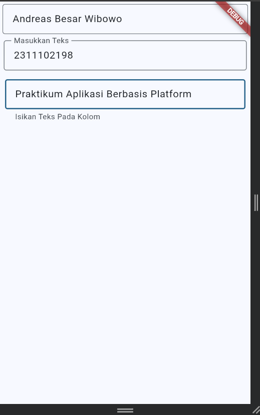

<div align="center">
  <br />

  <h1>LAPORAN PRAKTIKUM <br>
  APLIKASI BERBASIS PLATFORM
  </h1>

  <br />

  <h3>MODUL V & VI 

  ANTARMUKA PENGGUNA LANJUTAN &  INTERAKSI PENGGUNA
  </h3>

  <br />

  

  <br />
  <br />
  <br />

  <h3>Disusun Oleh :</h3>

  <p>
    <strong>Andreas Besar Wibowo</strong><br>
    <strong>2311102198</strong><br>
    <strong>S1 IF-11-REG01</strong>
  </p>

  <br />

  <h3>Dosen Pengampu :</h3>

  <p>
    <strong>Dimas Fanny Hebrasianto Permadi, S.ST., M.Kom</strong>
  </p>
  
  <br />
    <h4>Asisten Praktikum :</h4>
    <strong>Apri Pandu Wicaksono </strong> <br>
    <strong>Rangga Pradarrell Fathi</strong>
  <br />

  <h3>LABORATORIUM HIGH PERFORMANCE
 <br>FAKULTAS INFORMATIKA <br>UNIVERSITAS TELKOM PURWOKERTO <br>2026</h3>
</div>

<hr>

## Dasar Teori
### 5.1. Row
Row merupakan suatu widget yang digunakan untuk membuat widget-widget tersusun berjajar secara horizontal. Row memiliki sintaks seperti berikut:
```dart
Row( 
  children: <Widget>[ 
    //widget code 
  ], 
) 
```

Parameter children berisi kumpulan atau list dari widget karena kita dapat menyusun beberapa widget sekaligus di dalamnya. Jika mengacu pada contoh tombol-tombol di atas kodenya seperti berikut: 
```dart
Row( 
  children: <Widget>[ 
    const FlutterLogo(), 
    const Expanded( 
      child: Text("Flutter's hot reload helps you quickly and easily experiment, build UIs, add features, and fix bug faster. Experience sub-second reload times, without losing state, on emulators, simulators, and hardware for iOS and Android."), 
    ), 
    const Icon(Icons.sentiment_very_satisfied), 
  ], 
) 
```

Terdapat permasalahan yang terjadi ketika menggunakan widget Row dengan data yang banyak atau data yang panjang. Dalam kasus diatas, widget text memiliki data text yang panjang dan menampilkan gambar “yellow & black” yang menunjukkan bahwa tidak adanya ruang atau melebihi ruang kosong yang tersedia.  

Untuk mengatasi hal tersebut yaitu dengan menggunakan widget Expanded, yang dimana widget tersebut akan memberikan ruang kosong yang tersisa. 

Tambahkan Expanded pada kode yang telah dibuat sebelumnya, seperti berikut:
```dart
Row(
  children: <Widget>[
    const FlutterLogo(),
    const Expanded(
      child: Text(
        "Flutter's hot reload helps you quickly and easily experiment, "
        "build UIs, add features, and fix bug faster. Experience sub-second "
        "reload times, without losing state, on emulators, simulators, and "
        "hardware for iOS and Android.",
      ),
    ),
    const Icon(Icons.sentiment_very_satisfied),
  ],
)
```

### 5.2. Column
Column merupakan suatu widget yang digunakan untuk membuat widget-widget tersusun berjajar secara vertikal. Column memiliki sintaks mirip dengan Row, seperti berikut:
```dart
Column(
  children: <Widget>[
    // widget code
  ],
)
```

Dan berikut adalah contoh penerapan Column:
```dart
Column(
  children: const <Widget>[
    Text('Deliver features faster'),
    Text('Craft beautiful UIs'),
    Expanded(
      child: FittedBox(
        fit: BoxFit.contain, // otherwise the logo will be tiny
        child: FlutterLogo(),
      ),
    ),
  ],
)
```

Jika dilihat kembali, secara default tampilan tersebut memiliki alignment rata tengah. Untuk membuat tampilan tersebut rata kiri atau kanan, maka kita bisa menambahkan kode crossAxisAlignment dan mainAxisSize dengan penerapan kode seperti di bawah ini:
```dart
Column( 
  crossAxisAlignment: CrossAxisAlignment.start, 
  mainAxisSize: MainAxisSize.min, 
  children: <Widget>[ 
    const Text('We move under cover and we move as one'), 
    const Text('Through the night, we have one shot to live another day'), 
    const Text('We cannot let a stray gunshot give us away'), 
    const Text('We will fight up close, seize the moment and stay in it'), 
    const Text('It’s either that or meet the business end of a bayonet'), 
    const Text('The code word is ‘Rochambeau,’ dig me?'), 
    Text('Rochambeau!', style: DefaultTextStyle.of(context).style.apply(fontSizeFactor: 2.0)), 
  ], 
)
```

### 5.3. Nested Rows & Column
Salah satu hal yang paling mendasar ketika membuat layout adalah mengaturnya secara horizontal dan vertikal. Untuk mengatasi hal tersebut bisa menggunakan widget Row dan Column secara bersamaan.

Untuk membuat Row atau Column, bisa ditambahkan pada children di setiap widget Row ataupun Column. Contoh berikut ini akan menunjukkan bahwa memungkinkan untuk membuat Row atau Column di dalam widget Row atau Column. 

Layout dibawah ini disusun dengan Row, yang dimana Row memiliki 2 widget yaitu Column di sebelah kiri dan Image di sebelah kanan. 

Rating pada layout diatas meliputi Row yang memiliki Row untuk icons bintang dan text:
```dart
var stars = Row(
  mainAxisSize: MainAxisSize.min,
  children: [
    Icon(Icons.star, color: Colors.green[500]),
    Icon(Icons.star, color: Colors.green[500]),
    Icon(Icons.star, color: Colors.green[500]),
    const Icon(Icons.star, color: Colors.black),
    const Icon(Icons.star, color: Colors.black),
  ],
);

final ratings = Container(
  padding: const EdgeInsets.all(20),
  child: Row(
    mainAxisAlignment: MainAxisAlignment.spaceEvenly,
    children: [
      stars,
      const Text(
        '170 Reviews',
        style: TextStyle(
          color: Colors.black,
          fontWeight: FontWeight.w800,
          fontFamily: 'Roboto',
          letterSpacing: 0.5,
          fontSize: 20,
        ),
      ),
    ],
  ),
);
```
Pada bagian bawah rating, memiliki 3 Columns yang dimana masing-masing Column meliputi icon dan dua baris text, Lalu buat iconList untuk mendefinisikan icons tiap row: 
```dart
const descTextStyle = TextStyle(
  color: Colors.black,
  fontWeight: FontWeight.w800,
  fontFamily: 'Roboto',
  letterSpacing: 0.5,
  fontSize: 18,
  height: 2,
);

// DefaultTextStyle.merge() allows you to create a default text
// style that is inherited by its child and all subsequent children.
final iconList = DefaultTextStyle.merge(
  style: descTextStyle,
  child: Container(
    padding: const EdgeInsets.all(20),
    child: Row(
      mainAxisAlignment: MainAxisAlignment.spaceEvenly,
      children: [
        Column(
          children: [
            Icon(Icons.kitchen, color: Colors.green[500]),
            const Text('PREP:'),
            const Text('25 min'),
          ],
        ),
        Column(
          children: [
            Icon(Icons.timer, color: Colors.green[500]),
            const Text('COOK:'),
            const Text('1 hr'),
          ],
        ),
        Column(
          children: [
            Icon(Icons.restaurant, color: Colors.green[500]),
            const Text('FEEDS:'),
            const Text('4-6'),
          ],
        ),
      ],
    ),
  ),
);
```
Lalu buat leftColumn yang meliputi ratings dan iconList yang telah dibuat tadi, untuk titleText dan subTitle bisa diisi dengan teks seperti pada gambar diatas. Berikut baris kodenya:
```dart
final leftColumn = Container(
  padding: const EdgeInsets.fromLTRB(20, 30, 20, 20),
  child: Column(
    children: [
      titleText,
      subTitle,
      ratings,
      iconList,
    ],
  ),
);
```
Untuk leftColumn akan berada pada widget SizedBox untuk membatasi lebar dari konten tersebut. Hasilnya, keseluruhan UI akan memiliki Column di sisi kiri dan Image di sisi kanan. Berikut kodenya:
```dart
body: Center(
  child: Container(
    margin: const EdgeInsets.fromLTRB(0, 40, 0, 30),
    height: 600,
    child: Card(
      child: Row(
        crossAxisAlignment: CrossAxisAlignment.start,
        children: [
          SizedBox(
            width: 440,
            child: leftColumn,
          ),
          mainImage,
        ],
      ),
    ),
  ),
),
```

### 5.4. CustomScrollView
Widget ini memungkinkan membuat efek pada list, grid, maupun header yang lebar. Misalnya, ketika ingin membuat scroll view yang berisi app bar yang lebar yang meliputi list dan grid secara bersamaan, maka bisa menggunakan 3 widget sliver, yaitu SliverAppBar, SliverList, dan SliverGrid. 
 
Berikut adalah barisan kode yang menunjukkan scroll view dengan meliputi app bar yang fleksibel, 
grid dan infinite list. 
```dart
CustomScrollView(
  slivers: <Widget>[
    const SliverAppBar(
      pinned: true,
      expandedHeight: 250.0,
      flexibleSpace: FlexibleSpaceBar(
        title: Text('Demo'),
      ),
    ),
    SliverGrid(
      gridDelegate: const SliverGridDelegateWithMaxCrossAxisExtent(
        maxCrossAxisExtent: 200.0,
        mainAxisSpacing: 10.0,
        crossAxisSpacing: 10.0,
        childAspectRatio: 4.0,
      ),
      delegate: SliverChildBuilderDelegate(
        (BuildContext context, int index) {
          return Container(
            alignment: Alignment.center,
            color: Colors.teal[100 * (index % 9)],
            child: Text('Grid Item $index'),
          );
        },
        childCount: 20,
      ),
    ),
    SliverFixedExtentList(
      itemExtent: 50.0,
      delegate: SliverChildBuilderDelegate(
        (BuildContext context, int index) {
          return Container(
            alignment: Alignment.center,
            color: Colors.lightBlue[100 * (index % 9)],
            child: Text('List Item $index'),
          );
        },
      ),
    ),
  ],
)
```

### 6.1. Packages
#### 6.1.1. Pengenalan Packages
Secara singkat, dart package terdapat pada direktori yang didalamnya terdapat file pubspec. Contoh penggunaan packages adalah membuat request ke server menggunakan protokol http, custom navigation/route handling menggunakan fluro, dsb.

#### 6.1.2. Penggunaan Packages
Untuk penggunaan package, silahkan ikuti langkah-langkah berikut ini dengan menggunakan contoh yang akan kita pakai nantinya: 
1. Akses website pub.dev melalui browser
2. Cari package yang mau digunakan, disini kita akan menggunakan package google_fonts 
3. Buka folder project, lalu cari file bernama pubspec.yaml 
4. Tambahkan google_fonts dibawah dependencies 
5. Lalu save dengan cara CTRL + S pada keyboard atau klik tombol run pada pojok kanan atas 
6. Tunggu hingga proses pub get selesai 
7. Untuk menggunakannya, import package tersebut pada file Dart.

### 6.2. User Interaction
#### 6.2.1.Stateful & Stateless
Widget stateless tidak pernah berubah. Ikon, IconButton, dan Teks adalah contoh widget stateless. Sub kelas widget stateless StatelessWidget.Widget stateful bersifat dinamis misalnya, ia dapat mengubah tampilannya sebagai respons terhadap peristiwa yang dipicu oleh interaksi pengguna atau saat menerima data. Kotak centang, Radio, Slider, InkWell, Form, dan TextField adalah contoh widget stateful. Subkelas widget stateful StatefulWidget.

#### 6.2.2. Form
```dart
import 'package:flutter/material.dart';

void main() => runApp(const MyApp());

class MyApp extends StatelessWidget {
  const MyApp({Key? key}) : super(key: key);

  @override
  Widget build(BuildContext context) {
    const appTitle = 'Form Styling Demo';

    return MaterialApp(
      title: appTitle,
      home: Scaffold(
        appBar: AppBar(
          title: const Text(appTitle),
        ),
        body: const MyCustomForm(),
      ),
    );
  }
}

class MyCustomForm extends StatelessWidget {
  const MyCustomForm({Key? key}) : super(key: key);

  @override
  Widget build(BuildContext context) {
    return Column(
      crossAxisAlignment: CrossAxisAlignment.start,
      children: <Widget>[
        const Padding(
          padding: EdgeInsets.symmetric(
            horizontal: 8,
            vertical: 16,
          ),
          child: TextField(
            decoration: InputDecoration(
              border: OutlineInputBorder(),
              hintText: 'Enter a search term',
            ),
          ),
        ),
        Padding(
          padding: const EdgeInsets.symmetric(
            horizontal: 8,
            vertical: 16,
          ),
          child: TextFormField(
            decoration: const InputDecoration(
              border: UnderlineInputBorder(),
              labelText: 'Enter your username',
            ),
          ),
        ),
      ],
    );
  }
}
```

#### 6.2.3. Menu
Salah satu hal penting dari pembuatan aplikasi adalah menu. Menu ini berfungsi untuk separasi antar fitur atau page. Sulit rasanya apabila semua fitur ditampilkan dalam satu halaman, selain sulit pengguna akan kesulitan dalam mengoperasikannya. Maka disini menu page sangat bermanfaat. 

Secara umum terdapat 2 jenis widget menu yang sering digunakan, yaitu `bottom navigation bar` dan `tab bar`. Karena Flutter mendukung penuh guideline yang dibuat oleh Google, yaitu Material Design.

##### 6.2.3.1. Tab Bar
Resep untuk membuat tab bar adalah mengikuti 3 step dibawah :
1. Membuat `TabController`. 
2. Membuat tabs. 
3. Membuat konten untuk setiap tab. 

**Membuat TabController**

Agar tab berfungsi, Anda harus tetap menyinkronkan tab yang dipilih dan bagian konten. Menggunakan DefaultTabController adalah opsi paling sederhana, karena ia membuat TabController dan membuatnya tersedia untuk semua widget turunan. 
```dart
DefaultTabController(
  // The number of tabs / content sections to display.
  length: 3,

  child: // Complete this code in the next step.
);
```

**Membuat Tabs**

Saat tab dipilih, maka harus menampilkan sebuah konten. Anda dapat membuat tabs menggunakan TabBar widget. Contoh dibawah adalah membuat TabBar dengan tiga widget Tab yang disimpan dalam widget AppBar.
```dart
DefaultTabController(
  length: 3,
  child: Scaffold(
    appBar: AppBar(
      bottom: TabBar(
        tabs: [
          Tab(icon: Icon(Icons.directions_car)),
          Tab(icon: Icon(Icons.directions_transit)),
          Tab(icon: Icon(Icons.directions_bike)),
        ],
      ),
    ),
  ),
);
```

**Membuat konten untuk masing-masing tab**

Setelah anda memiliki tabs, tampilkan konten saat tab dipilih. Untuk tujuan ini, gunakan widget TabBarView.
```dart
TabBarView(
  children: [
    Icon(Icons.directions_car),
    Icon(Icons.directions_transit),
    Icon(Icons.directions_bike),
  ],
);
```

Perhatikan urutan!!! Urutan sangat penting dan gunakan urutan sesuai dengan urutan pada TabBar 

Contoh implementasi: 
```dart
import 'package:flutter/material.dart';

void main() {
  runApp(const TabBarDemo());
}

class TabBarDemo extends StatelessWidget {
  const TabBarDemo({Key? key}) : super(key: key);

  @override
  Widget build(BuildContext context) {
    return MaterialApp(
      home: DefaultTabController(
        length: 3,
        child: Scaffold(
          appBar: AppBar(
            bottom: const TabBar(
              tabs: [
                Tab(icon: Icon(Icons.directions_car)),
                Tab(icon: Icon(Icons.directions_transit)),
                Tab(icon: Icon(Icons.directions_bike)),
              ],
            ),
            title: const Text('Tabs Demo'),
          ),
          body: const TabBarView(
            children: [
              Icon(Icons.directions_car),
              Icon(Icons.directions_transit),
              Icon(Icons.directions_bike),
            ],
          ),
        ),
      ),
    );
  }
}
```

##### 6.2.3.2. Button Navigation Bar
Mirip dengan membuat TabBar, dibawah ini contoh untuk implementasi Bottom Navigation Bar 
```dart
// Flutter code sample for BottomNavigationBar 
// This example shows a [BottomNavigationBar] as it is used within a [Scaffold] 
// widget. The [BottomNavigationBar] has three [BottomNavigationBarItem] 
// widgets, which means it defaults to [BottomNavigationBarType.fixed], and 
// the [currentIndex] is set to index 0. The selected item is 
// amber. The `_onItemTapped` function changes the selected item's index 
// and displays a corresponding message in the center of the [Scaffold]. 
import 'package:flutter/material.dart';

void main() {
  runApp(const TabBarDemo());
}

class TabBarDemo extends StatelessWidget {
  const TabBarDemo({Key? key}) : super(key: key);

  @override
  Widget build(BuildContext context) {
    return MaterialApp(
      home: DefaultTabController(
        length: 3,
        child: Scaffold(
          appBar: AppBar(
            bottom: const TabBar(
              tabs: [
                Tab(icon: Icon(Icons.directions_car)),
                Tab(icon: Icon(Icons.directions_transit)),
                Tab(icon: Icon(Icons.directions_bike)),
              ],
            ),
            title: const Text('Tabs Demo'),
          ),
          body: const TabBarView(
            children: [
              Icon(Icons.directions_car),
              Icon(Icons.directions_transit),
              Icon(Icons.directions_bike),
            ],
          ),
        ),
      ),
    );
  }
}
```

#### 6.2.4. Buttons
##### 6.2.4.1. ElevatedButton
ElevatedButton adalah tombol yang biasa kita gunakan saat kita mendaftar,submit,login dst. berikut merupakan sourcecode dari ElevatedButton : 
```dart
ElevatedButton(
  onPressed: () {
    print('ini done');
  },
  child: new Text('submit'),
),
``` 
##### 6.2.4.2. Text Button
```dart
TextButton(
  child: Text('menu'),
  onPressed: () {
    print('sukses');
  },
)
```

##### 6.2.4.3. DropdownButton
untuk membuat DropdownButton kita harus memiliki value di dalamnya agar dapat bekerja contoh sourcecode sebagai berikut :
```dart
DropdownButton(
  value: selectedValue,
  onChanged: (String? newValue) {
    setState(() {
      selectedValue = newValue!;
    });
  },
  items: dropdownItems,
)
```
## Tugas
**📝 Tugas Praktikum Modul 5 dan 6 Flutter**

Buat Form dengan Padding

## Hasil
### Output


### Source Code
```dart
// Andreas Besar Wibowo - 2311102198
// Modul 5 dan 6 Flutter

import 'package:flutter/material.dart';

void main() {
  runApp(const MyApp());
}

class MyApp extends StatelessWidget {
  const MyApp({super.key});

  // This widget is the root of your application.
  @override
  Widget build(BuildContext context) {
    return MaterialApp(
      title: 'Talkyu',
      theme: ThemeData(
        // This is the theme of your application.
        //
        // TRY THIS: Try running your application with "flutter run". You'll see
        // the application has a purple toolbar. Then, without quitting the app,
        // try changing the seedColor in the colorScheme below to Colors.green
        // and then invoke "hot reload" (save your changes or press the "hot
        // reload" button in a Flutter-supported IDE, or press "r" if you used
        // the command line to start the app).
        //
        // Notice that the counter didn't reset back to zero; the application
        // state is not lost during the reload. To reset the state, use hot
        // restart instead.
        //
        // This works for code too, not just values: Most code changes can be
        // tested with just a hot reload.
        colorScheme: .fromSeed(seedColor: Colors.lightBlue),
      ),
      home: const MyHomePage(title: 'Talkyu'),
    );
  }
}

class MyHomePage extends StatefulWidget {
  const MyHomePage({super.key, required this.title});

  // This widget is the home page of your application. It is stateful, meaning
  // that it has a State object (defined below) that contains fields that affect
  // how it looks.

  // This class is the configuration for the state. It holds the values (in this
  // case the title) provided by the parent (in this case the App widget) and
  // used by the build method of the State. Fields in a Widget subclass are
  // always marked "final".

  final String title;

  @override
  State<MyHomePage> createState() => _MyHomePageState();
}

class _MyHomePageState extends State<MyHomePage> {
  int _counter = 0;

  void _incrementCounter() {
    setState(() {
      // This call to setState tells the Flutter framework that something has
      // changed in this State, which causes it to rerun the build method below
      // so that the display can reflect the updated values. If we changed
      // _counter without calling setState(), then the build method would not be
      // called again, and so nothing would appear to happen.
      _counter++;
    });
  }

  @override
  Widget build(BuildContext context) {
    // This method is rerun every time setState is called, for instance as done
    // by the _incrementCounter method above.
    //
    // The Flutter framework has been optimized to make rerunning build methods
    // fast, so that you can just rebuild anything that needs updating rather
    // than having to individually change instances of widgets.
    return Scaffold(
      body: Column(
        crossAxisAlignment: CrossAxisAlignment.end,
        children: <Widget> [
          const Padding(
              padding: EdgeInsetsGeometry.symmetric(horizontal: 4, vertical: 4),
              child: TextField(
                decoration: InputDecoration(
                  hintText: "Masukkan Teks",
                  border: OutlineInputBorder()
                ),
              ),
          ),
          Padding(
              padding: EdgeInsetsGeometry.symmetric(horizontal: 6, vertical: 6),
              child: TextField(
                decoration: InputDecoration(
                  labelText: "Masukkan Teks",
                  border: OutlineInputBorder()
                ),
              ),
          ),
          Padding(
            padding: EdgeInsetsGeometry.symmetric(horizontal: 8, vertical: 8),
            child: TextField(
              decoration: InputDecoration(
                  helperText: "Isikan Teks Pada Kolom",
                  border: OutlineInputBorder()
              ),
            ),
          )
        ],
      ),
    );
  }
}
```

### Penjelasan Singkat
Form merupakan komponen pada Flutter yang digunakan untuk menampung dan mengelola input data dari pengguna. Form biasanya terdiri dari beberapa `TextField` yang dapat digunakan untuk memasukkan data seperti nama, email, maupun password. Berikut penjelasan mengenai form pada program Flutter:
- Column digunakan untuk menyusun widget secara vertikal.
- Padding digunakan untuk memberi jarak antar widget.
- TextField digunakan sebagai input teks.
- hintText menampilkan teks sementara pada input.
- labelText menampilkan label pada input.
- helperText menampilkan petunjuk tambahan di bawah input.
- OutlineInputBorder memberi garis tepi pada input.