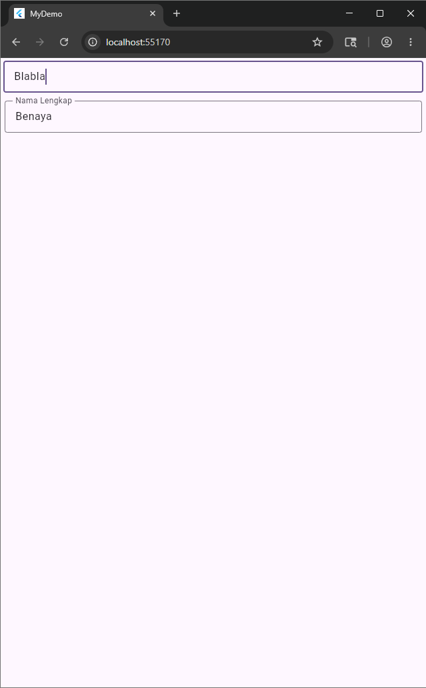

<div align="center">
  <br>

  <h1>LAPORAN PRAKTIKUM <br>
  APLIKASI BERBASIS PLATFORM
  </h1>

  <br>

  <h3>03-04 Mobile</h3>

  <br>

  


  <br>
  <br>
  <br>

  <h3>Disusun Oleh :</h3>

  <p>
    <strong>Irshad Benaya Fardeca</strong><br>
    <strong>2311102199</strong><br>
    <strong>S1 IF-11-REG01</strong>
  </p>

  <br>

  <h3>Dosen Pengampu :</h3>

  <p>
    <strong>Dimas Fanny Hebrasianto Permadi, S.ST., M.Kom</strong>
  </p>
  
  <br>
  <br>
    <h4>Asisten Praktikum :</h4>
    <strong>Apri Pandu Wicaksono </strong> <br>
    <strong>Rangga Pradarrell Fathi</strong>
  <br>

  <h3>LABORATORIUM HIGH PERFORMANCE
 <br>FAKULTAS INFORMATIKA <br>UNIVERSITAS TELKOM PURWOKERTO <br>2026</h3>
</div>
<hr>

# Dasar Teori

# Modul 5. Antarmuka Pengguna Lanjutan

## 5.1. Row

Row merupakan suatu widget yang digunakan untuk membuat widget-widget tersusun berjajar secara **horizontal**. Row memiliki sintaks seperti berikut:

```dart
Row(
  children: <Widget>[
    //widget code
  ],
)
```

Parameter `children` berisi kumpulan atau list dari widget karena kita dapat menyusun beberapa widget sekaligus di dalamnya. Contoh penerapan:

```dart
Row(
  children: <Widget>[
    const FlutterLogo(),
    const Expanded(
      child: Text("Flutter's hot reload helps you quickly and easily experiment, build UIs, add features, and fix bug faster. Experience sub-second reload times, without losing state, on emulators, simulators, and hardware for iOS and Android."),
    ),
    const Icon(Icons.sentiment_very_satisfied),
  ],
)
```

> ⚠️ **Permasalahan Overflow:** Ketika widget Row diisi data yang panjang, akan muncul tampilan "yellow & black" yang menunjukkan konten melebihi ruang yang tersedia.

**Solusi:** Gunakan widget `Expanded` untuk memberikan ruang kosong yang tersisa:

```dart
Row(
  children: <Widget>[
    const FlutterLogo(),
    const Expanded(
      child: Text("Flutter's hot reload helps you quickly and easily experiment, build UIs, add features, and fix bug faster. Experience sub-second reload times, without losing state, on emulators, simulators, and hardware for iOS and Android."),
    ),
    const Icon(Icons.sentiment_very_satisfied),
  ],
)
```

---

## 5.2. Column

Column merupakan suatu widget yang digunakan untuk membuat widget-widget tersusun berjajar secara **vertikal**. Column memiliki sintaks mirip dengan Row:

```dart
Column(
  children: <Widget>[
    //widget code
  ]
)
```

Contoh penerapan Column:

```dart
Column(
  children: const <Widget>[
    Text('Deliver features faster'),
    Text('Craft beautiful UIs'),
    Expanded(
      child: FittedBox(
        fit: BoxFit.contain,
        child: FlutterLogo(),
      ),
    ),
  ],
)
```

Secara default, tampilan Column memiliki alignment **rata tengah**. Untuk membuat rata kiri atau kanan, tambahkan `crossAxisAlignment` dan `mainAxisSize`:

```dart
Column(
  crossAxisAlignment: CrossAxisAlignment.start,
  mainAxisSize: MainAxisSize.min,
  children: <Widget>[
    const Text('We move under cover and we move as one'),
    const Text('Through the night, we have one shot to live another day'),
    const Text('We cannot let a stray gunshot give us away'),
    const Text('We will fight up close, seize the moment and stay in it'),
    const Text('It\'s either that or meet the business end of a bayonet'),
    const Text('The code word is \'Rochambeau,\' dig me?'),
    Text('Rochambeau!', style: DefaultTextStyle.of(context).style.apply(fontSizeFactor: 2.0)),
  ],
)
```

---

## 5.3. Nested Rows & Columns

Salah satu hal paling mendasar ketika membuat layout adalah mengaturnya secara horizontal dan vertikal. Kita bisa menggunakan widget **Row** dan **Column** secara bersamaan (nested).

Layout berikut disusun dengan Row yang memiliki 2 widget: Column di sebelah kiri dan Image di sebelah kanan.

### Membuat Rating Row

```dart
var stars = Row(
  mainAxisSize: MainAxisSize.min,
  children: [
    Icon(Icons.star, color: Colors.green[500]),
    Icon(Icons.star, color: Colors.green[500]),
    Icon(Icons.star, color: Colors.green[500]),
    const Icon(Icons.star, color: Colors.black),
    const Icon(Icons.star, color: Colors.black),
  ],
);

final ratings = Container(
  padding: const EdgeInsets.all(20),
  child: Row(
    mainAxisAlignment: MainAxisAlignment.spaceEvenly,
    children: [
      stars,
      const Text(
        '170 Reviews',
        style: TextStyle(
          color: Colors.black,
          fontWeight: FontWeight.w800,
          fontFamily: 'Roboto',
          letterSpacing: 0.5,
          fontSize: 20,
        ),
      ),
    ],
  ),
);
```

### Membuat Icon List (3 Column)

```dart
const descTextStyle = TextStyle(
  color: Colors.black,
  fontWeight: FontWeight.w800,
  fontFamily: 'Roboto',
  letterSpacing: 0.5,
  fontSize: 18,
  height: 2,
);

final iconList = DefaultTextStyle.merge(
  style: descTextStyle,
  child: Container(
    padding: const EdgeInsets.all(20),
    child: Row(
      mainAxisAlignment: MainAxisAlignment.spaceEvenly,
      children: [
        Column(
          children: [
            Icon(Icons.kitchen, color: Colors.green[500]),
            const Text('PREP:'),
            const Text('25 min'),
          ],
        ),
        Column(
          children: [
            Icon(Icons.timer, color: Colors.green[500]),
            const Text('COOK:'),
            const Text('1 hr'),
          ],
        ),
        Column(
          children: [
            Icon(Icons.restaurant, color: Colors.green[500]),
            const Text('FEEDS:'),
            const Text('4-6'),
          ],
        ),
      ],
    ),
  ),
);
```

### Menyusun Left Column dan Keseluruhan Layout

```dart
final leftColumn = Container(
  padding: const EdgeInsets.fromLTRB(20, 30, 20, 20),
  child: Column(
    children: [
      titleText,
      subTitle,
      ratings,
      iconList,
    ],
  ),
);

// Keseluruhan body
body: Center(
  child: Container(
    margin: const EdgeInsets.fromLTRB(0, 40, 0, 30),
    height: 600,
    child: Card(
      child: Row(
        crossAxisAlignment: CrossAxisAlignment.start,
        children: [
          SizedBox(
            width: 440,
            child: leftColumn,
          ),
          mainImage,
        ],
      ),
    ),
  ),
),
```

---

## 5.4. CustomScrollView

Widget ini memungkinkan pembuatan efek scroll pada list, grid, maupun header yang lebar. Gunakan 3 widget sliver berikut secara bersamaan:

| Widget | Fungsi |
|---|---|
| `SliverAppBar` | App bar yang fleksibel dan dapat di-pin |
| `SliverList` | List yang scrollable |
| `SliverGrid` | Grid yang scrollable |

Contoh implementasi:

```dart
CustomScrollView(
  slivers: <Widget>[
    const SliverAppBar(
      pinned: true,
      expandedHeight: 250.0,
      flexibleSpace: FlexibleSpaceBar(
        title: Text('Demo'),
      ),
    ),
    SliverGrid(
      gridDelegate: const SliverGridDelegateWithMaxCrossAxisExtent(
        maxCrossAxisExtent: 200.0,
        mainAxisSpacing: 10.0,
        crossAxisSpacing: 10.0,
        childAspectRatio: 4.0,
      ),
      delegate: SliverChildBuilderDelegate(
        (BuildContext context, int index) {
          return Container(
            alignment: Alignment.center,
            color: Colors.teal[100 * (index % 9)],
            child: Text('Grid Item $index'),
          );
        },
        childCount: 20,
      ),
    ),
    SliverFixedExtentList(
      itemExtent: 50.0,
      delegate: SliverChildBuilderDelegate(
        (BuildContext context, int index) {
          return Container(
            alignment: Alignment.center,
            color: Colors.lightBlue[100 * (index % 9)],
            child: Text('List Item $index'),
          );
        },
      ),
    ),
  ],
)
```

---

# Modul 6. Interaksi Pengguna

## 6.1. Packages

### 6.1.1. Pengenalan Packages

Dart package terdapat pada direktori yang di dalamnya terdapat file `pubspec`. Contoh penggunaan packages:
- Membuat request ke server menggunakan protokol `http`
- Custom navigation/route handling menggunakan `fluro`

### 6.1.2. Penggunaan Packages

Langkah-langkah menambahkan package (contoh: `google_fonts`):

1. Akses website [pub.dev](https://pub.dev) melalui browser
2. Cari package yang ingin digunakan (contoh: `google_fonts`)
3. Buka folder project, lalu cari file bernama `pubspec.yaml`
4. Tambahkan `google_fonts` di bawah `dependencies`:

```yaml
dependencies:
  flutter:
    sdk: flutter
  google_fonts: ^6.0.0
```

5. Simpan dengan `CTRL + S` atau klik tombol **run pub get** di pojok kanan atas
6. Tunggu hingga proses pub get selesai
7. Import package pada file Dart:

```dart
import 'package:google_fonts/google_fonts.dart';
```

---

## 6.2. User Interaction

### 6.2.1. Stateful & Stateless

| Jenis Widget | Sifat | Contoh |
|---|---|---|
| **Stateless** | Tidak pernah berubah | `Icon`, `IconButton`, `Text` |
| **Stateful** | Dinamis, berubah sesuai interaksi | `Checkbox`, `Radio`, `Slider`, `TextField`, `Form` |

- Widget stateless merupakan subkelas dari `StatelessWidget`
- Widget stateful merupakan subkelas dari `StatefulWidget`

### 6.2.2. Form

```dart
import 'package:flutter/material.dart';

void main() => runApp(const MyApp());

class MyApp extends StatelessWidget {
  const MyApp({Key? key}) : super(key: key);

  @override
  Widget build(BuildContext context) {
    const appTitle = 'Form Styling Demo';
    return MaterialApp(
      title: appTitle,
      home: Scaffold(
        appBar: AppBar(
          title: const Text(appTitle),
        ),
        body: const MyCustomForm(),
      ),
    );
  }
}

class MyCustomForm extends StatelessWidget {
  const MyCustomForm({Key? key}) : super(key: key);

  @override
  Widget build(BuildContext context) {
    return Column(
      crossAxisAlignment: CrossAxisAlignment.start,
      children: <Widget>[
        const Padding(
          padding: EdgeInsets.symmetric(horizontal: 8, vertical: 16),
          child: TextField(
            decoration: InputDecoration(
              border: OutlineInputBorder(),
              hintText: 'Enter a search term',
            ),
          ),
        ),
        Padding(
          padding: const EdgeInsets.symmetric(horizontal: 8, vertical: 16),
          child: TextFormField(
            decoration: const InputDecoration(
              border: UnderlineInputBorder(),
              labelText: 'Enter your username',
            ),
          ),
        ),
      ],
    );
  }
}
```

### 6.2.3. Menu

Terdapat 2 jenis widget menu yang sering digunakan:
- **Bottom Navigation Bar**
- **Tab Bar**

#### 6.2.3.1. Tab Bar

Tiga langkah membuat Tab Bar:

**Langkah 1 — Membuat TabController**

```dart
DefaultTabController(
  length: 3,
  child: // Complete this code in the next step.
);
```

**Langkah 2 — Membuat Tabs**

```dart
DefaultTabController(
  length: 3,
  child: Scaffold(
    appBar: AppBar(
      bottom: TabBar(
        tabs: [
          Tab(icon: Icon(Icons.directions_car)),
          Tab(icon: Icon(Icons.directions_transit)),
          Tab(icon: Icon(Icons.directions_bike)),
        ],
      ),
    ),
  ),
);
```

**Langkah 3 — Membuat konten untuk masing-masing tab**

> ⚠️ **Perhatikan urutan!** Urutan konten harus sesuai dengan urutan pada `TabBar`.

```dart
TabBarView(
  children: [
    Icon(Icons.directions_car),
    Icon(Icons.directions_transit),
    Icon(Icons.directions_bike),
  ],
);
```

**Contoh implementasi lengkap:**

```dart
import 'package:flutter/material.dart';

void main() {
  runApp(const TabBarDemo());
}

class TabBarDemo extends StatelessWidget {
  const TabBarDemo({Key? key}) : super(key: key);

  @override
  Widget build(BuildContext context) {
    return MaterialApp(
      home: DefaultTabController(
        length: 3,
        child: Scaffold(
          appBar: AppBar(
            bottom: const TabBar(
              tabs: [
                Tab(icon: Icon(Icons.directions_car)),
                Tab(icon: Icon(Icons.directions_transit)),
                Tab(icon: Icon(Icons.directions_bike)),
              ],
            ),
            title: const Text('Tabs Demo'),
          ),
          body: const TabBarView(
            children: [
              Icon(Icons.directions_car),
              Icon(Icons.directions_transit),
              Icon(Icons.directions_bike),
            ],
          ),
        ),
      ),
    );
  }
}
```

#### 6.2.3.2. Bottom Navigation Bar

```dart
import 'package:flutter/material.dart';

void main() => runApp(const MyApp());

class MyApp extends StatelessWidget {
  const MyApp({Key? key}) : super(key: key);
  static const String _title = 'Flutter Code Sample';

  @override
  Widget build(BuildContext context) {
    return const MaterialApp(
      title: _title,
      home: MyStatefulWidget(),
    );
  }
}

class MyStatefulWidget extends StatefulWidget {
  const MyStatefulWidget({Key? key}) : super(key: key);

  @override
  State<MyStatefulWidget> createState() => _MyStatefulWidgetState();
}

class _MyStatefulWidgetState extends State<MyStatefulWidget> {
  int _selectedIndex = 0;
  static const TextStyle optionStyle =
      TextStyle(fontSize: 30, fontWeight: FontWeight.bold);

  static const List<Widget> _widgetOptions = <Widget>[
    Text('Index 0: Home', style: optionStyle),
    Text('Index 1: Business', style: optionStyle),
    Text('Index 2: School', style: optionStyle),
  ];

  void _onItemTapped(int index) {
    setState(() {
      _selectedIndex = index;
    });
  }

  @override
  Widget build(BuildContext context) {
    return Scaffold(
      appBar: AppBar(
        title: const Text('BottomNavigationBar Sample'),
      ),
      body: Center(
        child: _widgetOptions.elementAt(_selectedIndex),
      ),
      bottomNavigationBar: BottomNavigationBar(
        items: const <BottomNavigationBarItem>[
          BottomNavigationBarItem(
            icon: Icon(Icons.home),
            label: 'Home',
          ),
          BottomNavigationBarItem(
            icon: Icon(Icons.business),
            label: 'Business',
          ),
          BottomNavigationBarItem(
            icon: Icon(Icons.school),
            label: 'School',
          ),
        ],
        currentIndex: _selectedIndex,
        selectedItemColor: Colors.amber[800],
        onTap: _onItemTapped,
      ),
    );
  }
}
```

### 6.2.4. Buttons

#### 6.2.4.1. ElevatedButton

`ElevatedButton` adalah tombol yang umum digunakan untuk aksi seperti daftar, submit, login, dan sebagainya.

```dart
ElevatedButton(
  onPressed: () {
    print('ini done');
  },
  child: new Text('submit'),
),
```

#### 6.2.4.2. TextButton

```dart
TextButton(
  child: Text('menu'),
  onPressed: () {
    print('sukses');
  },
)
```

#### 6.2.4.3. DropdownButton

Untuk membuat `DropdownButton`, diperlukan sebuah `value` di dalamnya agar dapat bekerja:

```dart
DropdownButton(
  value: selectedValue,
  onChanged: (String? newValue) {
    setState(() {
      selectedValue = newValue!;
    });
  },
  items: dropdownItems,
)
```

---

## Source Code
```
import 'package:flutter/material.dart';

void main() {
  runApp(const MyApp());
}

class MyApp extends StatelessWidget {
  const MyApp({super.key});

  // This widget is the root of your application.
  @override
  Widget build(BuildContext context) {
    return MaterialApp(
      title: 'MyDemo',
      theme: ThemeData(colorScheme: .fromSeed(seedColor: Colors.deepPurple)),
      home: const MyHomePage(title: 'MyDemo'),
      debugShowCheckedModeBanner: false,
    );
  }
}

class MyHomePage extends StatefulWidget {
  const MyHomePage({super.key, required this.title});

  final String title;

  @override
  State<MyHomePage> createState() => _MyHomePageState();
}

class _MyHomePageState extends State<MyHomePage> {
  @override
  Widget build(BuildContext context) {
    return Scaffold(
      body: Column(
        crossAxisAlignment: CrossAxisAlignment.end,
        children: <Widget>[
          const Padding(
            padding: EdgeInsets.symmetric(horizontal: 4, vertical: 4),
            child: TextField(
              decoration: InputDecoration(
                hintText: "Masukkan Teks:v",
                border: OutlineInputBorder(),
              ),
            ),
          ),

          Padding(
            padding: EdgeInsets.symmetric(horizontal: 6, vertical: 8),
            child: TextField(
              decoration: InputDecoration(
                labelText: "Nama Lengkap",
                border: OutlineInputBorder(),
              ),
            ),
          ),
        ],
      ),
    );
  }
}
```

Pada bagian awal, aplikasi diinisialisasi melalui fungsi main() yang menjalankan widget utama bernama MyApp. Kelas MyApp merupakan StatelessWidget yang berfungsi mengonfigurasi tema global aplikasi (menggunakan warna dasar ungu) dan menentukan halaman utama yang akan ditampilkan, yaitu MyHomePage.
Kelas MyHomePage sendiri dibuat menggunakan StatefulWidget untuk mengelola tampilan halaman secara dinamis. Di dalam state-nya (_MyHomePageState), halaman dibungkus menggunakan widget Scaffold sebagai struktur dasar tata letak. Di dalam badan halaman (body), terdapat widget Column yang menyusun elemen secara vertikal ke bawah dengan posisi rata kanan (crossAxisAlignment: CrossAxisAlignment.end).

Column tersebut berisi dua buah widget input:
1. TextField pertama dibungkus dengan Padding tipis, menampilkan teks petunjuk (hintText) "Masukkan Teks:v", dan memiliki bingkai kotak.
2. TextField kedua memiliki jarak Padding yang sedikit lebih lebar, menampilkan label teks (labelText) "Nama Lengkap", dan juga menggunakan bingkai kotak yang sama.

## Output
