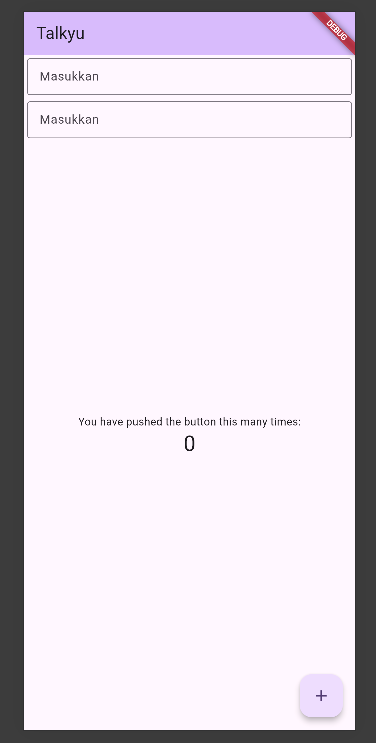

<div align="center">
  <br />
  <h1>LAPORAN PRAKTIKUM <br>APLIKASI BERBASIS PLATFORM</h1>
  <br />
  <h3>TUGAS MODUL 05 & 06 <br> mobile flutter</h3>
  <br />
  <br />
   
  <br />
  <br />
  <br />
  <br />
  <h3>Disusun Oleh :</h3>
  <p>
    <strong>M. Faleno Albar Firjatulloh</strong><br>
    <strong>2311102297</strong><br>
    <strong>S1 IF-11-01</strong>
  </p>
  <br />
  <br />
  <h3>Dosen Pengampu :</h3>
  <p>
    <strong>Dimas Fanny Hebrasianto Permadi, S.ST., M.Kom</strong>
  </p>
  <br />
  <br />
    <h4>Asisten Praktikum :</h4>
    <strong> Apri Pandu Wicaksono </strong> <br>
    <strong>Rangga Pradarrell Fathi</strong>
  <br />
  <h3>LABORATORIUM HIGH PERFORMANCE
 <br>FAKULTAS INFORMATIKA <br>UNIVERSITAS TELKOM PURWOKERTO <br>2026</h3>
</div>

---

## 1. Dasar Teori

### 1.1 Flutter

Flutter adalah framework open-source buatan Google untuk membangun aplikasi mobile, web, dan desktop dari satu basis kode (codebase). Flutter menggunakan bahasa pemrograman **Dart** dan mengandalkan konsep **widget** sebagai unit dasar pembangunan antarmuka pengguna (UI).

### 1.2 Dart

Dart adalah bahasa pemrograman berorientasi objek yang dikembangkan oleh Google. Dart bersifat strongly typed, mendukung null safety, dan dirancang untuk performa tinggi. Dalam Flutter, seluruh logika aplikasi dan definisi UI ditulis menggunakan Dart.

### 1.3 Widget

Dalam Flutter, **semua elemen UI adalah widget**. Widget bersifat immutable (tidak dapat diubah langsung) dan disusun secara hierarki membentuk sebuah **widget tree**. Terdapat dua jenis widget utama:

| Jenis Widget | Keterangan |
|---|---|
| `StatelessWidget` | Widget yang tidak memiliki state yang berubah. Tampilannya bersifat statis. |
| `StatefulWidget` | Widget yang memiliki state internal yang dapat berubah, sehingga UI dapat diperbarui secara dinamis menggunakan `setState()`. |

### 1.4 Widget-Widget yang Digunakan

#### `MaterialApp`
Widget root yang menyediakan berbagai fitur Material Design seperti routing, tema, dan lokalisasi. Setiap aplikasi Flutter berbasis Material biasanya dimulai dengan widget ini.

#### `ThemeData`
Kelas yang digunakan untuk mendefinisikan tema visual aplikasi secara global, mencakup warna, tipografi, dan gaya komponen. `ColorScheme.fromSeed()` digunakan untuk menghasilkan palet warna secara otomatis berdasarkan warna seed yang diberikan.

#### `Scaffold`
Widget yang menyediakan struktur dasar halaman Material Design, termasuk `AppBar`, `body`, `floatingActionButton`, `drawer`, dan sebagainya.

#### `Column`
Widget layout yang menyusun widget-widget anaknya secara vertikal (dari atas ke bawah). Properti `crossAxisAlignment` digunakan untuk mengatur perataan horizontal dari widget-widget di dalamnya.

#### `Padding`
Widget yang menambahkan jarak (ruang kosong) di sekeliling widget anaknya. Jarak ditentukan menggunakan `EdgeInsets`.

#### `TextField`
Widget input teks yang memungkinkan pengguna mengetikkan teks. Dapat dikustomisasi menggunakan properti `decoration` bertipe `InputDecoration`.

#### `InputDecoration`
Kelas yang digunakan untuk mendekorasi tampilan `TextField`, seperti menambahkan label, hint text, ikon, dan border.

#### `OutlineInputBorder`
Salah satu jenis border pada `TextField` yang menampilkan garis tepi mengelilingi seluruh area input (berbentuk kotak).

---
## 2. Hasil
 

## 3. Penjelasan Program

### 3.1 Fungsi `main()`

```dart
void main() {
  runApp(const MyApp());
}
```

Fungsi `main()` merupakan bagian awal yang pertama kali dijalankan ketika aplikasi Flutter dibuka. Pada fungsi ini, `runApp()` digunakan untuk menjalankan widget utama aplikasi, yaitu `MyApp`, kemudian menampilkannya ke layar sebagai root widget.

---

### 3.2 Class `MyApp`

```dart
class MyApp extends StatelessWidget {
  const MyApp({super.key});

  @override
  Widget build(BuildContext context) {
    return MaterialApp(
      title: 'Talkyu',
      theme: ThemeData(colorScheme: ColorScheme.fromSeed(seedColor: Colors.deepPurple)),
      home: const MyHomePage(title: 'Talkyu'),
    );
  }
}
```

Class `MyApp` berfungsi sebagai widget utama dalam aplikasi. Widget ini menggunakan `StatelessWidget` karena tampilannya tidak memerlukan perubahan data secara dinamis. Pada bagian `MaterialApp`, terdapat beberapa pengaturan penting, yaitu:

* `title` digunakan sebagai nama aplikasi.
* `theme` dipakai untuk menentukan tampilan tema aplikasi dengan warna dasar `deepPurple`.
* `home` menentukan halaman pertama yang akan muncul ketika aplikasi dijalankan, yaitu `MyHomePage`.

---

### 3.3 Class `MyHomePage`

```dart
class MyHomePage extends StatefulWidget {
  const MyHomePage({super.key, required this.title});

  final String title;

  @override
  State<MyHomePage> createState() => _MyHomePageState();
}
```

`MyHomePage` dibuat menggunakan `StatefulWidget` karena halaman ini dapat memiliki state yang dapat berubah sewaktu-waktu. Widget ini menerima parameter `title` dengan tipe data `String`. Method `createState()` digunakan untuk menghubungkan widget dengan class `_MyHomePageState` sebagai pengelola state.

---

### 3.4 Class `_MyHomePageState`

```dart
class _MyHomePageState extends State<MyHomePage> {

  @override
  Widget build(BuildContext context) {
    return Scaffold(
      body: Column(
        crossAxisAlignment: CrossAxisAlignment.end,
        children: <Widget>[
          const Padding(
            padding: EdgeInsets.symmetric(vertical: 5, horizontal: 5),
            child: TextField(
              decoration: InputDecoration(
                hintText: 'Masukkan teks',
                border: OutlineInputBorder()
              ),
            ),
          ),
          Padding(
            padding: const EdgeInsets.symmetric(vertical: 6, horizontal: 8),
            child: TextField(
              decoration: InputDecoration(
                hintText: 'Masukkan teks 2',
                border: OutlineInputBorder()
              ),
            ),
          )
        ],
      ),
    );
  }
}
```

Class `_MyHomePageState` bertugas membangun tampilan antarmuka pada halaman utama melalui method `build()`. Struktur widget yang digunakan terdiri dari beberapa komponen berikut:

| Komponen                 | Keterangan                                                   |
| ------------------------ | ------------------------------------------------------------ |
| `Scaffold`               | Digunakan sebagai kerangka dasar halaman aplikasi.           |
| `Column`                 | Menata widget secara vertikal dari atas ke bawah.            |
| `crossAxisAlignment.end` | Membuat isi `Column` rata ke sisi kanan.                     |
| `Padding` pertama        | Memberikan jarak di sekitar `TextField` pertama.             |
| `TextField` pertama      | Kolom input teks dengan placeholder “Masukkan teks”.         |
| `Padding` kedua          | Menambahkan ruang di sekitar `TextField` kedua.              |
| `TextField` kedua        | Kolom input teks kedua dengan placeholder “Masukkan teks 2”. |
| `OutlineInputBorder`     | Menampilkan garis border berbentuk kotak pada input teks.    |

---

## 3. Struktur Widget

```text
MyApp
└── MaterialApp
    └── MyHomePage
        └── Scaffold
            └── Column
                ├── Padding
                │   └── TextField
                └── Padding
                    └── TextField
```
