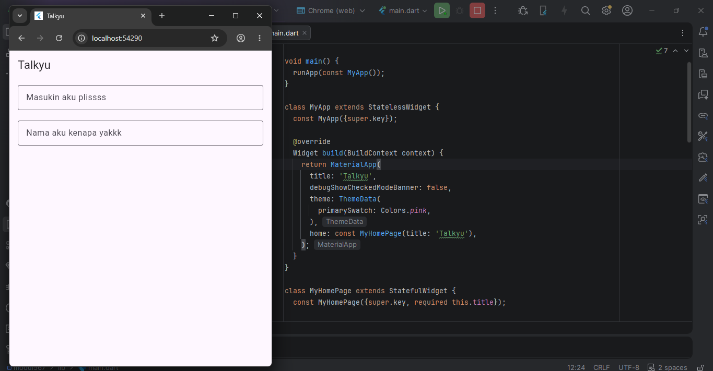

# Dasar Teori

## 1. Flutter

Flutter adalah framework open-source buatan **Google** untuk membangun aplikasi mobile, web, dan desktop dari satu basis kode (*codebase*). Flutter menggunakan bahasa **Dart** dan menyediakan kumpulan widget yang kaya untuk membangun UI yang menarik dan responsif.

### Arsitektur Flutter

| Lapisan | Deskripsi |
|----------|------------|
| **Framework Layer** | Ditulis dalam Dart; berisi widget, rendering, animasi, dan gestur |
| **Engine Layer** | Ditulis dalam C++; menangani rendering grafis menggunakan Skia/Impeller |
| **Embedder Layer** | Menjembatani engine Flutter dengan sistem operasi (Android, iOS, dll.) |

### Keunggulan Flutter

- **Cross-platform** — satu kode untuk Android, iOS, Web, dan Desktop
- **Hot Reload** — perubahan kode langsung terlihat tanpa restart
- **Widget-based UI** — semua elemen antarmuka adalah widget yang dapat dikustomisasi
- **Performa tinggi** — dikompilasi ke native code, bukan JavaScript bridge

---

## 2. Dart

Dart adalah bahasa pemrograman **berorientasi objek (OOP)** yang dikembangkan oleh Google dan dirancang untuk membangun aplikasi cepat di berbagai platform.

### Fitur Utama Dart

- **Null Safety** — mencegah *null reference error* secara default
- **Async/Await** — mendukung pemrograman asinkron dengan `Future` dan `Stream`
- **AOT & JIT Compilation** — AOT untuk produksi, JIT untuk development (*hot reload*)
- **Strong Typing dengan Type Inference** — pendeteksian tipe otomatis menggunakan `var`

### Contoh Sintaks Dart

```dart
String nama = 'Talkyu';
int counter = 0;

void incrementCounter() {
  counter++;
}
```

---

## 3. Widget Flutter

Dalam Flutter, **semua elemen antarmuka adalah widget**. Widget merupakan deskripsi immutable dari bagian UI. Ketika state berubah, Flutter akan membangun ulang (*rebuild*) widget yang diperlukan secara efisien.

### StatelessWidget

Widget yang **tidak memiliki state** yang dapat berubah. Bersifat statis dan hanya dirender sekali.

Contoh pada aplikasi Talkyu:
- `MyApp`

### StatefulWidget

Widget yang **memiliki state** yang dapat berubah selama siklus hidup aplikasi. Perubahan state dilakukan menggunakan `setState()` yang akan memicu proses rebuild.

Contoh pada aplikasi Talkyu:
- `MyHomePage`

---

## 4. Widget yang Digunakan dalam Talkyu

| Widget | Fungsi |
|---------|---------|
| `MaterialApp` | Root aplikasi; mengatur tema, judul, dan routing |
| `Scaffold` | Kerangka halaman dengan `AppBar` dan `body` |
| `AppBar` | Bilah navigasi atas berisi judul aplikasi |
| `Column` | Menyusun widget secara vertikal |
| `Padding` | Memberikan jarak (*padding*) di sekitar widget |
| `TextField` | Input teks dari pengguna |
| `InputDecoration` | Dekorasi tampilan `TextField` |
| `OutlineInputBorder` | Border berbentuk kotak pada `TextField` |

---

## 5. Material Design

Flutter menggunakan **Material Design** dari Google sebagai sistem desain antarmuka. `ThemeData` digunakan untuk mengatur tema global aplikasi, termasuk warna utama (`primarySwatch`) yang pada aplikasi Talkyu menggunakan `Colors.pink`.

---

# Deskripsi Tugas

Talkyu adalah aplikasi Flutter sederhana yang dibangun menggunakan `StatefulWidget` dan `StatelessWidget`. Aplikasi ini menampilkan dua buah input field pada halaman utama sehingga cocok dijadikan dasar untuk aplikasi form, login, maupun input data lainnya.

---

# Struktur Kode

## `main()`

Merupakan *entry point* aplikasi yang menjalankan widget `MyApp`.

---

## `MyApp` *(StatelessWidget)*

Widget utama (*root widget*) yang mengatur konfigurasi global aplikasi.

### Konfigurasi:
- **Title:** `Talkyu`
- **Theme:** `Colors.pink`
- **Debug Banner:** Dinonaktifkan

---

## `MyHomePage` *(StatefulWidget)*

Halaman utama aplikasi yang memiliki:
- State `counter` untuk menyimpan nilai integer
- Method `incrementCounter()` untuk menambah nilai counter

---

## `_MyHomePageState`

Mengatur tampilan utama aplikasi yang terdiri dari:

| Widget | Keterangan |
|---------|-------------|
| `AppBar` | Menampilkan judul `"Talkyu"` |
| `TextField` #1 | Input dengan hint `"Masukin aku plissss"` |
| `TextField` #2 | Input dengan hint `"Nama aku kenapa yakkk"` |

Kedua `TextField` menggunakan:
- `OutlineInputBorder`
- `Padding` horizontal `16px`
- `Padding` vertical `10px`

---

# Source Code

```dart
import 'package:flutter/material.dart';

void main() {
  runApp(const MyApp());
}

class MyApp extends StatelessWidget {
  const MyApp({super.key});

  @override
  Widget build(BuildContext context) {
    return MaterialApp(
      title: 'Talkyu',
      debugShowCheckedModeBanner: false,
      theme: ThemeData(
        primarySwatch: Colors.pink,
      ),
      home: const MyHomePage(title: 'Talkyu'),
    );
  }
}

class MyHomePage extends StatefulWidget {
  const MyHomePage({super.key, required this.title});

  final String title;

  @override
  State<MyHomePage> createState() => _MyHomePageState();
}

class _MyHomePageState extends State<MyHomePage> {
  int counter = 0;

  void incrementCounter() {
    setState(() {
      counter++;
    });
  }

  @override
  Widget build(BuildContext context) {
    return Scaffold(
      appBar: AppBar(
        title: const Text('Talkyu'),
      ),
      body: Column(
        crossAxisAlignment: CrossAxisAlignment.center,
        children: const [
          Padding(
            padding: EdgeInsets.symmetric(
              horizontal: 16,
              vertical: 10,
            ),
            child: TextField(
              decoration: InputDecoration(
                hintText: 'Masukin aku plissss',
                border: OutlineInputBorder(),
              ),
            ),
          ),
          Padding(
            padding: EdgeInsets.symmetric(
              horizontal: 16,
              vertical: 10,
            ),
            child: TextField(
              decoration: InputDecoration(
                hintText: 'Nama aku kenapa yakkk',
                border: OutlineInputBorder(),
              ),
            ),
          ),
        ],
      ),
    );
  }
}
```

---

# Output


