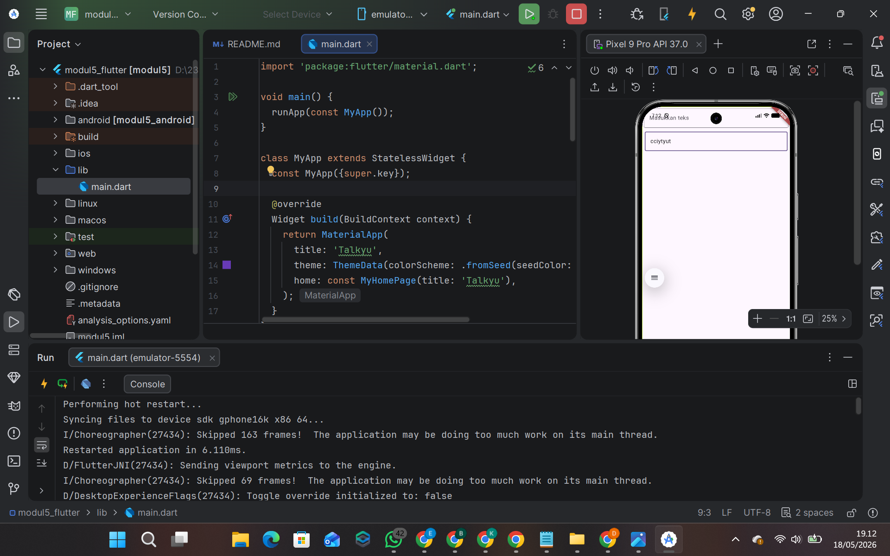

<div align="center">
  <br />
  <h1>LAPORAN PRAKTIKUM <br>APLIKASI BERBASIS PLATFORM</h1>
  <br />
  <h2>MODUL 05-06 FLUTTER 
  <br /><br />

  

  <br /><br /><br />

  <h3>Disusun Oleh :</h3>

  <p>
    <strong>Deshan Rafif Alfarisi</strong><br>
    <strong>2311102326</strong><br>
    <strong>S1 IF-11</strong>
  </p>

  <br />

  <h3>Dosen Pengampu :</h3>

  <p>
    <strong>Dimas Fanny Hebrasianto Permadi, S.ST., M.Kom</strong>
  </p>

  <br /><br />

  <h4>Asisten Praktikum :</h4>

  <p>
    <strong>Asisten Laboratorium HIGH PERFORMANCE</strong><br>
  </p>

  <br />

  <h2>
  LABORATORIUM HIGH PERFORMANCE <br>
  FAKULTAS INFORMATIKA <br>
  UNIVERSITAS TELKOM PURWOKERTO <br>
  2026
  </h2>
</div>

---

## 1. Pendahuluan

Flutter merupakan framework open-source yang dikembangkan oleh Google untuk membangun aplikasi multiplatform yang responsif dan cepat. Dengan menggunakan satu basis kode, Flutter memungkinkan pengembang untuk membuat aplikasi yang dapat berjalan pada berbagai platform seperti Android, iOS, Web, dan Desktop.

Pada praktikum Modul 05-06 ini, fokus kegiatan adalah mempelajari widget dasar Flutter dan state management. Praktikum ini memusatkan perhatian pada pembuatan antarmuka pengguna yang interaktif menggunakan widget-widget fundamental seperti `TextField`, `Column`, `Scaffold`, dan `MaterialApp`. Selain itu, praktikum ini juga mengeksplorasi konsep state management dalam Flutter untuk membuat aplikasi yang responsif terhadap perubahan data.

Aplikasi yang dikembangkan bernama "Talkyu", sebuah aplikasi dasar yang menampilkan dua buah field input untuk menerima masukan teks dari pengguna. Praktikum ini bertujuan untuk memberikan pemahaman mendalam tentang bagaimana Flutter menangani input pengguna dan manajemen state dalam aplikasi.

---

## 2. Tujuan Praktikum

Tujuan dari praktikum ini adalah sebagai berikut:

1. Memahami konsep dasar pembuatan antarmuka aplikasi menggunakan Flutter.
2. Mengetahui fungsi dan penggunaan widget dasar seperti `TextField`, `Column`, `Scaffold`, dan `Padding`.
3. Mampu membuat form input dengan multiple text fields.
4. Memahami konsep `StatefulWidget` dan bagaimana mengelola state dalam aplikasi Flutter.
5. Mampu mengatur layout dan spacing menggunakan `Padding` dan `Column`.
6. Mampu membuat tampilan aplikasi yang responsif dan user-friendly.

---

## 3. Dasar Teori

### 3.1 Flutter

Flutter adalah framework UI open-source yang dikembangkan oleh Google untuk membangun aplikasi multiplatform yang indah dan cepat. Flutter menggunakan bahasa pemrograman Dart dan memiliki filosofi "Everything is a Widget". Dengan pendekatan ini, setiap elemen tampilan aplikasi disusun dari widget yang saling berkaitan membentuk widget tree.

Kelebihan utama Flutter adalah:
- **Single Codebase**: Satu kode dapat berjalan di berbagai platform
- **Hot Reload**: Perubahan kode dapat langsung dilihat tanpa restart aplikasi
- **Performance**: Aplikasi Flutter memiliki performa yang sangat baik
- **Beautiful UI**: Flutter menyediakan widget yang indah dan customizable

### 3.2 Dart

Dart adalah bahasa pemrograman modern yang dikembangkan oleh Google dan menjadi bahasa resmi untuk Flutter. Dart mendukung konsep pemrograman berorientasi objek, fungsional, dan imperatif. Dart juga memiliki fitur strong typing, garbage collection, dan hot reload yang membuatnya ideal untuk pengembangan aplikasi Flutter.

### 3.3 Widget

Widget adalah komponen dasar dalam Flutter. Hampir semua elemen tampilan Flutter merupakan widget, mulai dari teks, tombol, input field, hingga layout. Dalam Flutter, ada dua jenis widget utama:

1. **StatelessWidget**: Widget yang tidak memiliki state (tampilan statis dan tidak berubah)
2. **StatefulWidget**: Widget yang memiliki state (tampilan dapat berubah berdasarkan perubahan data)

### 3.4 StatelessWidget

`StatelessWidget` adalah widget yang tampilannya tidak berubah selama aplikasi berjalan. Widget ini immutable, artinya propertinya tidak dapat diubah setelah widget dibuat. Class `MyApp` pada praktikum ini menggunakan `StatelessWidget` karena tampilan awal aplikasi bersifat statis.

### 3.5 StatefulWidget

`StatefulWidget` adalah widget yang memiliki state yang dapat berubah. Berbeda dengan `StatelessWidget`, `StatefulWidget` dapat memicu rebuild ketika state berubah. Class `MyHomePage` pada praktikum ini menggunakan `StatefulWidget` untuk menangani input pengguna.

State dikelola melalui class yang mewarisi `State<T>` dimana `T` adalah nama widget `StatefulWidget`-nya. Pada praktikum ini, `_MyHomePageState` mengelola state dari `MyHomePage`.

### 3.6 MaterialApp

`MaterialApp` adalah widget utama yang biasanya digunakan pada aplikasi Flutter berbasis Material Design. Widget ini berfungsi sebagai pembungkus aplikasi dan mengatur berbagai konfigurasi seperti judul aplikasi, tema, halaman awal, dan lainnya.

Properti-properti penting `MaterialApp`:
- `title`: Judul aplikasi yang ditampilkan di task manager
- `theme`: Tema visual aplikasi
- `home`: Widget halaman awal yang ditampilkan

### 3.7 Scaffold

`Scaffold` adalah widget yang menyediakan kerangka dasar layout Material Design untuk sebuah halaman. `Scaffold` dapat menampung berbagai komponen seperti `AppBar`, `body`, `FloatingActionButton`, `Drawer`, dan lainnya.

### 3.8 Column

`Column` adalah widget layout yang menyusun child widget secara vertikal dari atas ke bawah. `Column` memiliki berbagai properti untuk mengatur alignment dan spacing:
- `crossAxisAlignment`: Mengatur alignment secara horizontal
- `mainAxisAlignment`: Mengatur alignment secara vertikal
- `children`: Daftar widget yang akan disusun

### 3.9 TextField

`TextField` adalah widget input yang memungkinkan pengguna memasukkan teks. Widget ini memiliki properti `decoration` yang mengatur tampilan input field seperti hint text, border, label, dan lainnya.

Properti penting `TextField`:
- `decoration`: Mengatur tampilan field (InputDecoration)
- `hintText`: Teks placeholder yang ditampilkan
- `border`: Border style dari input field
- `onChanged`: Callback ketika teks berubah

### 3.10 InputDecoration

`InputDecoration` digunakan untuk mengatur tampilan visual `TextField`. Properti-properti penting:
- `hintText`: Placeholder text
- `border`: Jenis border (OutlineInputBorder, UnderlineInputBorder, dll)
- `label`: Label untuk field
- `prefixIcon`: Icon di awal field
- `suffixIcon`: Icon di akhir field

### 3.11 Padding

`Padding` adalah widget yang memberikan space (padding) di sekitar child widget-nya. Properti-properti penting:
- `padding`: Menentukan ukuran padding dengan `EdgeInsets`
- `child`: Widget yang akan diberi padding

### 3.12 OutlineInputBorder

`OutlineInputBorder` adalah style border untuk `TextField` yang menampilkan border di semua sisi input field. Style ini memberikan tampilan modern dan jelas untuk input field.

### 3.13 EdgeInsets

`EdgeInsets` digunakan untuk menentukan padding atau margin. Ada beberapa cara mendefinisikan `EdgeInsets`:
- `EdgeInsets.all(value)`: Padding sama di semua sisi
- `EdgeInsets.symmetric(vertical, horizontal)`: Padding vertikal dan horizontal
- `EdgeInsets.only(top, bottom, left, right)`: Padding custom per sisi

---

## 4. Implementasi

### 4.1 Struktur Dasar Aplikasi

Aplikasi dimulai dengan mengimpor package Material Flutter dan mendefinisikan fungsi `main()` sebagai entry point aplikasi.

```dart
import 'package:flutter/material.dart';

void main() {
  runApp(const MyApp());
}
```

Fungsi `main()` adalah fungsi yang pertama kali dijalankan ketika aplikasi dimulai. `runApp()` menjalankan widget yang diberikan dan menjadikannya root widget dari widget tree.

### 4.2 Class MyApp

`MyApp` merupakan `StatelessWidget` yang merepresentasikan aplikasi secara keseluruhan. Widget ini mengkonfigurasi `MaterialApp` dengan judul dan tema aplikasi.

```dart
class MyApp extends StatelessWidget {
  const MyApp({super.key});
  
  @override
  Widget build(BuildContext context) {
    return MaterialApp(
      title: 'Talkyu',
      theme: ThemeData(colorScheme: ColorScheme.fromSeed(seedColor: Colors.deepPurple)),
      home: const MyHomePage(title: 'Talkyu'),
    );
  }
}
```

Pada kode di atas:
- `title`: Nama aplikasi adalah "Talkyu"
- `theme`: Tema aplikasi menggunakan warna seed deepPurple
- `home`: Halaman awal aplikasi adalah `MyHomePage`

### 4.3 Class MyHomePage (StatefulWidget)

`MyHomePage` adalah `StatefulWidget` yang menampilkan halaman utama aplikasi dengan form input.

```dart
class MyHomePage extends StatefulWidget {
  const MyHomePage({super.key, required this.title});

  final String title;

  @override
  State<MyHomePage> createState() => _MyHomePageState();
}
```

Properti `title` menerima judul halaman yang akan ditampilkan. Method `createState()` mengembalikan instance dari state class `_MyHomePageState`.

### 4.4 Class _MyHomePageState

`_MyHomePageState` adalah state class yang mengelola state dari `MyHomePage`. Class ini membangun widget tree yang menampilkan input form.

```dart
class _MyHomePageState extends State<MyHomePage> {

  @override
  Widget build(BuildContext context) {
    return Scaffold(
      body: Column(
        crossAxisAlignment: CrossAxisAlignment.end,
        children: <Widget>[
          const Padding(
            padding: EdgeInsets.symmetric(vertical: 5, horizontal: 5),
            child: TextField(
              decoration: InputDecoration(
                  hintText: 'Masukkan teks',
                  border: OutlineInputBorder()
              ),
            ),
          ),
          Padding(
            padding: const EdgeInsets.symmetric(vertical: 6, horizontal: 8),
            child: TextField(
              decoration: InputDecoration(
                  hintText: 'Masukkan teks 2',
                  border: OutlineInputBorder()
              ),
            ),
          )
        ],
      ),
    );
  }
}
```

**Penjelasan struktur widget:**
- `Scaffold`: Menyediakan basic app bar dan body
- `Column`: Menyusun dua TextField secara vertikal
- `crossAxisAlignment: CrossAxisAlignment.end`: Mengatur input field agar align ke kanan
- `Padding`: Memberikan spacing di sekitar setiap TextField
- `TextField`: Widget input yang menerima teks dari pengguna dengan hint text dan border outline

---

## 5. Source Code Lengkap

Berikut adalah kode lengkap aplikasi "Talkyu" pada file `lib/main.dart`:

```dart
import 'package:flutter/material.dart';

void main() {
  runApp(const MyApp());
}

class MyApp extends StatelessWidget {
  const MyApp({super.key});
  
  @override
  Widget build(BuildContext context) {
    return MaterialApp(
      title: 'Talkyu',
      theme: ThemeData(colorScheme: .fromSeed(seedColor: Colors.deepPurple)),
      home: const MyHomePage(title: 'Talkyu'),
    );
  }
}

class MyHomePage extends StatefulWidget {
  const MyHomePage({super.key, required this.title});

  final String title;

  @override
  State<MyHomePage> createState() => _MyHomePageState();
}

class _MyHomePageState extends State<MyHomePage> {

  @override
  Widget build(BuildContext context) {
    return Scaffold(
      body: Column(
        crossAxisAlignment: CrossAxisAlignment.end,
        children: <Widget>[
          const Padding(
            padding: EdgeInsets.symmetric(vertical: 5, horizontal: 5),
            child: TextField(
              decoration: InputDecoration(
                  hintText: 'Masukkan teks',
                  border: OutlineInputBorder()
              ),
            ),
          ),
          Padding(
            padding: const EdgeInsets.symmetric(vertical: 6, horizontal: 8),
            child: TextField(
              decoration: InputDecoration(
                  hintText: 'Masukkan teks 2',
                  border: OutlineInputBorder()
              ),
            ),
          )
        ],
      ),
    );
  }
}
```

---

## 6. Hasil Praktikum



Setelah kode dijalankan, aplikasi menampilkan halaman dengan struktur berikut:

**Elemen-elemen yang ditampilkan:**

1. **TextField Pertama**: Input field dengan hint text "Masukkan teks" dan border outline
2. **TextField Kedua**: Input field dengan hint text "Masukkan teks 2" dan border outline
3. **Layout**: Kedua input field disusun vertikal dengan alignment ke kanan

**Tampilan aplikasi:**

- Aplikasi bernama "Talkyu" dengan tema warna deepPurple
- Kedua input field memiliki border outline yang jelas
- Setiap input field memiliki padding yang konsisten
- Input field kedua memiliki padding yang sedikit lebih besar dibanding yang pertama

Hasil yang diharapkan dapat dilihat pada gambar screenshot (gabar.png) yang terlampir.

---

## 7. Pembahasan

Pada praktikum ini, aplikasi Flutter dibuat menggunakan struktur dasar dengan `MaterialApp` dan `Scaffold`. Penggunaan `Scaffold` memastikan bahwa aplikasi memiliki struktur layout yang sesuai dengan Material Design guidelines.

### 7.1 Widget Hierarchy

Struktur widget tree dalam aplikasi ini adalah:
```
MyApp (StatelessWidget)
├── MaterialApp
│   └── MyHomePage (StatefulWidget)
│       └── Scaffold
│           └── Column
│               ├── Padding
│               │   └── TextField (Input 1)
│               └── Padding
│                   └── TextField (Input 2)
```

### 7.2 Penggunaan StatefulWidget

`MyHomePage` menggunakan `StatefulWidget` karena aplikasi ini siap untuk mengelola state (misalnya ketika pengguna mengetik di TextField). Meskipun pada praktikum saat ini belum ada state yang dikelola secara eksplisit, struktur `StatefulWidget` memudahkan pengembangan lebih lanjut untuk menambahkan fungsionalitas seperti penyimpanan input atau validasi form.

### 7.3 Layout dengan Column dan Padding

Penggunaan `Column` memungkinkan penyusunan widget secara vertikal. Setiap `TextField` dibungkus dalam `Padding` untuk memberikan spacing yang konsisten. Properti `crossAxisAlignment: CrossAxisAlignment.end` membuat kedua input field rata ke kanan, memberikan tampilan yang unik dan user-friendly.

### 7.4 TextField Configuration

Setiap `TextField` dikonfigurasi dengan:
- **hintText**: Memberikan petunjuk kepada pengguna apa yang harus diinput
- **OutlineInputBorder**: Memberikan border visual yang jelas dan modern

Kombinasi ini menciptakan input field yang intuitif dan mudah digunakan.

### 7.5 Responsive Design

Meskipun aplikasi ini sederhana, sudah menerapkan prinsip responsive design dengan menggunakan padding yang fleksibel dan alignment yang jelas.

---

## 8. Kesimpulan

Berdasarkan praktikum yang telah dilakukan, dapat disimpulkan bahwa:

1. **Flutter Widget System**: Flutter membangun seluruh antarmuka menggunakan widget, yang mana setiap widget memiliki tanggung jawab spesifik dalam UI.

2. **StatefulWidget vs StatelessWidget**: Pemilihan tipe widget yang tepat (Stateful atau Stateless) sangat penting untuk menentukan bagaimana aplikasi mengelola dan merespons perubahan data.

3. **Layout Management**: Penggunaan `Column`, `Padding`, dan `Scaffold` memungkinkan pembuatan layout yang terstruktur dan mudah di-maintain.

4. **Input Handling**: `TextField` dengan `InputDecoration` yang tepat memberikan user experience yang baik untuk input form.

5. **Theme dan Styling**: `MaterialApp` dan `ThemeData` memudahkan pembuatan aplikasi dengan desain yang konsisten.

Aplikasi "Talkyu" yang dibuat pada praktikum ini merupakan dasar yang solid untuk pengembangan aplikasi Flutter yang lebih kompleks. Dengan memahami konsep-konsep fundamental ini, mahasiswa siap untuk membuat aplikasi Flutter yang lebih advanced dengan fitur-fitur yang lebih lengkap dan interaktif.

---

## 9. Saran Pengembangan

Untuk pengembangan lebih lanjut, berikut beberapa saran:

1. **State Management**: Tambahkan `TextEditingController` untuk mengelola nilai input field
2. **Validasi Form**: Tambahkan validasi pada form untuk memastikan input valid
3. **Button dan Action**: Tambahkan button untuk mengproses input dari pengguna
4. **User Feedback**: Tambahkan snackbar atau dialog untuk memberikan feedback kepada user
5. **Data Storage**: Implementasikan penyimpanan data lokal menggunakan shared_preferences atau database
6. **Error Handling**: Tambahkan error handling untuk berbagai skenario

---

## Referensi

1. Flutter Team. *Flutter Documentation*. https://docs.flutter.dev/
2. Flutter Team. *Building user interfaces with Flutter*. https://docs.flutter.dev/ui
3. Flutter Team. *MaterialApp class*. https://api.flutter.dev/flutter/material/MaterialApp-class.html
4. Flutter Team. *TextField class*. https://api.flutter.dev/flutter/material/TextField-class.html
5. Flutter Team. *StatefulWidget class*. https://api.flutter.dev/flutter/widgets/StatefulWidget-class.html
6. Universitas Telkom. *Modul Praktikum Pemrograman Perangkat Bergerak 2024*. https://telkomuniversityofficial-my.sharepoint.com/personal/dimasfhp_telkomuniversity_ac_id/_layouts/15/onedrive.aspx

---

<div align="center">
  <p><strong>© 2026 Deshan Rafif Alfarisi - Universitas Telkom Purwokerto</strong></p>
</div>
